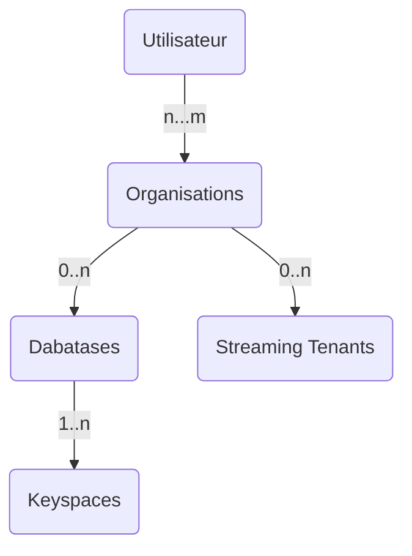
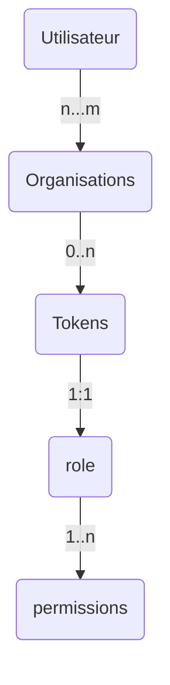
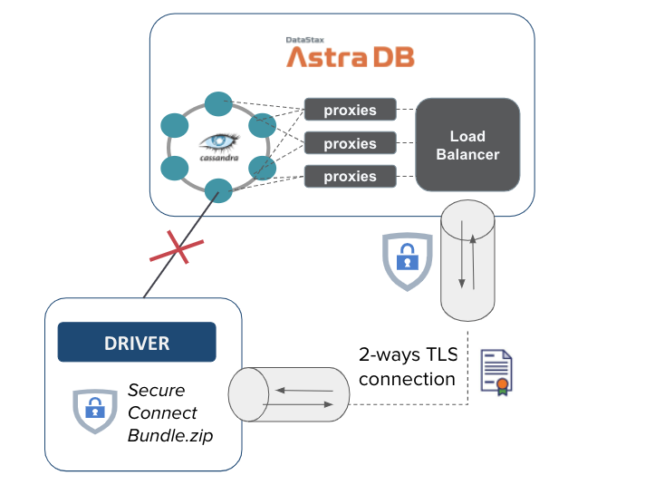

## 🇫🇷 Devoxx France 2022 🇫🇷

[](https://gitpod.io/#https://github.com/datastaxdevs/conference-2022-devoxx)
[](http://www.apache.org/licenses/LICENSE-2.0)
[](https://discord.com/widget?id=685554030159593522&theme=dark)

### Construire des Applications performantes avec Apache Cassandra™


Bienvenue dans ce workshop de découverte d'Apache Cassandra™ adressé aux **développeurs**. L'objectif est de vous rendre _dangereux_ avec la technologie et savoir la mettre en oeuvre rapidement sur vos projets.

⏲️ **Durée :** 3 heures

🎓 **Niveau** Débutant à intermédiaire


## 📋 Table des matières

- [Objectifs](#objectifs)
- [Foire aux questions](#foire-aux-questions)
- [Supports de Formation](#supports-de-formation)
- [#**LAB 1 - Initialisation des Environnements**](#lab1---création-de-la-base-de-donnée)
  - [1.1 - Démarrage de `Gitpod`](#11---démarrage-de-gitpod)
  - [1.2 - Apache Cassandra™ dans `Docker`](#12---apache-cassandra-dans-docker)
  - [1.3 - Apache Cassandra™ avec `Astra` (dbaas)](#13---apache-cassandra-avec-astra-dbaas)
- [#**LAB 2 - Les Fondamentaux d'Apache Cassandra™**](#lab2---les-fondamentaux-dapache-cassandra)
  - [2.1 - Tables et types de données simples](#21---tables-et-types-de-données-simples)
  - [2.2 - Opérations Unitaires CRUD](#22---opérations-create-read-update-delete)
  - [2.3 - Grammaire des requêtes avec CQL](#23---grammaire-des-requêtes-avec-cql)
  - [2.4 - Types de données avancés](#24---types-de-données-avancés)
  - [2.5 - Batches](#25---batches)
  - [2.6 - Indexes secondaires](#26---index-secondaires)
  - [2.7 - Niveaux de consistance](#27---niveau-de-consistence)
  - [2.8 - Lightweight Transactions](#28---lightweight-transactions)
- [#**LAB 3 - La modélisation de données**](#lab-3---modélisation-de-données)
  - [3.1 - Méthodologie](#31---méthodologie)
  - [3.2 - Modèle de données timeseries](#32---modèle-de-données-pour-les-timeseries)
  - [3.3 - Exemple de migration de Sql à NoSQL](#33---de-sql-à-nosql-avec-petclinic)
- [#**LAB 4 - Introduction aux drivers**](#lab-4---introduction-aux-drivers)
  - [4.1 - Connectivité](#41---connectivité)
  - [4.2 - Création du Schéma](#42---création-du-schéma)
  - [4.3 - Création des Statements](#43---création-des-statements)
  - [4.4 - Opération Create, Read, Update, Delete](#44---opération-create-read-update-delete-crud)
  - [4.5 - Batches](45---batches)
  - [4.6 - Pagination](#46---pagination)
  - [4.7 - Travailler avec des List, Set et Map](#47---travailler-avec-list-set-et-map)
  - [4.8 - Requêter avec JSON](#48---requêter-avec-json)
  - [4.9 - Programmation Asynchrone](#49---programmation-asynchrone)
  - [4.10 - Programmation Réactive](#410---programmation-réactive)
  - [4.11 - Les Counters](#411---les-counters)
  - [4.12 - Les Lightweight Transactions](#412---les-lightweight-transactions)
  - [4.13 - Object Mapping](#413---object-mapping)
- [#**LAB 5 - Spring Data Cassandra**](#lab8---spring-data-cassandra)
  - [5.1 - Connexion et Configuration](#51---configuration)
  - 5.2 - Comprendre les `CrudRepositories`
  - 5.3 - Manipulation de `CassandraOperations`
  - 5.4 - Application Spring Boot
- [#**LAB 6** - Cassandra Quarkus extension](#lab9---cassandra-quarkus-extension)
  - 6.1 - Introduction aux extensions Quarkus
  - 6.2 - Connexion et configuration
  - 6.2 - Application Quarkus
- [#**LAB 7** - Micronaut Cassandra](#lab10---micronaut-cassandra)
  - 7.1 - Connexion et Configuration
  - 7.2 - Application Micronaut
- [#**LAB 8** - La solution Stargate ](#lab11---stargate-apis)
  - 8.1 - Introduction à Stargate.io
  - 8.2 - Utilisation des Apis Rest
  - 8.3 - Utilisation des Apis Documents
  - 8.4 - Utilisation des Apis GraphQL
  - 8.5 - Configuration de SDKs
  - 8.6 - Utilisation des SDKs

## Objectifs

- 🎯 Comprendre la nature et l'architecture de la base de données NoSQL Apache Cassandra™ pour déterminer les **bons cas d'usage.**
- 🎯 Comprendre les différences fondamentales avec les bases de données relationnelles et la **méthodologie pour construire un modèle de données** approprié.
- 🎯 Savoir **utiliser les drivers** pour établir la connexion, construire ses requêtes et implémenter tous types de services.
- 🎯 Disposer d'**exemples fonctionnels** pour bien démarrer avec les principaux frameworks Java : `Spring`, `Quarkus` et `Micronaut`.
- 🎯 Découvrir le composant **Stargate**, en comprendre les différentes `Apis` et tester son utilisation avec le `SDK`.

## Foire aux questions

<p/>
<details>
<summary><b> 1️⃣ Quels sont les pré-requis à cette session ? </b></summary>
<hr>
<ul>
<li>Vous devez maîtriser un <b>langage de programmation</b> <i>(Java, Javascript, Python - cette session s'adresse à des développeurs)</i> mais pas nécessairement une grande expérience.
<li>Pour utiliser Gitpod vous aurez besoin d'un <b>compte Github ou Gitlab.</b>
</ul>
</p>
</details>

<p/>
<details>
<summary><b> 2️⃣ Puis-je exécuter les LABS sur ma machine ?</b></summary>
<hr>
<p>Afin de rendre l'expérience la plus agréable possible nous fournissons un environnement dans le cloud avec l'outil Gitpod mais rien de vous empêche d'utiliser votre machine. Durant chaque atelier nous listerons les pré-requis.</p>

<p>Le contenu étant dense, le temps pour l’installation de tous les outils localement est limité. Voici une liste exhaustive :
<ol>
<li><b>Java 8+</b> ainsi que <b>Maven 3.6+</b> pour les LABS avec Java.
<li><b>Python 3+</b> ainsi que <b>pip3</b> pour les LABS avec Python.
<li><b>Node 16+</b> ainsi que <b>NPM 8+</b> pour les LABS avec Javascript.
<li><b>Docker</b> ainsi que <b>Docker-compose</b> pour démarrer les conteneurs.
<li>Une machine disposant d'au moins <b>8Go de mémoire vive.</b>
<li><b>2Go d'espace disque libre </b>pour télécharger les différents images et outils.
<li>Un atelier de développement logiciel  <b>(IDE)</b>comme Eclipse, IntelliJ, Netbean...
</ol>
</p>
</details>

<p/>
<details>
<summary><b> 3️⃣ Les outils resteront-ils gratuits après la session ?</b></summary>
<hr>
<b>Absolutement.</b> Toutes les solutions utilisées aujourd'hui sont gratuites. Pour les démonstrations avec les produits en Saas aucune carte de crédit ne sera demandée ni maintenant, ni après.
</details>
<p/>
<details>
<summary><b> 4️⃣ S'agit t'il d'une formation certifiante ?</b></summary>
<hr>


DataStax propose <a href="https://www.datastax.com/dev/certifications">3 certifications</a> autour des technologies Apache Cassandra™. En 3h il nous est impossible de tout couvrir pour prétendre à la certification. Cependant tous les cours nécessaires sont disponibles sur <a href="https://academy.datastax.com">academy.datastax.com"</a> et <a href="https://datastax.com/dev">datastax.com/dev</a>. Participer à cette session (live) vous ouvre le droit à un voucher pour 2 tentatives gratuites aux certifications <i>(au lieu de 145$)</i>.</p>
</details>
<p/>

## Supports de Formation

Que vous soyez dans la salle avec nous pour Devoxx ou que vous regardiez la session maintenant sur Youtube voici toutes les supports nécessaires :

- [Les slides](slides.pdf)
- [Les labs](/hands-on)
- [Une invitation sur notre serveur Discord](https://bit.ly/cassandra-workshop) pour échanger et rejoindre la communauté.
- [Notre forum, community.datastax.com](https://community.datastax.com/) afin de poser vos questions.

## LAB1 - Création de la base de données

## 1.1 - Démarrage de `Gitpod`

[Gitpod](https://www.gitpod.io/) est un IDE 100% dans le cloud. Il s'appuie sur [VS Code](https://github.com/gitpod-io/vscode/blob/gp-code/LICENSE.txt?lang=en-US) et fournit de nombreux outils pour développer dans plusieurs langages.

#### `✅.001`- _Click-Droit_ sur le bouton pour ouvrir gitpod dans un nouveau onglet sur votre navigateur.

[](https://gitpod.io/#https://github.com/datastaxdevs/conference-2022-devoxx){:target="_blank"}

## 1.2 - Apache Cassandra™ dans `Docker`

> ℹ️ Lors du premier copier-coller dans `Gitpod` le navigateur vous invite à autoriser les copies depuis le presse-papier, il est nécessaire de le faire.

Lorsque Gitpod est démarré, localiser le terminal `cassandra-docker`. Il devrait contenir uniquement un message en bleu.

```
------------------------------------------------------------
---        Bienvenue à Devoxx France 2022                ---
--           Local Cassandra (Docker)                    ---
------------------------------------------------------------
```

### 1.2.1 - Démarrage du cluster

Dans le répertoire `labs` repérer le fichier `docker-compose.yml`. Nous allons utiliser l'[image officielle Docker Cassandra](https://hub.docker.com/_/cassandra/).

#### `✅.002`- Ouvrir le fichier et visualiser comment le `seed` est un service séparé des autres noeuds. La recommentation est de 1 à 2 `seeds` par datacenter (anneau).

```bash
gp open /workspace/conference-2022-devoxx/labs/docker-compose.yml
```

#### `✅.003`- Démarrer 2 noeuds avec `docker-compose`

```bash
cd /workspace/conference-2022-devoxx/labs/
docker-compose up -d
```

> 🖥️ Résultat
>
> ```
> [+] Running 3/3
>  ⠿ Network labs_cassandra           Created      0.0s
>  ⠿ Container labs-dc1_seed-1        Started      0.4s
>  ⠿ Container labs-dc1_noeud-1       Started      1.2s
> ```

#### `✅.004`- Afficher le statut des conteneurs avec `Docker`

Les deux conteneurs (services) démarrent. Le second réalise une temporisation de 30 seconds afin d'attendre que le noeud seed bootstrape.

```bash
docker ps
```

#### `✅.005`- Afficher le statut des conteneurs avec `docker-compose`

```bash
 docker-compose ps
```

> 🖥️ Résultat
>
> ```bash
>     Name                    Command               State                                        Ports
> --------------------------------------------------------------------------------------------------------------------------------------------
> labs_dc1_noeud_1   docker-entrypoint.sh /bin/ ...   Up      7000/tcp, 7001/tcp, 7199/tcp, 9042/tcp, 9160/tcp
> labs_dc1_seed_1    docker-entrypoint.sh cassa ...   Up      7000/tcp, 7001/tcp, 7199/tcp, 0.0.0.0:9042->9042/tcp,:::9042->9042/tcp, 9160/tcp
> ```

#### `✅.006`- Sauvegarder l'identifiant du conteneur `seed`

Nous allons utiliser les outils disponibles en ligne de commande dans une installation Apache Cassandra™ à savoir `cqlsh` et `nodetool`.

Nous sauvegardons l'identifiant du conteneur seed pour simplifier les futures lignes de commande.

```bash
export dc1_seed_containerid=`docker ps | grep dc1_seed | cut -b 1-12`

echo "container ID saved: $dc1_seed_containerid"
```

#### `✅.007`- Vérification du démarrage du cluster avec `nodetool`

```
docker exec -it $dc1_seed_containerid nodetool status
```

> 🖥️ Résultat (après environ 1min)
>
> ```
> Datacenter: dc1
> ===============
> Status=Up/Down
> |/ State=Normal/Leaving/Joining/Moving
> --  Address     Load       Tokens  Owns (effective)  Host > ID                               Rack
> UN  172.28.0.2  69.05 KiB  16      100.0%8707bea1-ac47-4da0-9e96-5541d3e1431d  rack1
> UN  172.28.0.3  69.05 KiB  16      100.0%            25f43936-be10-471d-b8ac-7efe93834712  rack1
> ```

_Il faut s'attarder sur le `State` des noeuds, nous attendons qu'ils soient tous au statut `UN` (Up/Normal)._

### 1.2.2 - Scale up du cluster

#### `✅.008`- Ajouter un 3e noeud (scale up du noeud non seed).

```bash
docker-compose up --scale dc1_noeud=2 -d
```

On notera que la commande n'est pas exceptionnelle car elle redémarre le `dc1_noeud` existant. Malheureusement l'ancienne `docker-compose scale` est dépréciée. Dans un sens cela démontre l'un des avantages de la technologie, sa grande résilience.

Cela démontre également les limites d'utilisation des bases de données dans Docker. Pour une utilisation en production il est nécessaire de déployer dans Kubernetes et de disposer d'un operator qui prendra en charge tous les cas aux limites.

Nous n'avons pas définis de volumes sur les services docker. Si vous éteignez complètement le cluster vous perdrez les données.

#### `✅.009`- Vérifier le statut

Attendez une bonne minute pour laisser le temps aux noeuds de joindre le cluster et de boostraper puis exécuter:

```bash
docker exec -it $dc1_seed_containerid nodetool status
```

> 🖥️ Résultat (après environ 1min)
>
> ```
> Datacenter: dc1
> ===============
> Status=Up/Down
> |/ State=Normal/Leaving/Joining/Moving
> --  Address     Load       Tokens  Owns (effective)  Host > ID                               Rack
> UN  172.28.0.2  69.05 KiB  16      100.0%8707bea1-ac47-4da0-9e96-5541d3e1431d  rack1
> UN  172.28.0.3  69.05 KiB  16      100.0%            25f43936-be10-471d-b8ac-7efe93834712  rack1
> UN  172.28.0.4  69.06 KiB  16      76.0%             fe43b0d0-952b-48ec-86e1-d73ace617dc8  rack1
> ```

### 1.2.3 - Création d'un `keyspace'

#### `✅.010`- Ouvrir le shell intéractif (REPL) CQLSH

Cet outil est disponible dans une installation Cassandra. `C.Q.L` pour _Cassandra Query Language_ et `sh` pour shell.

```bash
docker exec -it $dc1_seed_containerid cqlsh
```

#### `✅.011`- Afficher les informations du noeud local

La table `system.local` contient les informations locales, ici pour `dc1_seed`.

```sql
select cluster_name,data_center,rack,broadcast_address
from system.local;
```

> 🖥️ Résultat (après environ 1min)
>
> ```
>  cluster_name | data_center | rack  | broadcast_address
> --------------+-------------+-------+-------------------
>       handson |         dc1 | rack1 |        172.28.0.2
>
> (1 rows)
> ```

#### `✅.012`- Afficher les informations des 2 autres noeuds

Les informations relatives aux autres noeuds sont stockées dans `system.peers`.

```sql
select data_center,rack,peer
from system.peers;
```

> 🖥️ Résultat (après environ 1min)
>
> ```
> cqlsh> select data_center,rack,peer from system.peers;
>
> data_center | rack  | peer
> -------------+-------+------------
>         dc1 | rack1 | 172.28.0.4
>         dc1 | rack1 | 172.28.0.3
>
> (2 rows)
> ```

#### `✅.013`- Création du keyspace

Un keyspace c'est un groupement logique des différents objets. Il est recommandé d'en utiliser un par application.

Une même application peut utiliser plusieurs `keyspaces` (avec la même session). Cela peut être utile si certaines données doivent être répliquées de manière différente. (le keyspace porte le facteur de réplication)

```sql
CREATE KEYSPACE IF NOT EXISTS devoxx
WITH REPLICATION = {
  'class' : 'NetworkTopologyStrategy',
  'dc1' : 3
}  AND DURABLE_WRITES = true;
```

`NetworkTopologyStrategy` sera toujours la classe à utiliser sauf dans le cas d'un noeud unique pour les développements auxquel cas on utilisera `SimpleReplicationStrategy`.

```sql
CREATE KEYSPACE IF NOT EXISTS test
WITH REPLICATION = {
  'class' : 'SimpleStrategy',
  'replication_factor': '1'
} AND DURABLE_WRITES = true;
```

`DURABLE_WRITES` ? Dans le chemin d'écriture Cassandra écrit en mémoire (`memtable`) avant de _flusher_ les valeurs sur disque (SSTABLE) soit par vacation soit lorsque'un seuil est atteint en mémoire. Utiliser `DURABLE_WRITES = true` permet d'ecrire dans le `commit log` avant même l'écriture en mémoire cela permet de ne pas perdre la donnée, il faut tout le temps le faire mais c'est la valeur par défaut.

#### `✅.014`- Lister les keyspaces

```sql
describe keyspaces;
```

> 🖥️ Résultat (après environ 1min)
>
> ```
> devoxx  system_auth         system_schema  system_views
> system  system_distributed  system_traces  system_virtual_schema
> ```

## 1.3 - Apache Cassandra™ avec `Astra` (dbaas)

Astra est un logiciel de _sofware-as-a-service_ dans le cloud que l'on peut utiliser gratuitement jusqu'à quelques millions de requêtes par mois sans carte de crédit ni limite de temps, parfait pour les environnements de tests ^\_^.

### 1.3.1 - Configuration Astra

#### `✅.015`- Créer un compte sur Astra

> 📖 Documentation: [Créer son compte Astra 🇬🇧](https://awesome-astra.github.io/docs/pages/astra/create-account/)

[](https://astra.dev/devoxx)

#### `✅.016`- Créer une base de donnée sur Astra

> 📖 Documentation: [Créer une base de donnée sur Astra 🇬🇧](https://awesome-astra.github.io/docs/pages/astra/create-instance/)

Pour la session d'aujourd'hui nous utiliserons les valeurs suivantes. Vous pouvez utiliser des valeurs différentes mais ce sont celles définies par défaut dans les LABS.

| Paramètre     | Valeur                                                                                                                                                                            |
| ------------- | --------------------------------------------------------------------------------------------------------------------------------------------------------------------------------- |
| Database name | `workshops`                                                                                                                                                                       |
| Keyspace name | `devoxx`                                                                                                                                                                          |
| Region name   | `Google Cloud` et l'une des 3 régions `North America/us-east-1`, `Europe/europe-west-1` ou `Asia Pacific/Mumbai`. Les autres ne sont pas dans le plan gratuit et repérées par 🔒. |

> 🖥️ **Résultat:**
>
> _Voici une petite animation mais attention à bien utiliser les valeurs dans le tableau ci-dessus._
>
> 

Lorsque vous créez un compte vous créez également une `Organization`, il s'agit de votre tenant. À l'intérieur vous pouvez définir plusieurs bases de données. Vous pouvez inviter d'autres utilisateurs dans votre organisation.



#### `✅.017`- Créer vos identifiants sur Astra

> 📖 Documentation: [Créer vos identifiants pour Astra 🇬🇧](https://awesome-astra.github.io/docs/pages/astra/create-token/#c-procedure)

Lorsque vous créez un jeton, il faut lui associer un role qui regroupe plusieurs permissions.



Pour la session, utiliser le role `Database Administrator` afin d'avoir accès à tout.

Télécharger le fichier `CSV` localement, les informations affichées ne seront plus disponibles ultérieurement pour des raisons de sécurité.

| Parameter | Value                    |
| --------- | ------------------------ |
| Role      | `Database Administrator` |

> 🖥️ **Résultat:**
>
> _Voici une petite animation pour retrouver les étapes_
>
> 

Vos identifiants contiennent 3 champs:

- `ClientId` qui correspond à un identifiant utilisateur
- `ClientSecret` qui correspond à un mot de passe utilisateur
- `Token` qui correspond à une clé pour Apis _(mais peut aussi servir de mot de passe avec le compte utilisateur générique `token`)_

### 1.3.2 - Configurer `Gitpod`

Dans `Gitpod`, repérer le terminal `cassandra-astra` nous allons configurer `cqlsh` pour utiliser la base de donnée Cassandra dans ASTRA 🚀.

On pourra noter que la console CQLSH est également disponible dans l'interface web Astra en tant qu'onglet nommé `CQL Console`. Cependant pour ne pas multiplier les fenêtres nous vous invitons à rester dans gitpod.


#### `✅.018`- Définir le nom de la base de données

Création de la variable d'environnement `ASTRA_DB_NAME`.

```bash
export ASTRA_DB_NAME=workshops
```

#### `✅.019`- Définir le nom du `keyspace`

Création de la variable d'environnement `ASTRA_DB_KEYSPACE`

```bash
export ASTRA_DB_KEYSPACE=devoxx
```

#### `✅.020`- Configurer l'environnement avec `astra-setup`

L'utilitaire `astra-setup` va initialiser les autres variables d'environnements nécessaires dans un fichier `.env` mais également télécharger le fichier zip `secureConnectBundle` nécessaire aux connexions.

```bash
npm exec -y astra-setup $ASTRA_DB_NAME $ASTRA_DB_KEYSPACE
```

> 🖥️ **Résultat:**
>
> 
>
> _Il est arrivé que le script remonte des erreurs de timeout. Pour le relancer il faut simplement_
>
> ```
> /workspace/conference-2022-devoxx/scripts/astra-cqlsh-install
> ```

#### `✅.021`- Vérifier la configuration du fichier `.env`

```bash
cat /workspace/conference-2022-devoxx/.env
```

#### `✅.022`- Vérifier que le zip de connexion `secureConnectBundle` est téléchargé. Il doit faire environ `12 ko`.

```bash
ls -l /home/gitpod/.cassandra/bootstrap.zip
```

#### `✅.023`- Lancement de `CqlSH`

Le script `astra-cqlsh` réutilise les différentes variables d'environnement ainsi que le `secureConnectBundle` (SCB) pour initialiser la connexion.

```bash
/workspace/conference-2022-devoxx/scripts/astra-cqlsh
```

> 🖥️ **Résultat:**
>
> 

#### `✅.024`- Lister les keyspaces

```sql
DESCRIBE KEYSPACES;
```

> 🖥️ **Résultat:**
>
> ```
> token@cqlsh> describe KEYSPACEs;
>
> system_virtual_schema  system_auth         better_reads      todos
> devoxx                 system_views        spring_petclinic  feeds_reader
> undefined              system              native_java
> netflix                datastax_sla        system_traces
> system_schema          data_endpoint_auth  ecommerce
> ```

# LAB2 - Les Fondamentaux d'Apache Cassandra™

Dans ce LAB nous travaillerons dans l'outil `CQLSH`. Vous pouvez utiliser celui en local (dans docker) ou celui d'Astra à votre convenance.

## 2.1 - Tables et types de données simples

#### `✅.025`- Lister les keyspaces

Vérifier que `devoxx` fait partie de la liste affichée.

```sql
describe KEYSPACES;
```

#### `✅.026`- Sélectionner le keyspace `devoxx`

```sql
use devoxx;
```

#### `✅.027`- Lister les tables du keyspace `devoxx`

Sans suspense, le keyspace est vide.

```sql
desc tables;
```

#### `✅.028`- Créer de votre première table.

```sql
CREATE TABLE IF NOT EXISTS city_by_country (
	country     text,
	city        text,
	population  int,
	PRIMARY KEY ((country), city)
);
```

On notera:

- `IF NOT EXISTS` permet d'avoir une commande idempotente
- les colonnes sont de types simples `text` et `int`
- La `clé primaire` en plusieurs parties que nous détaillerons par la suite.

#### `✅.029`- Insérer des enregistrements dans la table

```sql
INSERT INTO city_by_country(country, city, population)
VALUES('FR','Paris', 2187526);

INSERT INTO city_by_country(country, city, population)
VALUES('FR','Marseille', 863310);

INSERT INTO city_by_country(country, city, population)
VALUES('FR','Lyon', 516092);

INSERT INTO city_by_country(country, city, population)
VALUES('FR','Toulouse', 479553);

INSERT INTO city_by_country(country, city, population)
VALUES('FR','Nice', 340017);

INSERT INTO city_by_country(country, city, population)
VALUES('FR','Nantes', 309346);

INSERT INTO city_by_country(country, city, population)
VALUES('FR','Montpellier', 285121);

INSERT INTO city_by_country(country, city, population)
VALUES('FR','Strasbourg', 280966);

INSERT INTO city_by_country(country, city, population)
VALUES('FR','Bordeaux', 254436);

INSERT INTO city_by_country(country, city, population)
VALUES('FR','Lille', 232787);

INSERT INTO city_by_country(country, city, population)
VALUES('FR','Rennes', 216815);

INSERT INTO city_by_country(country, city, population)
VALUES('FR','Reims', 182460);

INSERT INTO city_by_country(country, city, population)
VALUES('FR','Saint-Étienne', 172565);

INSERT INTO city_by_country(country, city, population)
VALUES('FR','Toulon', 171953);

INSERT INTO city_by_country(country, city, population)
VALUES('FR','Le Havre', 170147);

INSERT INTO city_by_country(country, city, population)
VALUES('FR','Grenoble', 158454);

INSERT INTO city_by_country(country, city, population)
VALUES('FR','Dijon', 156920);

INSERT INTO city_by_country(country, city, population)
VALUES('FR','Angers', 150610);

INSERT INTO city_by_country(country, city, population)
VALUES('FR','Saint-Denis', 147931);

INSERT INTO city_by_country(country, city, population)
VALUES('FR','Villeurbanne', 147712);

INSERT INTO city_by_country(country, city, population)
VALUES('FR','Clermont-Ferrand', 143886);

INSERT INTO city_by_country(country, city, population)
VALUES('FR','Le Mans', 142946);

INSERT INTO city_by_country(country, city, population)
VALUES('FR','Aix-en-Provence', 142482);

INSERT INTO city_by_country(country, city, population)
VALUES('FR','Brest',  140064);

INSERT INTO city_by_country(country, city, population)
VALUES('FR','Tours', 135787);

INSERT INTO city_by_country(country, city, population)
VALUES('FR','Amiens', 134057);

INSERT INTO city_by_country(country, city, population)
VALUES('FR','Limoges', 132175);

INSERT INTO city_by_country(country, city, population)
VALUES('FR','Annecy', 126924);

INSERT INTO city_by_country(country, city, population)
VALUES('FR','Perpignan', 120158);

INSERT INTO city_by_country(country, city, population)
VALUES('USA','New York', 8000000);

INSERT INTO city_by_country(country, city, population)
VALUES('USA','Los Angeles', 4000000);

INSERT INTO city_by_country(country, city, population)
VALUES('DE','Berlin', 3350000);

INSERT INTO city_by_country(country, city, population)
VALUES('UK','London', 9200000);

INSERT INTO city_by_country(country, city, population)
VALUES('AU','Sydney', 4900000);

INSERT INTO city_by_country(country, city, population)
VALUES('DE','Nuremberg', 500000);

INSERT INTO city_by_country(country, city, population)
VALUES('CA','Toronto', 6200000);

INSERT INTO city_by_country(country, city, population)
VALUES('CA','Montreal', 4200000);

INSERT INTO city_by_country(country, city, population)
VALUES('JP','Tokyo', 37430000);

INSERT INTO city_by_country(country, city, population)
VALUES('IN','Mumbai', 20200000);
```

On notera:

- Que la personne qui rédige le Lab a une nette préférence pour les villes françaises.
- Que les instructions sont très proches du `SQL`

#### `✅.030`- Lister les engistrements de la table

Exécuter la requête sans fournir de filtre.

```sql
select * from city_by_country;
```

## 2.2 - Opérations Create, Read, Update, Delete

#### `✅.031`- Lister les villes de France

<p/>
<details>
<summary>Cliquer pour afficher la solution</summary>
<pre>select * from city_by_country 
WHERE country='FR';</pre>
</p>
</details>
<p/>

#### `✅.032`- Rechercher la ville de `Brest`

<p/>
<details>
<summary>Cliquer pour afficher la solution</summary>
<pre>select * from city_by_country 
WHERE country='FR' 
AND city='Brest';</pre>
</p>
</details>
<p/>

#### `✅.033`- Mettre à jour la population de Brest à `142000`

<p/>
<details>
<summary>Cliquer pour afficher la solution</summary>
<p>Avec Update
<pre>update city_by_country 
SET population=142000 
WHERE country='FR' 
AND city='Brest';</pre>

ou Avec Insert (tout insert est un upset)

<pre>INSERT INTO city_by_country(country, city, population) 
VALUES('FR','Brest',  142000);</pre>
</p>
</details>
<p/>

#### `✅.034`- Supprimer l'enregistrement pour la ville de `Tokyo`

<p/>
<details>
<summary>Cliquer pour afficher la solution</summary>
<pre>
DELETE FROM city_by_country 
WHERE country='JP'
AND city='Tokyo';
</pre>
Vérification:<pre>select * from city_by_country 
WHERE country='JP';</pre>
</details>
<p/>

> Lorsque l'on supprime un enregistrement en réalité la donnée est toujours dans la table. On vient ajouter une ligne dite `Tombstone` qui indique la valeur à vide. Si vous manquez de place sur disque le `DELETE` peut etre dangeureux.

#### `✅.035`- Supprimer les enregistrements pour le Canada `(CA)`

<p/>
<details>
<summary>Cliquer pour afficher la solution</summary>
<pre>
DELETE FROM city_by_country WHERE country='CA';
</pre>
Vérification:<pre>select * from city_by_country WHERE country='CA';</pre>
</details>
<p/>

#### `✅.036`- Supprimer la valeur de la population pour l'enregistrement Sydney `(AU, Sydney)`

<p/>
<details>
<summary>Cliquer pour afficher la solution</summary>
<pre>
DELETE population 
FROM city_by_country 
WHERE country='AU' 
AND city='Sydney';
</pre>
Vérification:<pre>SELECT * from city_by_country 
WHERE country='AU';</pre>
</details>
<p/>

## 2.3 - Grammaire des requêtes avec CQL

Dans cette partie nous présenterons les capacités de requêtage des tables avec le langage CQL.

```sql
SELECT [DISTINCT] * |
       select_expression [AS column_name][ , ... ]
FROM   [keyspace_name.] table_name
[WHERE partition_key_predicate
  [AND clustering_key_predicate]]
[GROUP BY primary_key_column_name][ , ... ]
[ORDER BY clustering_key_column_name ASC|DESC][ , ... ]
[PER PARTITION LIMIT number]
[LIMIT number]
[ALLOW FILTERING]
```

Dans la clause _`SELECT`_ on trouve :

- les caractères généraux comme `*`
- le nom des colonnes
- des aggrégats comme `COUNT()` et `AVG()`
- des fonctions numériques notamment sur le time-to-live (`TTL`) et le timestamp d'écriture (`WRITETIME`).

Dans la clause _`FROM`_ on trouve :

- le nom du keyspace et de la table
- on peut omettre le nom du keyspace si le shell est déjà positionné sur le keyspace.

Dans la clause _`WHERE`_ on trouve les critères de filtre des enregistrements mais aussi des partitions.

- On doit trouver **au minimum** l'ensemble des colonnes de la clé de partition. (`partition key`)
- On trouve ensuite des filtres sur les clustering colonnes (`clustering key`) dans **l'ordre de définition** de la clé primaire.
- Tous les prédicats sont des égalités (`=` ou `IN()`) sauf celui de la dernière clustering colonne où l'on peut aussi utiliser une inégalité. (`>`, `<`, `>=`, `<=`).

La clause de `GROUP BY` permet de grouper les enregistrements par clé de partition puis clustering colonnes (`clustering key`) dans **l'ordre de définition** de la clé primaire.

Les clauses `LIMIT` et ` PER PARTITION LIMIT` permettent de limiter le nombre d'enregistrement retournés globalement ou par partition.

La clause `ALLOW FILTERING` permet d'autoriser le _full scan_ du cluster et de ne pas uniquement rechercher sur la clé primaire. La règle est de **toujours éviter de l'utiliser**. Il existe un cas aux limites lorsque la clé de partition est connue et que la taille de la partition est failble.

#### `✅.037`- Requêter la clé de partition avec une égalité `=`

Afficher la liste des villes pour le code pays `FR`.

```sql
SELECT * FROM city_by_country
WHERE country='FR';
```

#### `✅.038`- Requêter la clé de partition avec une clause `IN`

- - Afficher la liste des villes pour le code pays `CA` ou `DE`.

```sql
select * FROM city_by_country
WHERE country IN('CA', 'DE');
```

#### `✅.039`- Requêter avec une égalité sur la clustering key

- Afficher l'enregistrement de la ville de `Brest` (pays=`FR`)

```sql
SELECT * FROM city_by_country
WHERE country='FR'
AND city='Brest';
```

#### `✅.040`- Requêter avec une inégalité sur la clustering key

- Afficher les villes de France commençant par la lettre `P` et les suivantes dans l'ordre alphabétique.

```sql
SELECT * FROM city_by_country
WHERE country='FR'
AND city>'P';
```

#### `✅.041`- Requêter avec `GROUP BY` et la fonction `AVG`

- Afficher la population moyenne des villes groupées par pays.

```sql
SELECT country, AVG(CAST(population AS FLOAT)) AS population_moyenne
FROM city_by_country
GROUP BY country;
```

#### `✅.042`- Requêter avec `GROUP BY` et la fonction `COUNT`

- Afficher le nombre de villes par pays.

```sql
SELECT country, count(city) as nb_villes
FROM city_by_country
GROUP BY country;
```

#### `✅.043`- Requêter avec `ALLOW FILTERING`

> :warning: Encore une fois ce n'EST PAS ce que vous devez faire.

- Afficher les villes de plus d'un million d'habitants.

```sql
SELECT city,population
FROM city_by_country
WHERE population > 1000000;
```

...oups ?

```sql
SELECT city,population
FROM city_by_country
WHERE population > 1000000
ALLOW FILTERING;
```

- Afficher les villes de France de plus d'un million d'habitants.

```sql
SELECT city,population
FROM city_by_country
WHERE country='FR'
AND population > 1000000
```

...oups encore...cette fois le `ALLOW FILTERING` est toléré car nous avons une clé de partition (country) et que l'on considère que le nombre de ville par pays est limité

```sql
SELECT city,population
FROM city_by_country
WHERE country='FR'
AND population > 1000000
ALLOW FILTERING;
```

#### `✅.044`- Vider la table

Pour éviter de créer des tombstones on préfèrera utiliser la commande `TRUNCATE` et non les `DELETE`.

```sql
TRUNCATE city_by_country;
```

## 2.4 - Types de données avancés

Nous avons vu plusieurs types simples comme `INT` et `TEXT`.

Il en existe une variété tout aussi simple à utiliser: `VARCHAR`, `ASCII`, `TINYINT`, `SMALLINT`, `INT`, `BIGINT`, `VARINT`, `FLOAT`, `DOUBLE`, `DECIMAL`, `TIME`, `TIMESTAMP`, `DATE`, `DURATION`, `BOOLEAN`, `BLOB`, et `INET`. Vous en retrouvez une liste exhaustive dans la [documentation Datastax](https://docs.datastax.com/en/cql-oss/3.x/cql/cql_reference/cql_data_types_c.html).

Il existe en revanche des types de données dits _avancés_ sur lesquels il convient de s'attarder:

- Les identifiants uniques ou `UUID` dont les types sont: `UUID` et `TIMEUUID`
- Les collections: `SET`, `LIST` and `MAP`
- Les tuples: `TUPLE`
- Les types personnalisés ou `UDT` (_User-Defined-Types_): `CREATE TYPE`, `ALTER TYPE`, `DROP TYPE` and `DESCRIBE TYPE`
- Les compteurs: `COUNTER`

### 2.4.1 - Les `UUIDS`

Un `UUID` est un nombre sur 128 bits qui peut être généré automatiquement. Ils sont utilisés pour identifier une entité ou une relation dans les bases Cassandra.

Ils fournissent une manière efficace de créer des identifiants sans introduire de synchronisation entre les noeuds. On s'affranchit ainsi d'`UPSERT` involontaires lors des accès concurrents (`MAX()`).

Le CQL supporte les 2 types suivants:

- `UUID` est un UUID dit de version 4 généré de manière aléatoire. Pour les générer on utilise la fonction `uuid()`.
- `TIMEUUID` est un UUID dit de version 1, il est construit sur la base de l'adresse MAC et d'un timestamp. Pour les générer on utilise la fonction `now()`. On peut extraire le `timestamp` d'un `TIMEUUID` avec les fonctions `unixTimestampOf()` ou `dateOf()`.

#### `✅.045`- Comprendre les `UUID`

- Créer une table `user` dont la clé primaire `id` est un `uuid`.

```sql
CREATE TABLE IF NOT EXISTS users (
  id UUID,
  name TEXT,
  age INT,
  PRIMARY KEY ((id))
);
```

#### `✅.046`- Insérer des enregistrements avec des `UUID`

- Insérer un enregistrement en utilisant une valeur fixe `7902a572-e7dc-4428-b056-0571af415df3` et un second avec la fonction `now()`.

```sql
INSERT INTO users (id, name, age)
VALUES (7902a572-e7dc-4428-b056-0571af415df3, 'Joe', 25);

INSERT INTO users (id, name, age)
VALUES (uuid(), 'Jen', 27);

SELECT * FROM users;
```

#### `✅.047`- Exercice `UUID`

Créer une table `movies`, dont la partition est `id` de type `UUID` et insérer les lignes suivantes:

| id                                   | title                        | year     | duration |
| ------------------------------------ | ---------------------------- | -------- | -------- |
| 5069cc15-4300-4595-ae77-381c3af5dc5e | Alice au pays des Merveilles | 2010 108 |
| uuid()                               | Alice                        | 1951     | 75       |

<p/>
<details>
<summary>Cliquer pour afficher la solution</summary>
<pre>
CREATE TABLE movies (
  id UUID,
  title TEXT,
  year INT,
  duration INT,
  PRIMARY KEY ((id))
);

INSERT INTO movies (id, title, year, duration)
VALUES (5069cc15-4300-4595-ae77-381c3af5dc5e,
'Alice au pays des Merveilles', 2010, 108);

INSERT INTO movies (id, title, year, duration)
VALUES (uuid(), 'Alice', 1951, 75);

</pre>
Vérification:<pre>SELECT * FROM movies;</pre>
</details>
<p/>

### 2.4.2 - Les `SET`

Comme en Java un `SET` est un attribut multi-valué, non ordonné, qui assure l'unicité de chaque enregistrement (dédoublonnage). Il a lui même un `type` qui indique quels renseignent sur les objets que l'on peut y insérer.

#### `✅.048`- Ajouter une colonne `SET` dans la table `movies`

- Ajouter la colonne `production` de type `SET<TEXT>` dans la table `movies`.

```sql
ALTER TABLE movies
ADD production SET<TEXT>;
```

#### `✅.049`- Mise à jour des enregistrements contenant un `SET`

Pour mettre à jour la valeur d'un set ou utilise des accolades `{}`.

```sql
UPDATE movies
SET production = { 'Walt Disney Pictures',
                   'Roth Films' }
WHERE id = 5069cc15-4300-4595-ae77-381c3af5dc5e;

UPDATE movies
SET production = production + { 'Team Todd' }
WHERE id = 5069cc15-4300-4595-ae77-381c3af5dc5e;

SELECT title, year, production FROM movies;
```

#### `✅.050`- Exercice `SET`\*\*

- Ajouter une colonne `genres` de type `SET<TEXT>` dans la table `movies`
- Ajouter les valeurs `Aventure`, `Famille` et `Fantasie` dans le set `genres` pour l'identifiant `5069cc15-4300-4595-ae77-381c3af5dc5e`.

<p/>
<details>
<summary>Cliquer pour afficher la solution</summary>
<pre>
ALTER TABLE movies ADD genres SET<TEXT>;

UPDATE movies
SET genres = { 'Adventure', 'Family', 'Fantasy' }
WHERE id = 5069cc15-4300-4595-ae77-381c3af5dc5e;

</pre>
Vérification:<pre>SELECT title, year, genres FROM movies;</pre>
</details>
<p/>

### 2.4.3 - Les `LIST`

Comme en Java une `LIST` est un attribut multi-valué, qui conserve l'ordre d'insertion. Il a lui même un `type` qui indique quels sont les objets que l'ont peut y insérer.

Les données y sont indexées, on peut donc accéder à un élément en fournissant l'offset.

#### `✅.051`- Ajouter une colonne `LIST` dans la table `users`

- Ajouter une colonne `searches` de type `LIST<TEXT>` dans la table `users`.

```sql
ALTER TABLE users
ADD searches LIST<TEXT>;
```

#### `✅.052`- Mise à jour des enregistrements contenant une `LIST`

Pour mettre à jour la valeur d'une `LIST` ou utilise des crochets `[]`.

- Ajouter la recherche `Alice au pays des merveilles` pour l'utilisateur `7902a572-e7dc-4428-b056-0571af415df3` dans la table `users`.

```sql
UPDATE users
SET searches = [ 'Alice au pays des merveilles' ]
WHERE id = 7902a572-e7dc-4428-b056-0571af415df3;
```

- Ajouter la recherche `Comédies` pour l'utilisateur `7902a572-e7dc-4428-b056-0571af415df3` dans la table `users`.

```sql
UPDATE users
SET searches = searches + [ 'Comédies' ]
WHERE id = 7902a572-e7dc-4428-b056-0571af415df3;
```

- Ajouter une seconde fois `Alice au pays des merveilles` pour l'utilisateur `7902a572-e7dc-4428-b056-0571af415df3` dans la table `users`.

```
UPDATE users
SET searches = searches + [ 'Alice au pays des merveilles' ]
WHERE id = 7902a572-e7dc-4428-b056-0571af415df3;
```

- Vérification du résultat.

```sql
SELECT id, name, searches FROM users;
```

#### `✅.053`- Ajouter ou supprimer des éléments d'une liste

- Supprimer le premier élément de `searches` pour l'utilisateur `7902a572-e7dc-4428-b056-0571af415df3` dans la table `users`

```sql
DELETE searches[0] FROM users
WHERE id = 7902a572-e7dc-4428-b056-0571af415df3;
```

- Ajouter à la fin de la liste `New releases` pour l'utilisateur `7902a572-e7dc-4428-b056-0571af415df3` dans la table `users`.

```sql
UPDATE users
SET searches = searches + [ 'New releases' ]
WHERE id = 7902a572-e7dc-4428-b056-0571af415df3;
```

- Vérification:

```sql
SELECT id, name, searches FROM users;
```

#### `✅.054`- Modifier un élément d'une liste

```sql
UPDATE USERS SET searches[2]='cedrick' WHERE id = 7902a572-e7dc-4428-b056-0571af415df3;
```

#### `✅.055`- Exercice LIST

- Ajouter une colonne `emails` de type `LIST<TEXT>` à la table `users`
- Ajouter 2 emails pour l'utilisateur `7902a572-e7dc-4428-b056-0571af415df3`

<p/>
<details>
<summary>Cliquer pour afficher la solution</summary>
<pre>
ALTER TABLE users ADD emails LIST<TEXT>;
UPDATE users SET emails = [ 'cedrick@datastax.com', 'duy@datastax.com' ]
WHERE id = 7902a572-e7dc-4428-b056-0571af415df3;</pre>
Vérification:<pre>SELECT id, name, emails FROM users;</pre>
</details>
<p/>

### 2.4.4 - Les `MAP`

Les maps sont une collection de clé/valeur. Dans un map, chaque clé est unique. La clé et la valeur sont toute deux typées, on peut écrire une map sous la forme `MAP<TEXT, TEXT>`.

#### `✅.056`- Ajouter une colonne `MAP` dans la table `users`

- Ajouter une colonne nommée `session` de type `MAP<TIMEUUID, INT>` dans la table `users`

```sql
ALTER TABLE users ADD sessions MAP<TIMEUUID,INT>;
SELECT name, sessions FROM users;
```

#### `✅.057`- Ajouter/Supprimer des éléments d'une `MAP`

Pour mettre à jour la valeur d'une `MAP` ou utilise à nouveau les accolade `{ cle1:valeur1 , cle2:valeur2 }`.

- Définir une session pour l'utilisateur `7902a572-e7dc-4428-b056-0571af415df3` en utilisant `now()`.

```sql
UPDATE users
SET sessions = { now(): 32, e22deb70-b65f-11ea-9aac-99396fc4f757: 7 }
WHERE id = 7902a572-e7dc-4428-b056-0571af415df3;
```

- Vérification

```sql
SELECT name, sessions FROM users;
```

#### `✅.058`- Remplacer un élément d'une `MAP`

```sql
UPDATE users
SET sessions[e22deb70-b65f-11ea-9aac-99396fc4f757] = 9
WHERE id = 7902a572-e7dc-4428-b056-0571af415df3;
```

- Vérification

```sql
SELECT name, sessions FROM users;
```

#### `✅.059`- Exercice sur les `MAP`

- Ajouter une colonne `preferences` sur la table `users` de type `MAP<TEXT,TEXT>`. - Insérer les valeurs `color=noir, qualité=auto` dans cette map pour l'utilisateur `7902a572-e7dc-4428-b056-0571af415df3`.

<p/>
<details>
<summary>Cliquer pour afficher la solution</summary>
<pre>
ALTER TABLE users ADD preferences MAP<TEXT,TEXT>;
UPDATE users 
SET preferences['color'] = 'dark'
WHERE id = 7902a572-e7dc-4428-b056-0571af415df3;

UPDATE users
SET preferences['quality'] = 'auto'
WHERE id = 7902a572-e7dc-4428-b056-0571af415df3;</pre>

Vérification:<pre>SELECT id, name, emails FROM users;</pre>

</details>
<p/>

### 2.4.5 - Collections Imbriquées 🪆🪆🪆

Il est possible d'imbriquées les collections les unes dans les autres. On peut ainsi avoir une liste de listes de maps. (`LIST<LIST<MAP<TEXT,TEXT>>>`).

Les collections imbriquées doivent contenir le terme `FROZEN`. Elles sont en effet stockées comme un blob. En d'autres termes, si l'un des items est mis à jour c'est toute la liste qui est réécrite.

#### `✅.060`- Ajouter une colonne avec des collections imbriquées

- Ajouter une colonne nommée `crew` de type `MAP<TEXT,<LIST<TEXT>>>` dans la table `movies`

```sql
ALTER TABLE movies
ADD crew MAP<TEXT,FROZEN<LIST<TEXT>>>;
SELECT title, year, crew FROM movies;
```

#### `✅.061`- Ajouter et supprimer des éléments

- Dans la table `movies`, pour le film `5069cc15-4300-4595-ae77-381c3af5dc5e`, ajouter les valeurs pour `crew`: cast=[Johnny Depp,Mia Wasikowska] et directed by=[Tim Burton]

```sql
UPDATE movies
SET crew = {
  'cast': ['Johnny Depp', 'Mia Wasikowska'],
  'directed by': ['Tim Burton']
 }
WHERE id = 5069cc15-4300-4595-ae77-381c3af5dc5e;
SELECT title, year, crew FROM movies;
```

### 2.4.6 - Les `Tuples`

Un tuple est une liste de **taille fixe**. Chaque item de la liste peut avoir son propre type. Un tuple sera donc de la forme `TUPLE<type1, type2, ...typeN>`.

#### `✅.062`- Ajouter une colonne `TUPLE`

- Ajouter une colonne nommée `full_name` de type `TUPLE<TEXT,TEXT,TEXT>` dans la table `users`

```sql
ALTER TABLE users ADD full_name TUPLE<TEXT,TEXT,TEXT>;
```

#### `✅.063`- Mettre à jour un `TUPLE`

Pour mettre à jour un tuple on utilise des **parenthèses simples** `()`.

- Dans la table `users`, pour l'utilisateur `7902a572-e7dc-4428-b056-0571af415df3`, définir la valeur du `full_name` par `(Joe, The, Great)`.

```sql
UPDATE users
SET full_name = ('Joe', 'The', 'Great')
WHERE id = 7902a572-e7dc-4428-b056-0571af415df3;

SELECT name, full_name FROM users;
```

A l'inverse des User Defined types (UDT), il est nécessaire de mettre à jour tout le tuple à chaque fois et c'est pour cette raison **qu'ils sont peu utilisés.** on préfèrera les `UDT` qui sont, de fait, strictement supérieurs.

### 2.4.7 - Les `UDT` ou User Defined Type

Les `UDT` ou `User Defined Type` sont des structures _custom_ que vous pouvez définir commr vous voulez, des sous-types à votre convenance. Il est possible de les imbriquer également avec la contrainte FROZEN présentée en [2.2.5](#).

#### `✅.064`- Création d'un `UDT`

- Créer un `UDT` nommé `ADDRESS`

```sql
CREATE TYPE IF NOT EXISTS ADDRESS (
    street  TEXT,
    city    TEXT,
    state   TEXT,
    zipcode INT
);
```

#### `✅.065`- Ajouter une colonne de type `UDT`

- Ajouter une colonne `address` dans la table `users` de type `ADDRESS`.

```sql
ALTER TABLE users ADD address ADDRESS;
SELECT name, address FROM users;
```

#### `✅.066`- Renseigner une colonne de type `UDT`

La mise à jour d'un `UDT` est faite avec des accolades `{ attribut:'valeur'}`. Le nom de l'attribut ne prend pas de guillemets.

- Dans la table `users`, ajouter une adresse de votre choix pour l'utilisateur `7902a572-e7dc-4428-b056-0571af415df3`.

```sql
UPDATE users
SET address = { street: '1100 Congress Ave',
                city: 'Austin',
                state: 'Texas',
                postal_code: '78701' }
WHERE id = 7902a572-e7dc-4428-b056-0571af415df3;

SELECT name, address FROM users
WHERE id = 7902a572-e7dc-4428-b056-0571af415df3;
```

#### `✅.067`- Mettre à jour une colonne de type `UDT`

- Dans la table `users`, pour l'utilisateur `7902a572-e7dc-4428-b056-0571af415df3` mettez à jour uniquement le `adress.state` avec une nouvelle valeur `TX`.

```sql
UPDATE users
SET address.state = 'TX'
WHERE id = 7902a572-e7dc-4428-b056-0571af415df3;
SELECT name,
       address.street      AS street,
       address.city        AS city,
       address.state       AS state,
       address.postal_code AS zip
FROM users
WHERE id = 7902a572-e7dc-4428-b056-0571af415df3;
```

#### `✅.068`- Exercice UDT

- Ajouter une colonne `previous_addresses` sur la table `user` comme une liste d'addresses (LIST<ADDRESS>), attention elle est considérée comme un type imbriqué.
- Renseigner 2 valeurs de votre choix pour `previous_addresses` pour notre utilisateur `7902a572-e7dc-4428-b056-0571af415df3`.

<p/>
<details>
<summary>Cliquer pour afficher la solution</summary>
<pre>
ALTER TABLE users 
ADD previous_addresses LIST<FROZEN<ADDRESS>>;

UPDATE users
SET previous_addresses = [
{ street: '10th and L St',
city: 'Sacramento',
state: 'CA',
postal_code: '95814' } ]
WHERE id = 7902a572-e7dc-4428-b056-0571af415df3;

UPDATE users
SET previous_addresses = previous_addresses + [
{ street: 'State St and Washington Ave',
city: 'Albany',
state: 'NY',
postal_code: '12224' } ]
WHERE id = 7902a572-e7dc-4428-b056-0571af415df3;

Vérification:<pre>
SELECT name, address, previous_addresses
FROM users
WHERE id = 7902a572-e7dc-4428-b056-0571af415df3;

</pre>

</details>
<p/>

### 2.4.8 - Les `Counter`

Un `counter` est un entier signé de 64 bits. Ce dernier est distribué mais sa mise à jour peut-être réalisée de manière rapide _(pas de lecture avant écriture)_ sans race condition _(accès concurrents)_

Cassandra définit le type `COUNTER` qui induit plusieurs restrictions:

- La valeur ne peut être ni forcée ou ni réinitialisée, on ne peut qu'incrémenter ou décrémenter. Si la valeur n'existait pas elle est insérée en considérant que la valeur par défaut était de `0`.
- Une table avec un `COUNTER` ne doit contenir que des colonnes de type `counter` en dehors de sa clé primaire.

#### `✅.069`- Création d'une table avec des counters

- Créer une table `movie_stats` contenant un identifiant `id` de type `uuid` et 2 counters.

```sql
CREATE TABLE movie_stats (
  id UUID,
  num_ratings COUNTER,
  sum_ratings COUNTER,
  PRIMARY KEY ((id))
);
```

#### `✅.070`- Mises à jour d'enregistrements avec counters

- Insérer un enregistrement pour le film `5069cc15-4300-4595-ae77-381c3af5dc5e` avec les valeurs `num_ratings=1` et `sum_ratings=7`.

```sql
UPDATE movie_stats
SET num_ratings = num_ratings + 1,
    sum_ratings = sum_ratings + 7
WHERE id = 5069cc15-4300-4595-ae77-381c3af5dc5e;
```

- Pour cet enregistrement, incrémenter `num_ratings` de `1` et `sum_ratings` de `9`.

```sql
UPDATE movie_stats
SET num_ratings = num_ratings + 1,
    sum_ratings = sum_ratings + 9
WHERE id = 5069cc15-4300-4595-ae77-381c3af5dc5e;

SELECT * FROM movie_stats;
```

#### `✅.071`- Exercice

- Dans la table `movie_stats`, ajouter une nouvelle colonne de type `counter` avec le nom `num_views` indiquant le nombre de vues pour chaque film
- Encrémenter le 3 fois de `1`.

<p/>
<details>
<summary>Cliquer pour afficher la solution</summary>
<pre>
ALTER TABLE movie_stats ADD num_views COUNTER;

UPDATE movie_stats
SET num_views = num_views + 1
WHERE id = 5069cc15-4300-4595-ae77-381c3af5dc5e;

UPDATE movie_stats
SET num_views = num_views + 1
WHERE id = 5069cc15-4300-4595-ae77-381c3af5dc5e;

UPDATE movie_stats
SET num_views = num_views + 1
WHERE id = 5069cc15-4300-4595-ae77-381c3af5dc5e;</pre>Vérification:<pre>SSELECT \* FROM movie_stats;</pre>

</details>
<p/>

### 2.4.9 - Requêter avec `JSON`

Il est possible de requêter (lecture et écriture) directement les tables en JSON. Les documents JSON devront respecter le schéma des tables sous-jacentes.

#### `✅.072`- Créer une table `videos` avec un `UDT` `video_format`

```sql
CREATE TYPE IF NOT EXISTS video_format (
  width   int,
  height  int
);

CREATE TABLE IF NOT EXISTS videos (
 videoid   uuid,
 title     text,
 upload    timestamp,
 email     text,
 url       text,
 tags      set <text>,
 frames    list<int>,
 formats   map <text,frozen<video_format>>,
 PRIMARY KEY (videoid)
);
```

#### `✅.073`- Insertions dans la table `videos` avec `CQL`

```sql
INSERT INTO videos(videoid, email, title, upload, url, tags, frames, formats)
VALUES(uuid(), 'clu@sample.com', 'sample video',
     toTimeStamp(now()), 'http://google.fr',
     { 'cassandra','accelerate','2020'},
     [ 1, 2, 3, 4],
     { 'mp4':{width:1,height:1},'ogg':{width:1,height:1}});

INSERT INTO videos(videoid, email, title, upload, url)
VALUES(uuid(), 'clu@sample.com', 'video2', toTimeStamp(now()), 'http://google.fr');

select videoid,email,title from videos;
```

#### `✅.074`- Insertions dans la table `videos` avec `JSON

```sql
INSERT INTO videos JSON '{
   "videoid":"e466f561-4ea4-4eb7-8dcc-126e0fbfd573",
     "email":"clunven@sample.com",
     "title":"A video inserted with JSON",
     "upload":"2020-02-26 15:09:22 +00:00",
     "url": "http://google.fr",
     "frames": [1,2,3,4],
     "tags":   [ "cassandra","accelerate", "2020"],
     "formats": {
        "mp4": {"width":1,"height":1},
        "ogg": {"width":1,"height":1}
     }
}';

select videoid,email,title from videos;
```

#### `✅.075`- Requêter un enregistrement avec `JSON`

_Traditionnellement:_

```sql
select * from videos
WHERE videoid=e466f561-4ea4-4eb7-8dcc-126e0fbfd573;
```

_Avec l'option JSON:_

```sql
select JSON * from videos
WHERE videoid=e466f561-4ea4-4eb7-8dcc-126e0fbfd573;
```

## 2.5 - Batches

### 2.5.1 - Introduction aux Batches `Atomic`

Avec Cassandra les opérations individuelles d'`insert`, `update`, `delete` sont atomiques (`atomic` = elles sont exécutées ou non, c'est blanc ou noir, pas de statut intermédaire) et isolées (`isolated` = les mises à jour ne sont pas visibles pour les autres). Afin de proposer de l'atomicité pour un groupe d'instructions Cassandra fournit les batches.

On peut en recenser de 2 natures:

- On travaille avec une partition unique (`single-partition`) : Il n'y aura qu'un seul accès à la base et l'on peut garantir le tout-ou-rien. Le cas principal pour son utilisation est la mise à jour de plusieurs enregistrements qui seraient considérés comme corrompus si l'atomicité n'était pas assurée.

- On travaille avec plusieurs partitions (`multi-partition batch`) soit au sein de la même table soit à travers plusieurs tables. Cette fois, il s'agit de mettre à jour la même donnée dans plusieurs tables. Cette donnée aurait été dupliquée pour les besoins de la dénormalisation.

La syntaxe pour le `BATCH` est la suivante:

```sql
BEGIN BATCH
  INSERT ...; | UPDATE ...; | DELETE ...;
  [...]
APPLY BATCH;
```

Remarques importantes:

- Les batches `single-partition` peuvent utiliser les `Lightweight transations` mais pas les autres. (nous les aborderons au chapître `2.8`)
- L'ordre des instructions n'est pas important, les instructions seront toutes exécutées en parallèle.

### 2.5.2 - `EXEMPLE BATCH 1` - Le caddie

#### `✅.076`- Création du schéma

- Voici une table permettant de stocker les différents articles du caddie dans un site de vente en ligne

\_Les colonnes `STATIC` sont des colonnes qui ne font pas partie de la clé primaire et qui ont la même valeur pour tous les enregistrements d'une même partition.

```sql
CREATE TABLE shopping_cart (
  cart_id   UUID,
  title     TEXT,
  year      INT,
  price     DECIMAL,
  user      TEXT STATIC,
  total     DECIMAL STATIC,
  PRIMARY KEY ((cart_id), title, year)
);
```

#### `✅.077`- Insertion Atomique avec un Batch

- Insérer 3 articles dans le même caddie `b7255608-4a42-4829-9b84-a355e0e5100d` avec un `BATCH`

```sql
BEGIN BATCH
  INSERT INTO shopping_cart
         (cart_id, title, year, price, user)
  VALUES (b7255608-4a42-4829-9b84-a355e0e5100d,
         'Alice au pays des merveilles', 2010, 1.99,
         'joe@datastax.com');

  INSERT INTO shopping_cart
         (cart_id, title, year, price, user)
  VALUES (b7255608-4a42-4829-9b84-a355e0e5100d,
         'Alice', 1951, 0.99,
         'joe@datastax.com');

  INSERT INTO shopping_cart (cart_id, total)
  VALUES (b7255608-4a42-4829-9b84-a355e0e5100d, 2.98)
  IF NOT EXISTS;
APPLY BATCH
```

#### `✅.078`- Vérification

- Afficher les articles du caddie `b7255608-4a42-4829-9b84-a355e0e5100d`

```sql
SELECT total, price, title, year
FROM shopping_cart
WHERE cart_id = b7255608-4a42-4829-9b84-a355e0e5100d;
```

#### `✅.079`- Exercice

- Mettre à jour le caddie en ajoutant un autre item et en mettant à jour le total. On notera que total est une colonne `static`, mettre á jour la valeur met à jour la valeur pour tous les enregistrements.

<p/>
<details>
<summary>Cliquer pour afficher la solution</summary>
<pre>
BEGIN BATCH

INSERT INTO shopping_cart (cart_id, title, year, price, user)
VALUES (b7255608-4a42-4829-9b84-a355e0e5100d, 'Edward Scissorhands', 1990, 3.99, 'joe@datastax.com');

UPDATE shopping_cart
SET total = 6.97
WHERE cart_id = b7255608-4a42-4829-9b84-a355e0e5100d
IF total = 2.98;

APPLY BATCH;

</pre>Vérification:<pre>SELECT total, price, title, year 
FROM shopping_cart
WHERE cart_id = b7255608-4a42-4829-9b84-a355e0e5100d;</pre>
</details>
<p/>

### 2.5.3 - `EXEMPLE BATCH 2` - Mise à jour de plusieurs tables avec un BATCH

#### `✅.080`- Créations du schéma

Pour des raisons de dénormalisation par exemple il est fréquent d'enregistrer la même donnée au sein de 2 tables avec des clés primaires différentes.

- Créer deux tables `ratings_by_user` et `ratings_by_movie` indiquant le rating d'un film avec la colonne `rating` de type `int`.

```sql
CREATE TABLE  IF NOT EXISTS ratings_by_user (
  email TEXT,
  title TEXT,
  year INT,
  rating INT,
  PRIMARY KEY ((email), title, year)
);

CREATE TABLE  IF NOT EXISTS ratings_by_movie (
  title TEXT,
  year INT,
  email TEXT,
  rating INT,
  PRIMARY KEY ((title, year), email)
);
```

#### `✅.081`- Insertion d'enregistrements avec un Batch (multi-partition)

- Pour l'utilisateur `'joe@datastax.com`, insérer le rating `9` pour le film `Alice aux pays des merveilles` (2010).

```sql
BEGIN BATCH
  INSERT INTO ratings_by_user (email, title, year, rating)
  VALUES ('joe@datastax.com', 'Alice aux pays des merveilles', 2010, 9);
  INSERT INTO ratings_by_movie (email, title, year, rating)
  VALUES ('joe@datastax.com', 'Alice aux pays des merveilles', 2010, 9);
APPLY BATCH;
```

#### `✅.082`- Mise à jour d'enregistrements avec un Batch (multi-partition)

- Mettre à jour le même rating avec la valeur `10`.

```sql
BEGIN BATCH
  UPDATE ratings_by_user SET rating = 10
  WHERE email = 'joe@datastax.com'
    AND title = 'Alice aux pays des merveilles'
    AND year  = 2010;
  UPDATE ratings_by_movie SET rating = 10
  WHERE email = 'joe@datastax.com'
    AND title = 'Alice aux pays des merveilles'
    AND year  = 2010;
APPLY BATCH;
```

#### `✅.083`- Affichage du rating

- Pour afficher les valeurs utiliser la clé primaire complète (email, title, year)

```sql
SELECT * FROM ratings_by_user
WHERE email = 'joe@datastax.com'
  AND title = 'Alice aux pays des merveilles'
  AND year  = 2010;

SELECT * FROM ratings_by_movie
WHERE title = 'Alice aux pays des merveilles'
  AND year  = 2010;
  AND email = 'joe@datastax.com'
```

#### `✅.084`- Suppression d'enregistrements avec un Batch (multi-partition)

- Pour supprimer les val les valeurs utiliser la clé primaire complète (email, title, year)

```sql
BEGIN BATCH
  DELETE FROM ratings_by_user
  WHERE email = 'joe@datastax.com'
    AND title = 'Alice aux pays des merveilles'
    AND year  = 2010;
  DELETE FROM ratings_by_movie
  WHERE email = 'joe@datastax.com'
    AND title = 'Alice aux pays des merveilles'
    AND year  = 2010;
APPLY BATCH;
```

## 2.6 - Index Secondaires

Lorsqu'il est nécessaire de requêter la même donnée de plusieurs manières le choix par défaut est de **créer une nouvelle table avec une autre clé primaire**.

Maintenant, dans les cas aux limites, **lorsque la cardinalité est faible** (peu de partitions contiennent la valeur) alors on peut utiliser un index secondaire.

#### `✅.085`- Rappels sur la table `city_by_country`

- Afficher la structure de la table `city_by_country`

```sql
describe table city_by_country;
```

La partition key étant la colonne `country`, nous pouvons exécuter la requête suivante:

```sql
SELECT *
FROM city_by_country
WHERE country='FR';
```

En revanche, il n'est pas possible de rechercher sur les villes uniquement (sans ALLOW FILTERING). La partition n'étant pas fournie cela entrainerait un full scan du cluster.

```sql
SELECT *
FROM city_by_country
WHERE city='Paris';
```

`--- oups ---`

#### `✅.086`- Création d'un index secondaire

On considère qu'il existe peu de villes qui s'appellent `Paris` au travers des différents pays, la cardinalité est donc faible.

- Créer un index `country_city_idx`, dans la table `city_by_country` sur la colonne `city`

```sql
CREATE INDEX  IF NOT EXISTS country_city_idx
ON city_by_country (city);
```

#### `✅.087`- Requêter avec un index

- Utiliser l'index nouvellement créé pour lister la ville de `Paris`.

```sql
SELECT * FROM city_by_country
WHERE city='Paris';
```

- Afficher les informations relatives à l'index `country_city_idx`

```sql
describe index country_city_idx;
```

> ℹ️ Sur Astra vous pouvez voir un index `CUSTOM` nommé `StorageAttachedIndex` (ou SAI). Un CEP est actuellement ouvert pour le versé dans `Cassandra 4.1`.
>
> ```
> CREATE CUSTOM INDEX country_city_idx
> ON devoxx.city_by_country (city) USING 'org.apache.cassandra.index.sai.> StorageAttachedIndex';
> ```

> ℹ️ Il existe d'autres type d'index custom comme `Sasi` que nous n'aborderons pas en détail ici (pas dans Astra + pas activé par défaut dans Cassandra). Il possède une configuration plus fine et est adapté à certaines requêtes _full text_ ou range queries. [Plus d'informations ici](https://docs.datastax.com/en/dse/5.1/cql/cql/cql_using/useSASIIndex.html)

Les indexes secondaires ne sont pas une garantie de performance. L'index est un dictionnaire qui associe la valeur de la colonne indexée à la liste partitions contenant la valeur. L'index est distribué entre les différents noeuds. Une requête avec index east donc par définitions assez lente:

- Pour une table donnée, demande à tous les noeuds N (stockant un partie de l'index) de lister les partitions contenant la valeur (P)
- Pour chaque partition (P), scan pour répérer les enregistrements.

La cardinatlité est donc (P \* E) on ne multiplie pas par N car tous les noeuds travaillent mais le réseau peut également ralentir la requête. Plus d'informations sur les indexes secondaires sont disponibles [ici](https://www.doanduyhai.com/blog/?p=13191)

## 2.7 - Niveau de consistence

### 2.7.1 - Introduction

Dans un cluster Apache Cassandra™, la donnée est répliquée plusieurs fois dans chaque anneau, c'est le facteur de réplication. `REPLICATION_FACTOR` (RF) Il est spécifié à la **création du keyspace.**

Lorsque l'on lit ou écrit dans la base, on définit combien de replicas doivent valider la réception du message c'est le `CONSISTENCY LEVEL` (CL) ou niveau de consistance. Il est spécifié à **chaque requête.**

Les principaux CL sont listés dans le tableau ci-dessous mais vous pouvez consulter la liste exhaustive [ici](https://docs.datastax.com/en/dse/6.8/cql/cql/cql_reference/cqlsh_commands/cqlshConsistency.html).

| Consistency Level | Description                                                                                                    |
| ----------------- | -------------------------------------------------------------------------------------------------------------- |
| ONE,TWO,THREE     | 1,2 ou 3 noeuds doivent répondre respectivement. _(`ONE` est non disponible sur Astra)_.                       |
| LOCAL_ONE         | Un seul noeud dans l'anneau local (`local datacenter`) doit répondre. _(non disponible sur Astra)_.            |
| QUORUM            | Une majorité des noeuds (n/2 + 1) doivent répondre peu importe le datacenter.                                  |
| LOCAL_QUORUM      | Une majorité des noeuds dans l'anneau local (`local datacenter`) (n/2 + 1) doivent répondre.                   |
| EACH_QUORUM       | Une majorité des noeuds (n/2 + 1) dans **chaque** anneau doivent répondre.                                     |
| ALL               | Tous les noeuds doivent répondre mais alors la disponibilité n'est plus assurée. Ce mode n'est pas recommandé. |

### 2.7.2 - Démonstration

Dans la session d'aujourd'hui nous avons un cluster avec un seul anneau contenant 3 noeuds.

- Dans **Docker** le datacenter est `dc1`. Il contient 3 noeuds.


- Dans **Astra** le nom du datacenter correspond au nom de la région que vous avez choisi, par exemple `eu-central-1`. Les noeuds n'ont pas de nom réseau, uniquement des adresses `ip`.


#### `✅.088`- Afficher et Définir le niveau de consistance

- Dans une console CQL, définisser le niveau de consistance :

```sql
CONSISTENCY;
CONSISTENCY LOCAL_QUORUM;
```

#### `✅.089`- Activer les logs `trace` et exécuter une requête:

```sql
TRACING ON;

SELECT country,city, population
FROM city_by_country
WHERE country='DE';


TRACING OFF;
```

On notera que seuls 2 noeuds parmi les trois ont eu besoin de répondre avant de retourner le résultat au client.

#### `✅.090`- Règle d'or pour la consistance.

La règle d'or afin d'obtenir un système consistant à tout instant ( `immediate consistency`) c'est d'avoir, la somme des niveaux de consistance en lecture et écriture (CL_READ et CL_WRITE) supérieure au facteur de rèplication (RF)

```
CL_READ + CL_WRITE > RF
```

- Imaginons une écriture en quorum. Sur la figure ci-dessous, les deux noeuds marqués d'une coche ont confirmé la prise en compte de l'écriture. Le dernier replica sera mis à jour quasi-immédiatement mais à ce moment précis il est toujours inconsistant avec les 2 autres.


- **Au même moment**, un autre client, effectue une lecture en quorum sur la même donnée. Deux replicas répondent et parmi eux le noeud inconsistant. _(pas de chance ^\_^)_.


- Cette fois le noeud qui coordonne la requête (appelé le coordinator node) prendra la valeur avec le timestamp le plus tard. La dernière écriture gagne et la réponse retournée sera correcte.

- Nous avons bien la somme du nombre de noeuds qui répondent à l'écriture `(2 = QUORUM)` et du nombre de noeuds qui répondent à la lecture `(2 = QUORUM)` strictement supérieure au facteur de réplication `(4>3)`.

Il y a plusieurs de combinaisons possibles:

- `CL_READ=*QUORUM avec CL_WRITE=*QUORUM`
- `CL_READ=ONE avec CL_WRITE=ALL`
- `CL_READ=ALL avec CL_WRITE=ONE`

## 2.8 - Lightweight Transactions

### 2.8.1 - Linearizable Consistency

L'_`eventual consistency`_, avec son niveau de consistance configurable, est suffisante pour bien des cas de la vie quotidienne - mais pas tous.

Certaines fois, il est nécessaire de se prémunir de _race condition_, c'est-à-dire la mise à jour de la même valeur par deux acteurs différents. C'est ce que l'on appelle la `Linearizable Consistency`.

### 2.8.2 - Introduction aux LWT

Avec Cassandra, pour assurer la `Linearizable Consistency` on utilise les _lightweight transactions_ ou _LWT_.

```sql
INSERT INTO ... VALUES ...
IF NOT EXISTS;

UPDATE ... SET ... WHERE ...
IF EXISTS | IF predicate [ AND ... ];

DELETE ... FROM ... WHERE ...
IF EXISTS | IF predicate [ AND ... ];
```

Avec Cassandra, afin de rendre les requêtes les plus rapides possibles on veut éviter de faire des _lectures_ avant des _écritures_.

Ici on ne peut s'y soustraire, la condition `IF` précède l'écriture. Cette transaction s'appuie sur l'algorithme de consensus distribué nommé `Paxos` et nécessite une pseudo-synchronisation des noeuds. En conséquence il faut s'attendre à un temps de réponse de l'ordre de 4 fois supérieur.

#### `✅.091`- Création d'une table pour illuster les LWT

- Créer une table `sample_lwt` contenant des utilisateurs et leurs mots de passe.

```sql
CREATE TABLE sample_lwt (
  username TEXT,
  email TEXT,
  name TEXT,
  password TEXT,
  reset_token UUID,
  PRIMARY KEY ((username))
);
```

#### `✅.092`- Insertion de données sous conditions avec les LWT

- Insérer l'utilisateur `dragonslayer` seulement si ce dernier n'existe pas.

```sql
INSERT INTO sample_lwt (username, email, name)
VALUES ('dragonslayer', 'joe@datastax.com', 'Joe')
IF NOT EXISTS;

INSERT INTO sample_lwt (username, email, name)
VALUES ('dragonslayer', 'jen@datastax.com', 'Jen')
IF NOT EXISTS;

SELECT * FROM sample_lwt
WHERE username = 'dragonslayer';
```

On notera que dans la réponse nous obtenons une colonne `WAS_APPLIED`:

- Si la valeur est `true` l'instruction a été exécutée.
- Si la valeur est `false` l'instruction n'a pas été exécutée (captain obvious) et toutes les colonnes de l'enregistrement sont retournées.

### 2.8.3 - `EXEMPLE LWT 1` - Reset de mots de passe

Un utilisateur veut mettre à jour son password. À sa première demande un jeton expirant au bout d'une heure est généré. Si une nouvelle demande est formulée durant cette heure, le jeton ne doit pas être mis à jour.

#### `✅.093`- Créer une demande de mise à jour de mot de passe

- Mettre à jour l'enregistrement avec un jeton temporaire pour 1 heure. On remarquera que chaque écriture dispose d'une durée de vie (par défaut illimitée) appelée TTL _time-to-live_

```sql
UPDATE sample_lwt
USING TTL 3600
SET reset_token = 6ef95fd0-9ae0-11ea-a9d2-d777ab7dec9e
WHERE username = 'devoxx_developer';

SELECT * FROM sample_lwt
WHERE username = 'devoxx_developer';
```

#### `✅.094`- Mettre à jour le mot de passe

- Une fois le mot de passe mis à jour au moyen du reset token il n'est plus possible de recommencer l'opération.

```sql
UPDATE sample_lwt
SET reset_token = null, password = 'encrypted password'
WHERE username = 'devoxx_developer'
IF reset_token = 6ef95fd0-9ae0-11ea-a9d2-d777ab7dec9e;

UPDATE sample_lwt
SET reset_token = null, password = 'malicious password'
WHERE username = 'devoxx_developer'
IF reset_token = 6ef95fd0-9ae0-11ea-a9d2-d777ab7dec9e;
```

#### `✅.0095`- Afficher les informations de l'utilisateur

```sql
SELECT * FROM sample_lwt
WHERE username = 'devoxx_developer';
```

### 2.8.4 - `EXEMPLE LWT 2` - Annulation d'une commande

Dans cet exemple nous voulons changer le statut d'une commande. L'idée est de bloquer l'annulation de la commande lorsque l'envoi est déjà effectué.

Il peut donc passer à `cancelled` seulement si le précédent est `awaiting shipment` ou `awaiting payment`. Il peut également passer de `awaiting shipment` à `shipped`.

#### `✅.096`- Création du dataset

```sql
CREATE TABLE orders_by_user (
  username TEXT,
  order_id UUID,
  status TEXT,
  PRIMARY KEY ((username), order_id)
);

INSERT INTO orders_by_user (username, order_id, status)
VALUES ('devoxx_developer', f1fa2590-2d78-4b77-9710-95bdb45b7fa1, 'awaiting payment');
INSERT INTO orders_by_user (username, order_id, status)
VALUES ('devoxx_developer', c420d3a3-cecc-4c25-a7f8-ef28eb532969, 'awaiting shipment');
SELECT * FROM orders_by_user WHERE username = 'devoxx_developer';
```

#### `✅.097`- Déclencher les envois

- Mettre à jour le statut à `shipped` si les conditions sont réunies (KO)

```sql
UPDATE orders_by_user SET status = 'shipped'
WHERE username = 'devoxx_developer'
  AND order_id = f1fa2590-2d78-4b77-9710-95bdb45b7fa1
IF status = 'awaiting shipment';
```

- Mettre à jour le statut à `shipped` si les conditions sont réunies (OK)

```sql
UPDATE orders_by_user SET status = 'shipped'
WHERE username = 'devoxx_developer'
  AND order_id = c420d3a3-cecc-4c25-a7f8-ef28eb532969
IF status = 'awaiting shipment';

SELECT * FROM orders_by_user WHERE username = 'devoxx_developer';
```

#### `✅.098`- Tenter d'annuler les commandes

- Annuler une commande si les conditions sont réunies (OK)

```sql
UPDATE orders_by_user
SET status = 'cancelled'
WHERE username = 'devoxx_developer'
  AND order_id = f1fa2590-2d78-4b77-9710-95bdb45b7fa1
IF status IN ('awaiting payment','awaiting shipment');
```

- Annuler une commande si les conditions sont réunies (KO)

```sql
UPDATE orders_by_user
SET status = 'cancelled'
WHERE username = 'devoxx_developer'
  AND order_id = c420d3a3-cecc-4c25-a7f8-ef28eb532969
IF status IN ('awaiting payment','awaiting shipment');

SELECT * FROM orders_by_user WHERE username = 'devoxx_developer';
```

### 2.8.5 - `EXEMPLE LWT 3` - Système d'enchères

Dans cet exemple nous allons simuler une vente aux enchères. L'enjeu est de ne pas permettre de surenchérir avec la même proposition et de gérer les accès concurrents.

#### `✅.099`- Création du schéma et import du jeu de données

- Création de la table. On notera l'enchère de départ `starting_bid`, l'enchère la plus haute `highest_bid` et le meilleur enchérisseur `highest_bidder`. Nous voulons retrouver toutes les enchères pour un objet en particulier, l'identifiant de l'objet sera notre partition key.

```sql
CREATE TABLE auction_items (
  item_id TEXT,
  starting_bid DECIMAL,
  highest_bid DECIMAL,
  highest_bidder TEXT,
  PRIMARY KEY ((item_id))
);
```

- Mise à prix de ma Wii 50 euros.

```sql
INSERT INTO auction_items (item_id, starting_bid, highest_bid)
VALUES ('Wii_a_cedrick', 50.00, 0.00);

SELECT * FROM auction_items WHERE item_id = 'Wii_a_cedrick';
```

#### `✅.100`- Un client place une enchère

- Emmanuel place une enchère à `50` qui equivaut à la mise de départ. Le `highest_bid` est toujours à 0.

```sql
UPDATE auction_items
SET highest_bid = 50.00, highest_bidder = 'Emmanuel'
WHERE item_id = 'Wii_a_cedrick'
IF starting_bid <= 50.00 AND highest_bid < 10.00;

SELECT * FROM auction_items WHERE item_id = 'Wii_a_cedrick';
```

#### `✅.101`- Un client place une enchère

- Marine veut également placer une enchère à `50` mais cette fois la condition n'est plus remplie. (was_applied=false)

```sql
UPDATE auction_items
SET highest_bid = 50.00, highest_bidder = 'Marine'
WHERE item_id = 'Wii_a_cedrick'
IF starting_bid <= 50.00 AND highest_bid < 50.00;

SELECT * FROM auction_items WHERE item_id = 'Wii_a_cedrick';
```

#### `✅.102`- Le deuxième client place une second enchère plus important

```sql
UPDATE auction_items
SET highest_bid = 51.00, highest_bidder = 'Marine'
WHERE item_id = 'Wii_a_cedrick'
IF starting_bid <= 51.00 AND highest_bid < 51.00;
SELECT * FROM auction_items WHERE item_id = 'Wii_a_cedrick';
```

### 2.8.6 - `EXEMPLE LWT 4:` - Historique des enchères

#### `✅.103`- Création du schéma

- Créeons une table pour les enchères mais cette ajoutong le `bid_id` comme un `timeuuid` pour conserver tous les records (plus d'upserts).

- L'ordre des enchères est `DESC`, les derniers seront en haut de la liste.

```sql
CREATE TABLE bids_by_item (
  item_id TEXT,
  bid_id TIMEUUID,
  bid DECIMAL,
  bidder TEXT,
  starting_bid DECIMAL STATIC,
  highest_bid DECIMAL STATIC,
  highest_bidder TEXT STATIC,
  PRIMARY KEY ((item_id), bid_id)
) WITH CLUSTERING ORDER BY (bid_id DESC);
```

- À nouveau la mise à prix est de 50.

```sql
INSERT INTO bids_by_item (item_id, bid_id, starting_bid, highest_bid)
VALUES ('Wii_a_cedrick', NOW(), 50.00, 0.00);

SELECT * FROM bids_by_item WHERE item_id = 'Wii_a_cedrick';
```

#### `✅.104`- Première enchère

- Emmanuel place son enchère à 50 à nouveau.

```sql
INSERT INTO bids_by_item (item_id, bid_id, bid, bidder)
VALUES ('Wii_a_cedrick', NOW(), 50.00, 'Emmanuel');
```

- Cette enchère place t'elle Emmanuel comme meilleur enchérisseur (ici oui)

```sql
UPDATE bids_by_item
SET highest_bid = 50.00, highest_bidder = 'Emmanuel'
WHERE item_id = 'Wii_a_cedrick'
IF starting_bid <= 50.00 AND highest_bid < 50.00;

SELECT * FROM bids_by_item WHERE item_id = 'Wii_a_cedrick';
```

#### `✅.105`- Deuxième enchère

- Marine place une enchère

```sql
INSERT INTO bids_by_item (item_id, bid_id, bid, bidder)
VALUES ('Wii_a_cedrick', NOW(), 50.00, 'Marine');
```

- Comme dans l'exemple précédent le montant est trop faible `highest_bid < 50.00;`, (was_applied=false)

```sql
UPDATE bids_by_item
SET highest_bid = 50.00, highest_bidder = 'Marine'
WHERE item_id = 'Wii_a_cedrick'
IF starting_bid <= 50.00 AND highest_bid < 50.00;
SELECT * FROM bids_by_item WHERE item_id = 'Wii_a_cedrick';
```

#### `✅.106`- Troisième enchère

- Avec un montant plus important Marine devient la meilleure enchérisseuse.

```sql
INSERT INTO bids_by_item (item_id, bid_id, bid, bidder)
VALUES ('Wii_a_cedrick', NOW(), 51.00, 'Marine');

UPDATE bids_by_item
SET highest_bid =  51.00, highest_bidder = 'Marine'
WHERE item_id = 'Wii_a_cedrick'
IF starting_bid <=  51.00 AND highest_bid <  51.00;
SELECT * FROM bids_by_item WHERE item_id = 'Wii_a_cedrick';
```

Ce type de modèle de données est appelé ledger. Il conserve à la fois le dernier état du système mais tous les états précédents.

# LAB 3 - Modélisation de données

## 3.1 - Méthodologie

Pour construire un modèle données avec Apache Cassandra™ les entités ne sont pas suffisantes. Il faut également disposer de la liste des requêtes aussi appelée `Application Workflow`.

Par des règles de mapping on peut alors retrouver le design des différentes tables (`modèle logique de données`). La dernière étape est une optimisation où au travers des différents types de données et des opérations de batch on réduit le nombre de table.

Ce processus est décrit dans la figure ci-dessous:


Nous allons appliquer la méthodologie pour quelques cas concret, un apprentissage par l'exemple.

## 3.2 - Modèle de données pour des `timeseries`

_Une **série temporelle** ou **timeseries** correspond à l'enregistrement de l'évolution de valeurs au cours du temps._

### 3.2.1 - Modèle conceptuel de données

**Définition:** Un modèle conceptuel de données permet de représenter les objets et leurs intéractions pour un domain fonctionnel en particulier. Le modèle permet la visualisation des différentes entités et les relations qui les caractérisent avec leur cardinalité et leur contraintes.

Dans premier exemple nous nous intéressons à l'enregistrement de mesure pour des capteurs. Les entités sont `Network` (réseau), `Sensor` (capteur), `Temperature` (mesure).

Le diagramme entité relation peut être décrit comme suit:
re


### 3.2.2 - Workflow Applicatif

**Définition:** Un workflow applicatif _(application workflow)_ permet de comprendre les patterns d'accès à la données ainsi que leur enchainement. Pour chaque requête il faut préciser quels sont les attributs recherchés, dans quel ordre et avec quelle aggrégation doivent ils être retournés.

Dans notre exemple:

- `Q1`: Le point d'entrée de notre application liste les différents réseaux disponibles.

- `Q3`: Affiche les différents capteurs (`Sensor`) pour un réseau (`Network`) en particulier.

- `Q2`: Pour un réseau donné, pour une plage horaire spécifiée (date/heure), afficher une moyenne horaire de la température pour chaque capteur.

- `Q4`: Pour un réseau donné, pour un capteur donné, pour une plage horaire spécifiée (date/heure) afficher l'ensemble des mesures sans filtres mais avec un affichage par ordre décroissant par rapport au temps. (les dernières entrées seront les premiers éléments retournés.)


### 3.2.3 - Modèle logique de données

**Définition:** : Le modéle logique de données reprend les patterns d'accès à la donnée (`Q1..Q4`) que l'on enrichit avec les différents attributs provenant du diagramme entité relation. En utilisant les critères de recherche on définit les clés primaires des tables en utilisant la notation de `Chebotko`:

- `K` : partition KEY. C'est le plus important. Elle peut porter sur une **ou plusieurs ** colonne. C'est la clé de découpage, l'élément indispensable dans la clause where. On enregistre ensemble ce que l'on souhaite retrouver ensemble plus tard. C'est comme si on faisait la jointure à l'écriture et non à la lecture.

- `C` : Clusting Column with order `ASC` (`↑`) or `DESC` (`↓`). Elles sont utilisés comme critère de filtre secondaire (attention l'ordre est important) et pour assurer l'unicité d'un enregistrement.

- `S` : Static column. C'est une colonne qui prend la même valeur pour tous les enregistrements d'une même partition.


### 3.2.4 - Modèle physique de données

**Définition:** : Le modèle physique de donnée est obtenu par extension du modèle logique en ajoutant les types propres à Cassandra et en cherchant les optimisations possibles (TIMEUUID, Index secondaires..).

Il faut être vigilant à la taille des partitions les limites recommandées sont `100.000` enregistrements maximum et `100` Mo maximum. Les autres optimisations peuvent concerner des aggrégations ou de l'indexation.

Voici le modèle physique dans notre cas et les modifications apportées (en vert)

- La table `networks` ne peut être partitionnée uniquement sur le nom car la requête reviendrai à faire un _full-scan._ En définissant un `bucket` on explore moins de partitions et la requête `Q1` est dramatiquement plus rapide.

- Sur la table `temperatures_by_network` 2 optimisations ont été apportées. Les colonnes `date` et `hour` peuvent être mergées en une seule de type `TIMESTAMP`. La seconde est une nouvelle fois d'éviter les partitions larges et d'introduire une colonne `week` pour diviser:
  - **Ancien design:** 100 capteurs, génèrent 100 lignes en une heure dans `temperatures_by_network` => 2400/jour, 16800/semaine, 876000/année....
  - **Nouveau design:** 16800 enregistrements par partition et toutes les partitions équivalentes.


#### `✅.104`- Créer un nouveau keyspace `sensor_data`

_Dans Docker:_

```sql
CREATE KEYSPACE IF NOT EXISTS sensor_data
WITH REPLICATION = {
  'class' : 'NetworkTopologyStrategy',
  'dc1' : 3
}  AND DURABLE_WRITES = true;
```

Avec Astra, la manipulation des keyspaces est désactivé, c'est lui qui fixe les facteurs de réplications pour vous (Saas). La procédure est décrite en détail dans [Awesome Astra](https://awesome-astra.github.io/docs/pages/astra/faq/#how-do-i-create-a-namespace-or-a-keyspace) mais voici quelques captures:

_Repérer le bouton `ADD KEYSPACE`_


_Créer le keyspace et valider avec `SAVE`_


#### `✅.105`- Importer le modèle données

```sql
use sensor_data;

CREATE TABLE networks (
  bucket TEXT,
  name TEXT,
  description TEXT,
  region TEXT,
  num_sensors INT,
  PRIMARY KEY ((bucket),name)
);

CREATE TABLE temperatures_by_network (
  network TEXT,
  week DATE,
  date_hour TIMESTAMP,
  sensor TEXT,
  avg_temperature FLOAT,
  latitude DECIMAL,
  longitude DECIMAL,
  PRIMARY KEY ((network,week),date_hour,sensor)
) WITH CLUSTERING ORDER BY (date_hour DESC, sensor ASC);


CREATE TABLE sensors_by_network (
  network TEXT,
  sensor TEXT,
  latitude DECIMAL,
  longitude DECIMAL,
  characteristics MAP<TEXT,TEXT>,
  PRIMARY KEY ((network),sensor)
);

CREATE TABLE temperatures_by_sensor (
  sensor TEXT,
  date DATE,
  timestamp TIMESTAMP,
  value FLOAT,
  PRIMARY KEY ((sensor,date),timestamp)
) WITH CLUSTERING ORDER BY (timestamp DESC);
```

#### `✅.106`- Chargement des données avec la commande `SOURCE`

_Pour Docker:_ Le fichier `sensor_data.cql` a été monté comme un volume.

```sql
SOURCE '/tmp/data_modelling/sensor_data.cql'
```

_Pour Astra:_ fournissez le chemin complet du fichier

```sql
SOURCE '/workspace/conference-2022-devoxx/labs/data_modelling/sensor_data.cql'
```

#### `✅.107`- Utilisation du modèle, lister les données

```sql
SELECT * FROM networks;
SELECT network, week, date_hour, sensor, avg_temperature FROM temperatures_by_network;
SELECT * FROM sensors_by_network;
SELECT * FROM temperatures_by_sensor;
```

#### `✅.108`- Utilisation du modèle: `Q1` Lister les `networks`

- Afficher tous les `networks`

```sql
SELECT name, description, region, num_sensors
FROM networks
WHERE bucket = 'all';
```

#### `✅.109`- Utilisation du modèle: `Q2:` Moyenne horaire par capteur

- Avec notre jeu de données, nous utilisons le network `forest-net` et l'intervalle de dates [`2020-07-05`,`2020-07-06`] pour la semaine `2020-07-05`

```sql
SELECT date_hour, avg_temperature, latitude, longitude, sensor
FROM temperatures_by_network
WHERE network    = 'forest-net'
  AND week       = '2020-07-05'
  AND date_hour >= '2020-07-05'
  AND date_hour  < '2020-07-07';
```

- Avec notre jeu de données si nous voulons maintenant retrouver pour les 2 semaines `2020-06-28` and `2020-07-05`:

```sql
SELECT date_hour, avg_temperature, latitude, longitude, sensor
FROM temperatures_by_network
WHERE network    = 'forest-net'
  AND week      IN ('2020-07-05','2020-06-28')
  AND date_hour >= '2020-07-04'
  AND date_hour  < '2020-07-07';
```

## 3.3 - De SQL à NoSQL avec Petclinic

#### `✅.110`- Introuction à l'application `petclinic`

PetClinic est une application de démonstration utilisée par les équipes Spring pour présenter les différentes fonctionnalités du framework. Une description exhaustive est diponible [ici](https://projects.spring.io/spring-petclinic/).

Il existe même une communauté dédiée [Spring Clinic](https://spring-petclinic.github.io/) qui a étendu le principe en proposant de nouvelles implémentations. Il est possible de tester une démo live sur [Heroku](https://spring-petclinic-community.herokuapp.com/). _(Mais vous allez faire mieux et la lancer sur votre machine durant cette session)_.


#### `✅.111`- Migration de SQL vers Apache Cassandra™

C'est une question qui revient fréquemment alors regardons comme faire avec un exemple.

Nous partons du modèle relationnel de l'application (elle existe déjà, il suffisait de faire un peu de retro engineering.)


Dans ce modèle nous identifions différents type de relations `one-to-many` et `many-to-many` qui peuvent sembler difficiles à implémenter dans Cassandra qui ne propose ni transaction, ni intégrité référentielle ni relations ou jointures d'aucune sorte.


C'est en réalité assez facile, il faut appliquer la méthodologie présentée plus haut. Nous avons besoin des entités mais aussi de l'application workflow des différentes requêtes nécessaires:

#### PetClinic - Liste des Owners

_`Q1`: Pas de critère de filtres nous voulons les lister tous_


- Voici donc le modèle logique de données associé\*


#### PetClinic - Détails d'un Owner et liste des Vets

- `Q2`: \_Pour un propriétaire, liste moi les différents animaux qu'il possède

_Sélection par l'identifiant_


_Affichage du détail_


- Voici donc le modèle logique de données associé à cette requête.


La logique est identique pour lister les Vétérinaires ou afficher la liste des visites pour un animal (`one-to-many`). Cela nous donne le modèle logique de données suivant:


#### PetClinic - Spécialité des vétérinaire `Many to Many`

Un vétrinaire peut avoir plusieurs spécialit


#### `✅.112`- Création du keyspace `spring_petclinic`

_Dans Docker:_

```sql
CREATE KEYSPACE IF NOT EXISTS spring_petclinic
WITH REPLICATION = {
  'class' : 'NetworkTopologyStrategy',
  'dc1' : 3
}  AND DURABLE_WRITES = true;
```

Avec Astra, la manipulation des keyspaces est désactivé, c'est lui qui fixe les facteurs de réplications pour vous (Saas). La procédure est décrite en détail dans [Awesome Astra](https://awesome-astra.github.io/docs/pages/astra/faq/#how-do-i-create-a-namespace-or-a-keyspace) mais voici quelques captures:

_Repérer le bouton `ADD KEYSPACE`_


_Créer le keyspace et valider avec `SAVE`_


#### `✅.113`- Création du schéma

```sql
use spring_petclinic;

DROP INDEX IF EXISTS petclinic_idx_vetname;
DROP INDEX IF EXISTS petclinic_idx_ownername;
DROP TABLE IF EXISTS petclinic_vet;
DROP TABLE IF EXISTS petclinic_vet_by_specialty;
DROP TABLE IF EXISTS petclinic_reference_lists;
DROP TABLE IF EXISTS petclinic_owner;
DROP TABLE IF EXISTS petclinic_pet_by_owner;
DROP TABLE IF EXISTS petclinic_visit_by_pet;

CREATE TABLE IF NOT EXISTS petclinic_vet (
  id          uuid,
  first_name  text,
  last_name   text,
  specialties set<text>,
  PRIMARY KEY ((id))
);

CREATE TABLE IF NOT EXISTS petclinic_vet_by_specialty (
 specialty   text,
 vet_id      uuid,
 first_name  text,
 last_name   text,
 PRIMARY KEY ((specialty), vet_id)
);

CREATE TABLE IF NOT EXISTS petclinic_owner (
  id         uuid,
  first_name text,
  last_name  text,
  address    text,
  city       text,
  telephone  text,
  PRIMARY KEY ((id))
);

CREATE TABLE IF NOT EXISTS petclinic_pet_by_owner (
  owner_id   uuid,
  pet_id     uuid,
  pet_type   text,
  name       text,
  birth_date date,
  PRIMARY KEY ((owner_id), pet_id)
);

CREATE TABLE IF NOT EXISTS petclinic_visit_by_pet (
   pet_id      uuid,
   visit_id    uuid,
   visit_date  date,
   description text,
   PRIMARY KEY ((pet_id), visit_id)
);

CREATE TABLE IF NOT EXISTS petclinic_reference_lists (
  list_name text,
  values set<text>,
  PRIMARY KEY ((list_name))
);

/** We could search veterinarians by their names. */
CREATE INDEX IF NOT EXISTS petclinic_idx_ownername ON petclinic_owner(last_name);
/** We could search vet by their names. */
CREATE INDEX IF NOT EXISTS petclinic_idx_vetname ON petclinic_vet(last_name);
```

Cette fois des index secondaires ont été placé sur les noms. Nous avons considéré que la cardinalité était faible.

#### `✅.114`- Insertion des données de références

```sql
INSERT INTO petclinic_reference_lists(list_name, values)
VALUES ('pet_type ', {'bird', 'cat', 'dog', 'lizard','hamster','snake'});

INSERT INTO petclinic_reference_lists(list_name, values)
VALUES ('vet_specialty', {'radiology', 'dentistry', 'surgery'});
```

Vous avez désormais l'ensemble des bases pour bien démarrer avec Apache Cassandra™ et construire des modèles de données performants.

# LAB 4 - Introduction aux drivers

Les applications se connectant à Cassandra utilisent des libraires nommées _drivers_ qui prennent en charge la communication binaire avec la base de données. Vous êtes peut-être déjà familier avec les drivers `JDBC` pour les bases de données relationnelles.

Les drivers pour Apache Cassandra ont été écrit par la `Datastax`. Pour les insérer dans vos projets voici les dépendances maven nécessaires.

```xml
<!-- Obligatoire -->
<dependency>
  <groupId>com.datastax.oss</groupId>
	<artifactId>java-driver-core</artifactId>
	<version>${cassandra-driver-version}</version>
</dependency>

<!-- Optionelles pour Object mapping -->
<dependency>
  <groupId>com.datastax.oss</groupId>
	<artifactId>java-driver-query-builder</artifactId>
	<version>${cassandra-driver-version}</version>
</dependency>
<dependency>
	<groupId>com.datastax.oss</groupId>
	<artifactId>java-driver-mapper-runtime</artifactId>
	<version>${cassandra-driver-version}</version>
</dependency>
```

Pour connaître la version `cassandra-driver-version` c'est sur le central maven:

[](https://maven-badges.herokuapp.com/maven-central/com.datastax.oss/java-driver-core)

> _**Note:** depuis janvier 2019 les drivers sont unifiés dans une version 4.x. C'est la version que nous utiliserons partout ici._

## 4.1 - Connectivité

Une fois les drivers importés dans votre projet, pour se connecter à Cassandra vous avez besoin:

- d'un `contact point` (ip:port)
- du `datacenter` avec lequel vous voulez travailler (`local datacenter`)
- Éventuellement du nom du keyspace pour ne pas avoir à prefixer toutes les requêtes.
- Éventuellement d'un identifiant et mot de passe. Lors de la connexion vous indiquez également

La connexion est un object `CqlSession` qui devra être un singleton dans votre application.

> ```java
> CqlSession cqlSession = CqlSession.builder()
>   .addContactPoint(new InetSocketAddress("localhost", 9042))
>   .withLocalDatacenter("dc1")
>   .withKeyspace("devoxx_drivers")
>   .build();
> ```

`Astra` est une base de données dans le cloud. Pour des raisons de sécurité vous ne voulez pas ouvrir des sockets sur internet, tout passe par HTTP. Pour mettre en place le tunnel SSl nécessaire vous avez besoin de certificats `X509`(authentification forte). Tout est disponible sous la forme d'une archive zip `secureConnecBundle`. Il est nécesaire de la fournir.



> ```java
> CqlSession cqlSession = CqlSession.builder()
>   .withCloudSecureConnectBundle(Paths.get(secureConnectBundle))
>   .withAuthCredentials(username, password)
>   .withKeyspace("devoxx_drivers")
>   .build();
> ```

Cette configuration est possible au driver du `CqlSessionBuilder` comme présenter ci-dessus. Toutes les clés ne sont pas disponible programmatiquement. Vous aurez également besoin d'une fichier `application.conf` pour la configuration plus fine.

```TypeScript
datastax-java-driver {
  basic {
    session-keyspace = devoxx
    request {
       timeout     = 8 seconds
       consistency = LOCAL_QUORUM
       page-size = 5000
    }
    cloud {
      secure-connect-bundle = /home/gitpod/.cassandra/bootstrap.zip
    }
  }

  advanced {
    connection {
      init-query-timeout = 10 seconds
      set-keyspace-timeout = 10 seconds
    }
    control-connection.timeout = 10 seconds
    auth-provider {
      class = PlainTextAuthProvider
      username = token
      password = "${ASTRA_DB_ADMIN_TOKEN}"
    }
  }
}
```

#### `✅.115`- Création du keyspace `devoxx_drivers`

_Dans Docker:_

```sql
CREATE KEYSPACE IF NOT EXISTS devoxx_drivers
WITH REPLICATION = {
  'class' : 'NetworkTopologyStrategy',
  'dc1' : 3
}  AND DURABLE_WRITES = true;
```

Avec Astra, la manipulation des keyspaces est désactivé, c'est lui qui fixe les facteurs de réplications pour vous (Saas). La procédure est décrite en détail dans [Awesome Astra](https://awesome-astra.github.io/docs/pages/astra/faq/#how-do-i-create-a-namespace-or-a-keyspace) mais voici quelques captures:

_Repérer le bouton `ADD KEYSPACE`_


_Créer le keyspace et valider avec `SAVE`_


#### `✅.116`- Configurer votre connexion à Apache Cassandra™ dans `CqlSessionProvider`

Nous avons choisi de déléguer la creation de la connexion `CqlSession` dans une classe dédiée `CqlSessionProvider` et cela pour deux raisons:

- Mutualisation du code: La connexion à la base Cassandra est nécessaire dans tous les exemples
- Certains utilisent Astra pour les exercices et d'autres `Docker`.

- Ouvrir la classe `CqlSessionProvider`

```bash
gp open /workspace/conference-2022-devoxx/labs/1-cassandra-drivers/src/main/java/com/datastax/samples/CqlSessionProvider.java
```

- Vérifier les informations de connexion. Si vous utilisez `Astra` mettez à jour votre token.

```java
public static final String LOCAL_DATACENTER   = "dc1";
public static final String CONTACT_POINT      = "localhost";
public static final int    CONTACT_POINT_PORT = 9042;
public static final String ASTRA_USERNAME     = "token";
public static final String ASTRA_PASSWORD     = "AstraCS:<votre jeton>";
public static final String ASTRA_BUNDLE       = "/home/gitpod/.cassandra/bootstrap.zip";
```

- Décommenter la connexion qui vous correspond. La ligne 40 (`connectToLocalCassandra()`) permet d'utilise le cluster local alors que la ligne `41` tentera de se connecter au cluster sur Astra. (`connectoToAstra()`)

```java
protected static synchronized CqlSession getCqlSession() {
  if (cqlSession == null) {
    //cqlSession = connectToLocalCassandra();
    cqlSession = connectoToAstra();
  }
  return cqlSession;
}
```

#### `✅.117`- Vérifier votre connexion à Cassandra

- Repéré le terminal `test-java` avec le texte en bleu

```
------------------------------------------------------------
-- Test Java                                             ---
------------------------------------------------------------
```

- Lancer le test de connectivité avec `Maven`.

```bash
cd /workspace/conference-2022-devoxx/labs/1-cassandra-drivers
mvn clean compile exec:java -Dexec.mainClass=com.datastax.samples.E00_TestConnectivity
```

Vous devez obtenir un `SUCCESS` dans la console.

```bash
01:25:36.397 INFO  com.datastax.samples.CqlSessionProvider       : Creating your CqlSession to Cassandra...
01:25:36.398 INFO  com.datastax.samples.CqlSessionProvider       : + Connecting to [LOCAL CASSANDRA]
01:25:42.584 INFO  com.datastax.samples.CqlSessionProvider       : + [OK] Your are connected.
01:25:42.584 INFO  com.datastax.samples.E00_TestConnectivity     : [SUCCESS]
```

## 4.2 - Création du schéma

Afin d'illustrer une grand nombre de cas d'usages et non se limiter au _Hello World_ nous allons travailler avec les objets listés ci-dessous. La première étape sera de définir les objets en utilisant du code.

```sql
CREATE TYPE devoxx_drivers.video_format (
    width int,
    height int
);

CREATE TABLE devoxx_drivers.comments_by_user (
    userid uuid,
    commentid timeuuid,
    comment text,
    videoid uuid,
    PRIMARY KEY (userid, commentid)
) WITH CLUSTERING ORDER BY (commentid DESC);

CREATE TABLE devoxx_drivers.comments_by_video (
    videoid uuid,
    commentid timeuuid,
    comment text,
    userid uuid,
    PRIMARY KEY (videoid, commentid)
) WITH CLUSTERING ORDER BY (commentid DESC);

CREATE TABLE devoxx_drivers.users (
    email text PRIMARY KEY,
    firstname text,
    lastname text
);

CREATE TABLE devoxx_drivers.videos (
    videoid uuid PRIMARY KEY,
    email text,
    title text,
    upload timestamp,
    url text,
    formats map<text, frozen<video_format>>,
    frames list<int>,
    tags set<text>
);

CREATE TABLE devoxx_drivers.videos_views (
    videoid uuid PRIMARY KEY,
    views counter
);
```

#### 📘 Ce qu'il faut retenir:

- Pour exécuter une requête on travaille avec l'object `CqlSession` et la méthode `execute()`.

- Les requêtes sont construites en utilisant un builder `SchemaBuilder`.

> ```java
> SchemaBuilder
> .createTable(USER_TABLENAME)
>  .ifNotExists()
>  .withPartitionKey(USER_EMAIL, DataTypes.TEXT)
>  .withColumn(USER_FIRSTNAME, DataTypes.TEXT)
>  .withColumn(USER_LASTNAME, DataTypes.TEXT)
>  .build()
> ```

- Les constantes sont regroupées dans un interface `SchemaConstants`. C'est une bonne pratique. En cas de renommage d'une colonne il ne faut changer qu'un seul fichier.

#### `✅.118`- Création du schéma

- Exécuter la classe `E01_CreateSchema` pour créer les tables et les types nécessaires.

```bash
mvn clean compile exec:java -Dexec.mainClass=com.datastax.samples.E01_CreateSchema
```

#### 🖥️ Logs

```bash
00:29:42.886 INFO  com.datastax.samples.E01_CreateSchema         : Starting 'CreateSchema' sample...
00:29:42.887 INFO  com.datastax.samples.CqlSessionProvider       : Creating your CqlSession to Cassandra...
00:29:42.888 INFO  com.datastax.samples.CqlSessionProvider       : + Connecting to [LOCAL CASSANDRA]
00:29:48.882 INFO  com.datastax.samples.CqlSessionProvider       : + [OK] Your are connected.
00:29:50.004 INFO  com.datastax.samples.schema.SchemaUtils       : + Type 'video_format' has been created (if needed).
00:29:51.120 INFO  com.datastax.samples.schema.SchemaUtils       : + Table 'users' has been created (if needed).
00:29:52.250 INFO  com.datastax.samples.schema.SchemaUtils       : + Table 'videos' has been created (if needed).
00:29:53.359 INFO  com.datastax.samples.schema.SchemaUtils       : + Table 'videos_views' has been created (if needed).
00:29:54.492 INFO  com.datastax.samples.schema.SchemaUtils       : + Table 'comments_by_video' has been created (if needed).
00:29:55.630 INFO  com.datastax.samples.schema.SchemaUtils       : + Table 'comments_by_user' has been created (if needed).
00:29:57.695 INFO  com.datastax.samples.E01_CreateSchema         : [OK] Success
```

## 4.3 - Création des `Statements`

#### 📘 Ce qu'il faut retenir:

- Pour exécuter une requête on travaille avec l'object `CqlSession` et la méthode `execute()`.

- Les requêtes peuvent être éxécutées en tant que chaînes de caractères

> ```java
> cqlSession.execute("" +
>  "INSERT INTO users (email, firstname, lastname) " +
>  "VALUES ('clun@sample.com', 'Cedrick', 'Lunven')");
> ```

- Toute requête est convertie en `Statement`

> ```java
> cqlSession.execute(SimpleStatement.newInstance(
>   "INSERT INTO users (email, firstname, lastname) " +
>   "VALUES ('clun2@sample.com', 'Cedrick', 'Lunven')"));
> ```

- Les paramètres doivent être externalisés (injection de CQL) soit en avec la position `?` soit avec leur nom `:label`

> ```java
> cqlSession.execute(SimpleStatement
>  .builder("INSERT INTO users (email, firstname, lastname) VALUES (?,?,?)")
>  .addPositionalValue("clun3@gmail.com")
>  .addPositionalValue("Cedrick")
>  .addPositionalValue("Lunven").build());
>
> cqlSession.execute(SimpleStatement
>   .builder("INSERT INTO users (email, firstname, lastname) VALUES (:e,:f,:l)")
>   .addNamedValue("e", "clun5@gmail.com")
>   .addNamedValue("f", "Cedrick")
>   .addNamedValue("l", "Lunven").build());
> ```

- Pour accélérer leur exécution il faut les `prepare()` au chargement de l'application. On les utilise alors avec un `bind()` des paramètres. Dans ce dernier exemple nous avons aussi démontré l'utilisation du `QueryBuilder` pour constuire la requête.

_Prepare_


_Requête_


> ```java
> PreparedStatement ps2 = cqlSession.prepare(QueryBuilder
>  .insertInto(USER_TABLENAME)
>  .value(USER_EMAIL, QueryBuilder.bindMarker())
>  .value(USER_FIRSTNAME, QueryBuilder.bindMarker())
>  .value(USER_LASTNAME, QueryBuilder.bindMarker())
>  .build());
>
> cqlSession.execute(ps2.bind("clun7@gmail.com", "Cedrick", "Lunven"));
> ```

#### `✅.119`- Exécuter la classe example

```bash
mvn clean compile exec:java -Dexec.mainClass=com.datastax.samples.E02_Statements
```

#### 🖥️ Logs

```bash
01:26:43.034 INFO  com.datastax.samples.CqlSessionProvider       : Creating your CqlSession to Cassandra...
01:26:43.035 INFO  com.datastax.samples.CqlSessionProvider       : + Connecting to [LOCAL CASSANDRA]
01:26:49.079 INFO  com.datastax.samples.CqlSessionProvider       : + [OK] Your are connected.
01:26:49.101 INFO  com.datastax.samples.E01_CreateSchema         : + Insert as a String
01:26:49.105 INFO  com.datastax.samples.E01_CreateSchema         : + Insert as a Statement
01:26:49.112 INFO  com.datastax.samples.E01_CreateSchema         : + Insert and externalize var with ?, option1
01:26:49.117 INFO  com.datastax.samples.E01_CreateSchema         : + Insert and externalize var with ?, option2
01:26:49.124 INFO  com.datastax.samples.E01_CreateSchema         : + Insert and externalize var with :labels, option1
01:26:49.131 INFO  com.datastax.samples.E01_CreateSchema         : + Insert and externalize var with :labels, option2
01:26:49.142 INFO  com.datastax.samples.E01_CreateSchema         : + Insert with QueryBuilder
01:26:49.193 INFO  com.datastax.samples.E01_CreateSchema         : + Insert with PrepareStatements
01:26:49.209 INFO  com.datastax.samples.E01_CreateSchema         : + Insert with PrepareStatements + QueryBuilder
```

## 4.4 - Opération `Create`, `Read`, `Update`, `Delete` (CRUD)

#### 📘 Ce qu'il faut retenir:

- On commence par définir les différents requêtes que l'on `prepare()` pour obtenir des `PreparedStatement`

> ```java
> private void prepareStatements(CqlSession cqlSession) {
>
>   // Create (upsert)
>   stmtCreateUser = cqlSession.prepare(QueryBuilder
>     .insertInto(USER_TABLENAME)
>     .value(USER_EMAIL, QueryBuilder.bindMarker())
>     .value(USER_FIRSTNAME, QueryBuilder.bindMarker())
>     .value(USER_LASTNAME, QueryBuilder.bindMarker())
>     .build());
>
>   // READ
>   stmtExistUser = cqlSession.prepare(QueryBuilder
>     .selectFrom(USER_TABLENAME).column(USER_EMAIL)
>     .whereColumn(USER_EMAIL)
>     .isEqualTo(QueryBuilder.bindMarker())
>     .build());
>
>   // DELETE
>   stmtDeleteUser = cqlSession.prepare(QueryBuilder
>      .deleteFrom(USER_TABLENAME)
>      .whereColumn(USER_EMAIL)
>      .isEqualTo(QueryBuilder.bindMarker())
>      .build());
> }
> ```

- On les utilise ensuite avec des `bind()`

> ```java
> boolean existUser(CqlSession cqlSession, String email) {
>   return cqlSession.execute(stmtExistUser.bind(email)).getAvailableWithoutFetching() > 0;
> }
> ```

> void deleteUser(CqlSession cqlSession, String email) {
> cqlSession.execute(stmtDeleteUser.bind(email));
> }
>
> ```
>
> ```

- Les requêtes retournent un `ResultSet` contenant un iterable de `Row`. Lorsque le resultat est unique nous pouvons utiliser `one()`. On access aux différentes colonnes par le nom et le type exemple `.getString("colonne")`

> ```java
> ResultSet rs = cqlSession.execute(stmtFindUser.bind(email));
> Row record = rs.one();
>
> public UserDto(Row tableUsersRow) {
>   super();
>   this.email      = tableUsersRow.getString(USER_EMAIL);
>   this.firstName  = tableUsersRow.getString(USER_FIRSTNAME);
>   this.lastName   = tableUsersRow.getString(USER_LASTNAME);
> }
> ```

#### `✅.120`- Exécuter la classe example

```bash
mvn clean compile exec:java -Dexec.mainClass=com.datastax.samples.E03_OperationsCrud
```

#### 🖥️ Logs

```bash
01:27:16.760 INFO  com.datastax.samples.CqlSessionProvider       : Creating your CqlSession to Cassandra...
01:27:16.761 INFO  com.datastax.samples.CqlSessionProvider       : + Connecting to [LOCAL CASSANDRA]
01:27:23.086 INFO  com.datastax.samples.CqlSessionProvider       : + [OK] Your are connected.
01:27:23.106 INFO  com.datastax.samples.schema.SchemaUtils       : + Table 'users' has been created (if needed).
01:27:23.293 INFO  com.datastax.samples.E03_OperationsCrud       : + clun@sample.com does not exists in table 'user'
01:27:23.341 INFO  com.datastax.samples.E03_OperationsCrud       : + User clun@sample.com has been created
01:27:23.347 INFO  com.datastax.samples.E03_OperationsCrud       : + clun@sample.com  now exists in table 'user'
01:27:23.352 INFO  com.datastax.samples.E03_OperationsCrud       : + eram@sample.com does not exists in table 'user'
01:27:23.358 INFO  com.datastax.samples.E03_OperationsCrud       : + User eram@sample.com has been updated
01:27:23.362 INFO  com.datastax.samples.E03_OperationsCrud       : + eram@sample.com  now exists in table 'user'
01:27:23.367 INFO  com.datastax.samples.E03_OperationsCrud       : + User eram@sample.com has been deleted
01:27:23.373 INFO  com.datastax.samples.E03_OperationsCrud       : + eram@sample.com does not exists in table 'user'
01:27:23.377 INFO  com.datastax.samples.E03_OperationsCrud       : + Retrieved eram@sample.com: Optional.empty
01:27:23.382 INFO  com.datastax.samples.E03_OperationsCrud       : + Retrieved clun@sample.com: clun@sample.com
01:27:23.388 INFO  com.datastax.samples.E03_OperationsCrud       : + User eram@sample.com has been updated
01:27:23.392 INFO  com.datastax.samples.E03_OperationsCrud       : + User clun@sample.com has been updated
01:27:23.400 INFO  com.datastax.samples.E03_OperationsCrud       : + Retrieved users count 2
```

## 4.5 - Batches

#### 📘 Ce qu'il faut retenir:

- Le batch est implémenter au traver d'un `BatchStatement` en y ajoutant les autres `Statements`

> ```java
> private static void updateComment(CqlSession cqlSession,
>   UUID commentid, UUID userid,
>   UUID videoid, String comment) {
>   cqlSession.execute(BatchStatement
>     .builder(BatchType.LOGGED)
>     .addStatement(stmt1.bind(videoid, userid, commentid, comment))
>     .addStatement(stmt2.bind(userid, videoid, commentid, comment))
>     .build()
>     );
> }
> ```

#### `✅.121`- Exécuter la classe example

```bash
mvn clean compile exec:java -Dexec.mainClass=com.datastax.samples.E04_Batches
```

#### 🖥️ Logs

```bash
01:27:49.909 INFO  com.datastax.samples.CqlSessionProvider       : Creating your CqlSession to Cassandra...
01:27:49.911 INFO  com.datastax.samples.CqlSessionProvider       : + Connecting to [LOCAL CASSANDRA]
01:27:55.991 INFO  com.datastax.samples.CqlSessionProvider       : + [OK] Your are connected.
01:27:56.008 INFO  com.datastax.samples.schema.SchemaUtils       : + Table 'comments_by_user' has been created (if needed).
01:27:56.012 INFO  com.datastax.samples.schema.SchemaUtils       : + Table 'comments_by_video' has been created (if needed).
01:27:56.263 INFO  com.datastax.samples.E04_Batches              : Video2
01:27:56.263 INFO  com.datastax.samples.E04_Batches              : Video2 is cool
01:27:56.276 INFO  com.datastax.samples.E04_Batches              : I am user2 and video2 is bad
01:27:56.276 INFO  com.datastax.samples.E04_Batches              : This is my new comment
01:27:56.288 INFO  com.datastax.samples.E04_Batches              : This is my new comment
01:27:56.293 INFO  com.datastax.samples.E04_Batches              : Video2 is cool
01:27:56.293 INFO  com.datastax.samples.E04_Batches              : This is my new comment
01:27:56.297 INFO  com.datastax.samples.E04_Batches              : Video2
01:27:56.297 INFO  com.datastax.samples.E04_Batches              : Video2 is cool
```

## 4.6 - Pagination

#### 📘 Ce qu'il faut retenir:

- Avec Cassandra toutes les requêtes sont paginées, la taille la page (pageSize) par défaut `5000`.

- Le drivers ira chercher les données de la page suivante de manière transparente si vous travaillez avec l'iterable de `Row` du resultset. Pour ne pas le faire il faut travailler avec `getAvailableWithoutFetching()`.

> ```java
> ResultSet page1 = cqlSession.execute(statement);
>
> Iterator<Row> page1Iter = page1.iterator();
> while (0 <  page1.getAvailableWithoutFetching()) {
>   LOGGER.info("Page1: " + page1Iter.next().getString(USER_EMAIL));
> }
> ```

- Le resultset contient un `pagingState` qu'il est nécessaire de conserver et de re-spécifié si la requête pour la page suivante intervient plus tard. (comportement fréquent avec les interfaces utilisateurs).

> ```java
> ByteBuffer pagingStateAsBytes = page1.getExecutionInfo().getPagingState();
>
> // Preparation page 2
> statement.setPagingState(pagingStateAsBytes);
> ResultSet page2 = cqlSession.execute(statement);
> ```

#### `✅.122`- Executer la classe example

```bash
mvn clean compile exec:java -Dexec.mainClass=com.datastax.samples.E05_Paging
```

#### 🖥️ Logs

```bash
01:30:21.231 INFO  com.datastax.samples.CqlSessionProvider       : Creating your CqlSession to Cassandra...
01:30:21.233 INFO  com.datastax.samples.CqlSessionProvider       : + Connecting to [LOCAL CASSANDRA]
01:30:27.489 INFO  com.datastax.samples.CqlSessionProvider       : + [OK] Your are connected.
01:30:27.508 INFO  com.datastax.samples.schema.SchemaUtils       : + Table 'users' has been created (if needed).
01:30:27.650 INFO  com.datastax.samples.E05_Paging               : + 50 users have been created
01:30:27.668 INFO  com.datastax.samples.E05_Paging               : + Page 1 has 10 items
01:30:27.670 INFO  com.datastax.samples.E05_Paging               : Page1: user_45@sample.com
01:30:27.670 INFO  com.datastax.samples.E05_Paging               : Page1: user_3@sample.com
01:30:27.670 INFO  com.datastax.samples.E05_Paging               : Page1: user_41@sample.com
01:30:27.670 INFO  com.datastax.samples.E05_Paging               : Page1: user_17@sample.com
01:30:27.671 INFO  com.datastax.samples.E05_Paging               : Page1: user_33@sample.com
01:30:27.671 INFO  com.datastax.samples.E05_Paging               : Page1: user_0@sample.com
01:30:27.671 INFO  com.datastax.samples.E05_Paging               : Page1: user_16@sample.com
01:30:27.671 INFO  com.datastax.samples.E05_Paging               : Page1: user_43@sample.com
01:30:27.671 INFO  com.datastax.samples.E05_Paging               : Page1: user_48@sample.com
01:30:27.671 INFO  com.datastax.samples.E05_Paging               : Page1: user_9@sample.com
01:30:27.680 INFO  com.datastax.samples.E05_Paging               : + Page 2 has 10 items
```

## 4.7 - Travailler avec `List`, `Set` et `Map`

#### 📘 Ce qu'il faut retenir:

- Il est possible de `binder` directement des `Set`, `List` et `Map`

> ```java
> cqlSession.execute(stmtCreateVideo.bind()
>   .setUuid(VIDEO_VIDEOID, dto.getVideoid())
>   .setString(VIDEO_TITLE, dto.getTitle())
>   .setString(VIDEO_USER_EMAIL, dto.getEmail())
>   .setInstant(VIDEO_UPLOAD, Instant.ofEpochMilli(dto.getUpload()))
>   .setString(VIDEO_URL, dto.getUrl())
>   .setSet(VIDEO_TAGS, dto.getTags(), String.class)
>   .setList(VIDEO_FRAMES, dto.getFrames(), Integer.class)
>   .setMap(VIDEO_FORMAT, dto.getFormats(), String.class, VideoFormatDto.class));
> ```

- Les opérations sur les collection `appendXXX` et `removeXXX`sur les listes sont disponibles.

> ```java
> cqlSession.execute(QueryBuilder
>   .update(VIDEO_TABLENAME)
>   .appendSetElement(VIDEO_TAGS, literal(newTag))
>   .whereColumn(VIDEO_VIDEOID).isEqualTo(literal(videoId))
>   .build());
> ```

- Pour travailler avec les `UDT` est les mapper il faut définir un custom codec

> ```java
> // Exemple de Bean
> public class VideoFormatDto {
>    private int width = 0;
>    private int height = 0;
> }
>
> // Définition du codec
> public class UdtVideoFormatCodec implements TypeCodec<VideoFormatDto> {
>  String format(VideoFormatDto value) {}
>  VideoFormatDto parse(String value)  {}
>  ByteBuffer encode(VideoFormatDto value, ProtocolVersion protocolVersion) {}
>  VideoFormatDto decode(ByteBuffer bytes, ProtocolVersion protocolVersion) {}
> ...
> }
>
> // Enregistrement
> // [...]
> cqlSession.getContext()
>  .getCodecRegistry()
>  .register(new UdtVideoFormatCodec(
>    registry.codecFor(videoFormatUdt),
>    VideoFormatDto.class)
>  );
> ```

#### `✅.123`- Executer la classe example

```bash
mvn clean compile exec:java -Dexec.mainClass=com.datastax.samples.E06_ListSetMapAndUdt
```

#### 🖥️ Logs

```bash
01:31:02.667 INFO  com.datastax.samples.CqlSessionProvider       : Creating your CqlSession to Cassandra...
01:31:02.669 INFO  com.datastax.samples.CqlSessionProvider       : + Connecting to [LOCAL CASSANDRA]
01:31:10.578 INFO  com.datastax.samples.CqlSessionProvider       : + [OK] Your are connected.
01:31:10.595 INFO  com.datastax.samples.schema.SchemaUtils       : + Type 'video_format' has been created (if needed).
01:31:10.602 INFO  com.datastax.samples.schema.SchemaUtils       : + Table 'videos' has been created (if needed).
01:31:10.702 INFO  com.datastax.samples.E06_ListSetMapAndUdt     : + Tags before adding 'OK' [accelerate, cassandra]
01:31:10.717 INFO  com.datastax.samples.E06_ListSetMapAndUdt     : + Tags after adding 'OK' [OK, accelerate, cassandra]
01:31:10.728 INFO  com.datastax.samples.E06_ListSetMapAndUdt     : + Tags after removing 'accelerate' [OK, cassandra]
01:31:10.734 INFO  com.datastax.samples.E06_ListSetMapAndUdt     : + Formats before {mp4=VideoFormatDto [width=640, height=480, ogg=VideoFormatDto [width=640, height=480}
01:31:10.748 INFO  com.datastax.samples.E06_ListSetMapAndUdt     : + Formats after removing 'ogg' {mp4=VideoFormatDto [width=640, height=480}
01:31:10.753 INFO  com.datastax.samples.E06_ListSetMapAndUdt     : + Formats after removing 'ogg' {mp4=VideoFormatDto [width=640, height=480}
01:31:10.757 INFO  com.datastax.samples.E06_ListSetMapAndUdt     : + Formats frames before [2, 3, 5, 8, 13, 21]
01:31:10.769 INFO  com.datastax.samples.E06_ListSetMapAndUdt     : + Formats frames after update all [1, 2, 3]
01:31:10.781 INFO  com.datastax.samples.E06_ListSetMapAndUdt     : + Formats frames after append 4 [1, 2, 3, 4]
```

## 4.8 - Requêter avec JSON

#### 📘 Ce qu'il faut retenir:

- Pour les syntaxes `INSERT INTO ... JSON` le paramètre que l'on externalise c'est toute la requête json.

> ```java
> cqlSession
>   .execute(SimpleStatement.builder(
>     "INSERT INTO " + VIDEO_TABLENAME + " JSON ? ")
>   .addPositionalValue("{"
>     + "\"videoid\":\""+ videoid4.toString() + "\","
>     + "\"email\":\"clu@sample.com\","
>     + "\"title\":\"sample video\","
>     + "\"upload\":\"2020-02-26 15:09:22 +00:00\","
>     + "\"url\":\"http://google.fr\","
>     + "\"frames\": [1,2,3,4],"
>     + "\"tags\": [\"cassandra\",\"accelerate\", \"2020\"],"
>     + "\"formats\": {"
>     + "   \"mp4\":{\"width\":1,\"height\":1},"
>     + "   \"ogg\":{\"width\":1,\"height\":1}"
>     + "}}")
>   .build());
> ```

#### `✅.124`- Executer la classe example

```bash
mvn clean compile exec:java -Dexec.mainClass=com.datastax.samples.E07_Json
```

#### 🖥️ Logs

```bash
01:32:48.700 INFO  com.datastax.samples.CqlSessionProvider       : Creating your CqlSession to Cassandra...
01:32:48.701 INFO  com.datastax.samples.CqlSessionProvider       : + Connecting to [LOCAL CASSANDRA]
01:32:54.760 INFO  com.datastax.samples.CqlSessionProvider       : + [OK] Your are connected.
01:32:54.778 INFO  com.datastax.samples.schema.SchemaUtils       : + Type 'video_format' has been created (if needed).
01:32:54.785 INFO  com.datastax.samples.schema.SchemaUtils       : + Table 'videos' has been created (if needed).
01:32:54.910 INFO  com.datastax.samples.E07_Json                 : + Video 'e7ae5cf3-d358-4d99-b900-85902fda9bb0' has been inserted
01:32:54.973 INFO  com.datastax.samples.E07_Json                 : + Video '8b8417b9-1772-4e6c-9060-6bb66a5ea8bd' has been inserted
01:32:54.985 INFO  com.datastax.samples.E07_Json                 : + Video '1c33bb64-a442-4923-b2a1-3b7412e8cc5f' has been inserted
01:32:54.996 INFO  com.datastax.samples.E07_Json                 : + Video '13bed42f-833e-49fd-9caa-fab86f8ec780' has been inserted
01:32:55.004 INFO  com.datastax.samples.E07_Json                 : + Video '08499c4c-3e55-49e0-aa0e-e975f529a746' has been inserted
01:32:55.004 INFO  com.datastax.samples.E07_Json                 : [OK] - All video Inserted
01:32:55.046 INFO  com.datastax.samples.E07_Json                 : + Video '08499c4c-3e55-49e0-aa0e-e975f529a746' has been inserted
01:32:55.087 INFO  com.datastax.samples.E07_Json                 : + Video '1c33bb64-a442-4923-b2a1-3b7412e8cc5f' has been read
01:32:55.088 INFO  com.datastax.samples.E07_Json                 : + Video '08499c4c-3e55-49e0-aa0e-e975f529a746' has been read
01:32:55.088 INFO  com.datastax.samples.E07_Json                 : + Video 'f169a4b0-6df9-4065-b5c5-ef468d0fbb25' has been read
01:32:55.088 INFO  com.datastax.samples.E07_Json                 : + Video '8b8417b9-1772-4e6c-9060-6bb66a5ea8bd' has been read
01:32:55.088 INFO  com.datastax.samples.E07_Json                 : + Video '1da246b5-8923-4479-9ebd-f757fbe4f644' has been read
01:32:55.088 INFO  com.datastax.samples.E07_Json                 : + Video '13bed42f-833e-49fd-9caa-fab86f8ec780' has been read
01:32:55.088 INFO  com.datastax.samples.E07_Json                 : [OK] - All video read
```

## 4.9 - Programmation Asynchrone


#### 📘 Ce qu'il faut retenir:

- Pour exécuter une requête asynchrone il faut utiliser la méthode `executeAsync()` de la classe `CqlSession`

#### `✅.125`- Executer la classe example

```bash
mvn clean compile exec:java -Dexec.mainClass=com.datastax.samples.E08_Async
```

#### 🖥️ Logs

```bash
01:36:37.177 INFO  com.datastax.samples.CqlSessionProvider       : Creating your CqlSession to Cassandra...
01:36:37.178 INFO  com.datastax.samples.CqlSessionProvider       : + Connecting to [LOCAL CASSANDRA]
01:36:43.331 INFO  com.datastax.samples.CqlSessionProvider       : + [OK] Your are connected.
01:36:43.348 INFO  com.datastax.samples.schema.SchemaUtils       : + Table 'users' has been created (if needed).
01:36:43.498 INFO  com.datastax.samples.E08_Async                : + 'clun@sample.com' exists ? (expecting false): false
01:36:43.518 INFO  com.datastax.samples.E08_Async                : + User clun@sample.com has been created
01:36:43.524 INFO  com.datastax.samples.E08_Async                : + 'clun@sample.com' exists ? (expecting true): false
01:36:43.530 INFO  com.datastax.samples.E08_Async                : + 'eram@sample.com' exists ? (expecting false): false
01:36:43.534 INFO  com.datastax.samples.E08_Async                : + User eram@sample.com has been updated
01:36:43.541 INFO  com.datastax.samples.E08_Async                : + 'eram@sample.com' exists ? (expecting true): true
01:36:43.545 INFO  com.datastax.samples.E08_Async                : + User eram@sample.com has been deleted
01:36:43.552 INFO  com.datastax.samples.E08_Async                : + 'eram@sample.com' exists ? (expecting false) false
01:36:43.558 INFO  com.datastax.samples.E08_Async                : + Retrieved 'eram@sample.com': (expecting Optional.empty) Optional.empty
01:36:43.564 INFO  com.datastax.samples.E08_Async                : + Retrieved 'eram@sample.com': (expecting result) Optional[com.datastax.samples.dto.UserDto@57bd8fea]
01:36:43.569 INFO  com.datastax.samples.E08_Async                : + User eram@sample.com has been updated
01:36:43.571 INFO  com.datastax.samples.E08_Async                : + User clun@sample.com has been updated
01:36:43.572 INFO  com.datastax.samples.E08_Async                : + Retrieved users count 2
[INFO] ------------------------------------------------------------------------
```

## 4.10 - Programmation Réactive

#### 📘 Ce qu'il faut retenir:

-

#### `✅.126`- Executer la classe example

```bash
mvn clean compile exec:java -Dexec.mainClass=com.datastax.samples.E09_Reactive
```

#### 🖥️ Logs

```bash
01:37:12.174 INFO  com.datastax.samples.CqlSessionProvider       : Creating your CqlSession to Cassandra...
01:37:12.175 INFO  com.datastax.samples.CqlSessionProvider       : + Connecting to [LOCAL CASSANDRA]
01:37:18.216 INFO  com.datastax.samples.CqlSessionProvider       : + [OK] Your are connected.
01:37:18.236 INFO  com.datastax.samples.schema.SchemaUtils       : + Table 'users' has been created (if needed).
01:37:18.421 INFO  com.datastax.samples.E09_Reactive             : + 'clun@sample.com' exists ? (expecting false): false
01:37:18.426 INFO  com.datastax.samples.E09_Reactive             : + 'clun@sample.com' exists ? (expecting false): true
01:37:18.437 INFO  com.datastax.samples.E09_Reactive             : + Retrieved 'ram@sample.com': (expecting Optional.empty) Optional.empty
01:37:18.441 INFO  com.datastax.samples.E09_Reactive             : + Retrieved 'clun@sample.com': (expecting result) clun@sample.com
01:37:18.441 INFO  com.datastax.samples.E09_Reactive             : + Retrieved 'ram@sample.com': (expecting result) Optional[com.datastax.samples.dto.UserDto@709d926a]
01:37:18.493 INFO  com.datastax.samples.E09_Reactive             : + 'ram@sample.com' email found
01:37:18.493 INFO  com.datastax.samples.E09_Reactive             : + 'clun@sample.com' email found
```

## 4.11 - Les `counters`

#### 📘 Ce qu'il faut retenir:

-

#### `✅.127`- Exécuter la classe example

```bash
mvn clean compile exec:java -Dexec.mainClass=com.datastax.samples.E10_Counters
```

#### 🖥️ Logs

```bash
01:37:47.296 INFO  com.datastax.samples.CqlSessionProvider       : Creating your CqlSession to Cassandra...
01:37:47.298 INFO  com.datastax.samples.CqlSessionProvider       : + Connecting to [LOCAL CASSANDRA]
01:37:53.434 INFO  com.datastax.samples.CqlSessionProvider       : + [OK] Your are connected.
01:37:53.453 INFO  com.datastax.samples.schema.SchemaUtils       : + Table 'videos_views' has been created (if needed).
01:37:53.560 INFO  com.datastax.samples.E10_Counters             : + Video views Optional.empty
01:37:53.607 INFO  com.datastax.samples.E10_Counters             : + Video views : 10
01:37:53.621 INFO  com.datastax.samples.E10_Counters             : + Video views : 2
01:37:53.633 INFO  com.datastax.samples.E10_Counters             : + Video views Optional.empty
```

## 4.12 - Les `Lightweight Transactions`

#### 📘 Ce qu'il faut retenir:

-

#### `✅.128`- Exécuter la classe example

```bash
mvn clean compile exec:java -Dexec.mainClass=com.datastax.samples.E11_LightweightTransactions
```

#### 🖥️ Logs

```bash
01:38:30.073 INFO  com.datastax.samples.CqlSessionProvider       : Creating your CqlSession to Cassandra...
01:38:30.074 INFO  com.datastax.samples.CqlSessionProvider       : + Connecting to [LOCAL CASSANDRA]
01:38:36.161 INFO  com.datastax.samples.CqlSessionProvider       : + [OK] Your are connected.
01:38:36.215 INFO  com.datastax.samples.schema.SchemaUtils       : + Table 'users' has been created (if needed).
01:38:36.361 INFO  com.datastax.samples.E11_LightweightTransactions : + Created first time ? true and second time false
01:38:36.392 INFO  com.datastax.samples.E11_LightweightTransactions : + Applied when correct value ? true and invalid value false
```

## 4.13 - Object Mapping

#### 📘 Ce qu'il faut retenir:

Le mapping object est une technique qui consiste à associer les tables de la base de données avec les objets d'une application. Le but est de ne pas avoir à écrire soit même les requêtes CQL. Cette approche est toutefois limitée car elle réduit les possibilités offertes par la base.

Pour effectuer un mapping objet il n'est pas nécessaire de recourir à un framework externe type Spring, la fonctionnalité est proposée directement au niveau des drivers. Pour une documentation exhaustive référez-vous à la [documentation officielle](https://docs.datastax.com/en/developer/java-driver/4.13/manual/mapper/)

- Il est nécessaire d'importer la librairie `java-driver-mapper-runtime` dans le projet.

```xml
<dependency>
  <groupId>com.datastax.oss</groupId>
  <artifactId>java-driver-mapper-runtime</artifactId>
  <version>${derniere-version}</version>
</dependency>
```

- La librairie d'object mapping va venir générer les classes nécessaires à la compilation sur la base d'annotations dans le code. (`Annotation Processor`). Pour l'activer avec le build `Maven` il est nécessaire de le déclarer dans le bloc XML `annotationProcessorPaths`.

```xml
<plugins>
 <plugin>
  <groupId>org.apache.maven.plugins</groupId>
  <artifactId>maven-compiler-plugin</artifactId>
  <configuration>
   <release>11</release>
   <source>11</source>
   <target>11</target>
   <annotationProcessorPaths>
    <path>
     <groupId>com.datastax.oss</groupId>
     <artifactId>java-driver-mapper-processor</artifactId>
    </path>
   </annotationProcessorPaths>
  </configuration>
 </plugin>
</plugins>
```

- Dans le principe on crée un objet sur la base du schéma de table (et non l'inverse - avec Cassandra c'et bien le modèle de données que l'on défini en premier)

```java
@Entity
@CqlName("myTable")
public class CommentByUser {

    @PartitionKey
    UUID userid;

    @ClusteringColumn
    UUID commentid;

    UUID videoid;

    String comment;
}
```

- On crée ensuite une interface annotée avec `@Dao`. Il est à noter qu'en tant qu'interface elle ne contient pas d'implémentation. Les méthodes de `Create` (save), `Read` (findById), `Update` et `delete` (deleteById) sont disponibles mais l'on peut déclarer d'autres méthodes comme ci-dessous.

```java
@Dao
public interface CommentDao extends CassandraSchemaConstants {

  @Query("SELECT * FROM ${keyspaceId}.${tableId} "
         + "WHERE " + COMMENT_BY_USER_USERID + " = :userid ")
  PagingIterable<CommentByUser> retrieveUserComments(UUID userid);
```

- Enfin le mapper, annoté avec `@Mapper` permet d'associer la `CqlSession` aux différents `@Dao`. Un seul est nécessaire dans votre application.

```java
@Mapper
public interface CommentDaoMapper {
 @DaoFactory
 CommentDao commentDao();

 static MapperBuilder<CommentDaoMapper> builder(CqlSession session) {
   return new CommentDaoMapperBuilder(session);
 }
}
```

#### `✅.128`- Exécuter la classe example

```bash
mvn clean compile exec:java -Dexec.mainClass=com.datastax.samples.E12_ObjectMapping
```

#### 🖥️ Logs

```bash
01:51:17.581 INFO  com.datastax.samples.CqlSessionProvider       : Creating your CqlSession to Cassandra...
01:51:17.582 INFO  com.datastax.samples.CqlSessionProvider       : + Connecting to [LOCAL CASSANDRA]
01:51:23.750 INFO  com.datastax.samples.CqlSessionProvider       : + [OK] Your are connected.
01:51:23.767 INFO  com.datastax.samples.schema.SchemaUtils       : + Table 'comments_by_user' has been created (if needed).
01:51:23.771 INFO  com.datastax.samples.schema.SchemaUtils       : + Table 'comments_by_video' has been created (if needed).
01:51:24.072 INFO  com.datastax.samples.E12_ObjectMapping        : Video2
01:51:24.072 INFO  com.datastax.samples.E12_ObjectMapping        : Video2 is cool
01:51:24.087 INFO  com.datastax.samples.E12_ObjectMapping        : I am user2 and video1 is bad
01:51:24.087 INFO  com.datastax.samples.E12_ObjectMapping        : This is my new comment
01:51:24.106 INFO  com.datastax.samples.E12_ObjectMapping        : I am user2 and video1 is bad
01:51:24.116 INFO  com.datastax.samples.E12_ObjectMapping        : Video2
01:51:24.116 INFO  com.datastax.samples.E12_ObjectMapping        : Video2 is cool
```

Les drivers sont très puissants et fournissent l'ensemble des opérations permises par la base Apache Cassandra™. Ils sont au coeur de simplifications ou d'abstraction des autres frameworks tels que Spring, Micronaut ou Quarkus aussi est'il important de bien les maîtriser. Dans les parties suivantes nous nous interesserons à ces surcouches.

# LAB 5 - Spring Data Cassandra

## 5.1 - Configuration

#### `✅.129`- Création du keyspace `devoxx_spring`

_Dans Docker:_

```sql
CREATE KEYSPACE IF NOT EXISTS devoxx_spring
WITH REPLICATION = {
  'class' : 'NetworkTopologyStrategy',
  'dc1' : 3
}  AND DURABLE_WRITES = true;
```

Avec Astra, la manipulation des keyspaces est désactivé, c'est lui qui fixe les facteurs de réplications pour vous (Saas). La procédure est décrite en détail dans [Awesome Astra](https://awesome-astra.github.io/docs/pages/astra/faq/#how-do-i-create-a-namespace-or-a-keyspace) mais voici quelques captures:

_Repérer le bouton `ADD KEYSPACE`_


_Créer le keyspace et valider avec `SAVE`_


To isolate the `Spring Data` work from what we did previous let's create a new keypace.

- _Locate the `new keyspace` button on the DB home page_


- \*Create the `spring_data` keyspace the DB will shoft in maintenance for a few seconds.


#### `✅.129`- Placer vous dans le bon répertoire `2-spring-data`

- Import the project `2-spring-data` in your IDE.

- Locate the configuration file `application.properties` in the folder `src/main/resources`.

- Edit the Spring configuration file updating `username`, `password` and `secure-connect-bundle` properties as shown below

```ini
spring.data.cassandra.schema-action=CREATE_IF_NOT_EXISTS
spring.data.cassandra.request.timeout=10s
spring.data.cassandra.connection.connect-timeout=10s
spring.data.cassandra.connection.init-query-timeout=10s

# -- Keys to be filled
spring.data.cassandra.keyspace-name=devoxx_spring
spring.data.cassandra.username=token
spring.data.cassandra.password=AstraCS:<your_token>
datastax.astra.secure-connect-bundle=/tmp/secure-connect-javazone.zip
```

✅ 12c. Validate configuration and create schema

- _Check Connectivity_

```bash
cd ../2-spring-data
mvn test -Dtest=com.datastax.workshop.E22_SpringDataAstraConnectivity
```

- _Create Schema if needed_

```bash
mvn test -Dtest=com.datastax.workshop.E23_CreateSchemaInAstraTest
```

✅ 12d. Browse the code

- _Project configuration, notice we are using a dedicated Spring Boot Starter_

```xml
<dependency>
  <groupId>org.springframework.boot</groupId>
  <artifactId>spring-boot-starter-data-cassandra</artifactId>
</dependency>
```

- _Create a Projo_

```java
@Table(value = TodoEntity.TABLENAME)
public class TodoEntity {

 public static final String TABLENAME        = "todos";
 public static final String COLUMN_UID       = "uid";
 public static final String COLUMN_TITLE     = "title";
 public static final String COLUMN_COMPLETED = "completed";
 public static final String COLUMN_ORDER     = "offset";

 @PrimaryKey
 @Column(COLUMN_UID)
 @CassandraType(type = Name.UUID)
 private UUID uid;

 @Column(COLUMN_TITLE)
 @CassandraType(type = Name.TEXT)
 private String title;

 @Column(COLUMN_COMPLETED)
 @CassandraType(type = Name.BOOLEAN)
 private boolean completed = false;

 @Column(COLUMN_ORDER)
 @CassandraType(type = Name.INT)
 private int order = 0;

 public TodoEntity(String title, int offset) {
   this(UUID.randomUUID(), title, false, offset);
 }
}
```

- _Create the Repository (An interface !) extending `CassandraRepository`_

```java
@Repository
public interface TodoRepositoryCassandra extends CassandraRepository<TodoEntity, UUID> {
}
```

- _Create a Better Repository now extending `SimpleCassandraRepository` to have access to CqlSession._

```java
@Repository
public class TodoRepositorySimpleCassandra extends SimpleCassandraRepository<TodoEntity, UUID> {

 protected final CqlSession cqlSession;

 protected final CassandraOperations cassandraTemplate;

 @SuppressWarnings("unchecked")
 public TodoRepositorySimpleCassandra(CqlSession cqlSession, CassandraOperations ops) {
   super(new MappingCassandraEntityInformation<TodoEntity, UUID>(
     (CassandraPersistentEntity<TodoEntity>) ops.getConverter().getMappingContext()
     .getRequiredPersistentEntity(TodoEntity.class), ops.getConverter()), ops);
   this.cqlSession = cqlSession;
   this.cassandraTemplate = ops;
 }

}
```

✅ 12e. Start the application

Start

```
mvn spring-boot:run
```

You can access Hello world

```
http://localhost:8080/
```

You can interact with the API

```

```

You can work with an external user interface

```

```

## 5.2 - Les `Repositories`

## 5.3 - CassandraOperations

## 5.4 - Application Spring Boot

# LAB 6 - Cassandra Quarkus Extension

## 6.1 - Configuration

To isolate the `Quarkus` work from what we did previous let's create a new keypace.

### ✅ 13a. Create a keyspace

- _Locate the `new keyspace` button on the DB home page_


- \*Create the `spring_data` keyspace the DB will shoft in maintenance for a few seconds.


### ✅ 13b. Setup the application

- Import the project `3-quarkus` in your IDE.

- Locate the configuration file `application.properties` in the folder `src/main/resources` (sounds familiar ?)

- Edit the Quarkusconfiguration file updating `username`, `password` and `secure-connect-bundle` properties as shown below

```ini
quarkus.cassandra.keyspace=quarkus
quarkus.cassandra.cloud.secure-connect-bundle=/tmp/secure-connect-javazone.zip
quarkus.cassandra.auth.username=<client_id>
quarkus.cassandra.auth.password=<client_secret>
```

### ✅ 13c. Validate configuration

- _Check Connectivity_

```bash
cd ../3-quarkus
mvn test -Dtest=com.datastaxdev.E24_QuarkusAstraConnectivity
```

### ✅ 13d. Browse the code

- _Project configuration, notice we are not using the same set of drivers_

```xml
<dependency>
  <groupId>com.datastax.oss.quarkus</groupId>
  <artifactId>cassandra-quarkus-client</artifactId>
  <version>1.1.1</version>
</dependency>
```

- _Define a Pojo_

```java
@RegisterForReflection
public class Todo {
   private String id;
   private String title;
   private boolean completed;
   // Getter and setters
}
```

### ✅ 13e. Start the Application

- _Start the application_

```
mvn quarkus:dev -DskipTests
```

The application starts

```
2021-12-02 17:53:52,114 WARN  [com.dat.oss.qua.dep.int.CassandraClientProcessor] (build-16) Micrometer metrics were enabled by configuration, but MicrometerMetricsFactory was not found.
2021-12-02 17:53:52,116 WARN  [com.dat.oss.qua.dep.int.CassandraClientProcessor] (build-16) Make sure to include a dependency to the java-driver-metrics-micrometer module.
__  ____  __  _____   ___  __ ____  ______
 --/ __ \/ / / / _ | / _ \/ //_/ / / / __/
 -/ /_/ / /_/ / __ |/ , _/ ,< / /_/ /\ \
--\___\_\____/_/ |_/_/|_/_/|_|\____/___/
2021-12-02 17:53:52,758 INFO  [com.dat.oss.dri.int.cor.DefaultMavenCoordinates] (Quarkus Main Thread) DataStax Java driver for Apache Cassandra(R) (com.datastax.oss:java-driver-core) version 4.13.0
2021-12-02 17:53:53,067 INFO  [com.dat.oss.qua.run.int.qua.CassandraClientStarter] (Quarkus Main Thread) Eagerly initializing Quarkus Cassandra client.
2021-12-02 17:53:53,919 INFO  [com.dat.oss.dri.int.cor.tim.Clock] (vert.x-eventloop-thread-0) Using native clock for microsecond precision
2021-12-02 17:53:55,381 INFO  [com.dat.oss.dri.int.cor.ses.DefaultSession] (vert.x-eventloop-thread-8) [s0] Negotiated protocol version V4 for the initial contact point, but cluster seems to support V5, keeping the negotiated version
**** Table created true****
2021-12-02 17:53:56,344 INFO  [io.quarkus] (Quarkus Main Thread) javazone-3-quarkus 0.0.1-SNAPSHOT on JVM (powered by Quarkus 2.3.1.Final) started in 5.326s. Listening on: http://localhost:8080
2021-12-02 17:53:56,346 INFO  [io.quarkus] (Quarkus Main Thread) Profile dev activated. Live Coding activated.
2021-12-02 17:53:56,346 INFO  [io.quarkus] (Quarkus Main Thread) Installed features: [cassandra-client, cdi, kubernetes, micrometer, resteasy-reactive, resteasy-reactive-jackson, smallrye-context-propagation, smallrye-health, smallrye-openapi, swagger-ui, vertx]

Tests paused
Press [r] to resume testing, [o] Toggle test output, [h] for more options
```

- \*Press `h` to show more options

```bash
== Continuous Testing

[r] - Resume testing
[o] - Toggle test output (disabled)

== HTTP

[w] - Open the application in a browser
[d] - Open the Dev UI in a browser

== System

[s] - Force restart
[i] - Toggle instrumentation based reload (disabled)
[l] - Toggle live reload (enabled)
[j] - Toggle log levels (INFO)
[h] - Shows this help
[q] - Quits the application
```

- \*Press `w` to see the [web UI](http://localhost:8080/)

## 6.2 - Application Quarkus

# LAB 7 - Micronaut Cassandra

## 7.1 - Configuration

## 7.2 - Application Micronaut

# LAB 8 - Stargate Apis

## 8.1 - Introduction à Stargate

## 8.2 - Rest Apis

## 8.3 - Document Apis

## 8.4 - GraphQL Apis

## 8.5 - Configuration de SDKs

## 8.6 - Utilisation des SDKs
