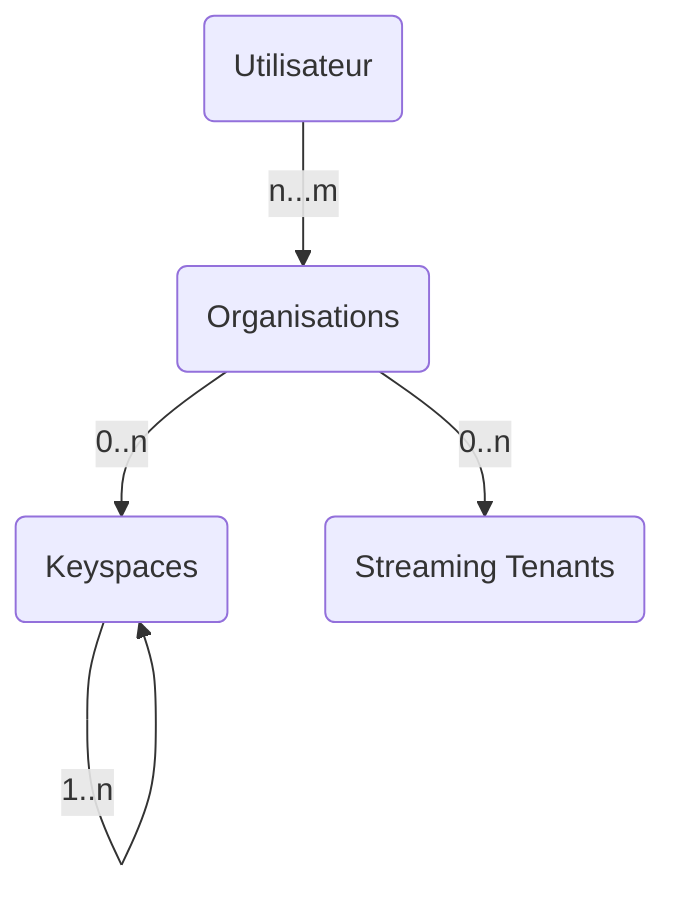
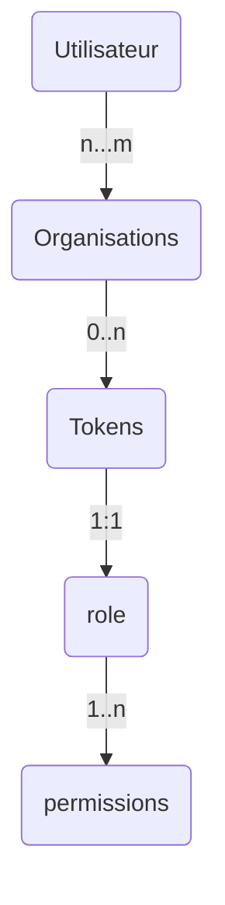

## 🇫🇷 Devoxx France 2022 🇫🇷

### Construire des Applications performantes avec Apache Cassandra™


Bienvenue dans ce workshop de découverte d'Apache Cassandra™ adressé aux **développeurs**. L'objectif est de vous rendre _dangeureux_ avec la technologie et savoir la mettre en oeuvre rapidement sur vos dans vos projets.

[](https://gitpod.io/#https://github.com/datastaxdevs/conference-2022-devoxx)
[](http://www.apache.org/licenses/LICENSE-2.0)
[](https://discord.com/widget?id=685554030159593522&theme=dark)

⏲️ **Durée:** 3 heures

🎓 **Niveau** Débutant à intermédiaire

## 📋 Table des matières.


- [Objectifs](#objectifs)
- [Foire aux questions](#foire-aux-questions)
- [Supports de Formation](#supports-de-formation)
- [#**LAB1** - Création de la base de donnée](#lab1---création-de-la-base-de-donnée)
- [#**LAB2** - Tables et types de données](#5-create-a-table)
- [#**LAB3** - Modèle de données `PetClinic`](#)
- [#**LAB4** - Modèle de données `TimeSeries`](#7-sensor-data-modeling)
- [#**LAB5** - Introduction aux drivers](#)
- [#**LAB6** - Mapping Objet avec les drivers](#)
- [#**LAB7** - Programmation reactive](#)
- [#**LAB8** - Spring Data Cassandra](#12-spring-data-cassandra)
- [#**LAB9** - Cassandra Quarkus extension](#13-cassandra-quarkus-extension)
- [#**LAB10** - Micronaut Cassandra](#)
- [#**LAB11** - Stargate Apis](#)
- [#**LAB12** - Stargate SDK](#)

## Objectifs

- 🎯 Comprendre la nature et l'architecture de la base de donnée NoSQL Apache Cassandra™ pour déterminer les **bons cas d'usage.**
- 🎯 Comprendre les différences fondamentales avec les bases de données relationnelles et la **méthodologie pour construire un modèle de donnée** approprié.
- 🎯 Savoir **utiliser les drivers** pour établir la connexion, construire ses requêtes et implémenter tout type de service.
- 🎯 Disposer d'**exemples fonctionnels** pour bien démarrer avec les principaux frameworks Java: `Spring`, `Quarkus` et `Micronaut`.
- 🎯 Découvrir le composant **Stargate**, comprendre les différentes `Apis`, tester son utilisation avec le `SDK.`

## Foire aux questions

<p/>
<details>
<summary><b> 1️⃣ Quels sont les pré-requis à cette session ? </b></summary>
<hr>
<ul>
<li>Vous devez maîtriser un <b>langage de programmation</b> <i>(Java, Javascript, Python - cette session s'adresse à des développeurs)</i> mais pas nécessairement une grande expérience.
<li>Pour utiliser Gitpod vous aurez besoin d'un <b>compte Github ou Gitlab.</b>
</ul>
</p>
</details>

<p/>
<details>
<summary><b> 2️⃣ Puis-je exécuter les LABS sur ma machine ?</b></summary>
<hr>
<p>Afin de rendre l'expérience la plus agréable possible nous fournissons un environnement dans le cloud avec l'outil Gitpod mais rien de vous empêche d'utiliser votre machine. Durant chaque atelier nous listerons les pré-requis.</p>

<p>Le contenu étant dense, le temps pour l’installation de tous les outils localement est limité. Voici une liste exhaustive:
<ol>
<li><b>Java 8+</b> ainsi que <b>Maven 3.6+</b> pour les LABS avec Java.
<li><b>Python 3+</b> ainsi que <b>pip3</b> pour les LABS avec Python.
<li><b>Node 16+</b> ainsi que <b>NPM 8+</b> pour les LABS avec Javascript.
<li><b>Docker</b> ainsi que <b>Docker-compose</b> pour démarrer les conteneurs.
<li>Une machine disposant d'au moins <b>8Go de mémoire vive.</b>
<li><b>2Go d'espace disque </b>pour télécharger les différents images et outils.
<li>Un atelier de développement logiciel **(IDE)** comme Eclipse, IntelliJ, Netbean...
</ol>
</p>
</details>

<p/>
<details>
<summary><b> 3️⃣ Les outils resteront'ils gratuits après la session ?</b></summary>
<hr>
<b>Absolutement.</b> Toutes les solutions utilisées aujourd'hui sont gratsuites. Pour les démonstrations avec les produits en Saas aucune carte de crédit ne sera demandée ni maintenant ni après.
</details>
<p/>
<details>
<summary><b> 4️⃣ S'agit t'il d'une formation certifiante ?</b></summary>
<hr>


Datastax propose <a href="https://www.datastax.com/dev/certifications">3 certifications </a> autour des technologies Apache Cassandra™. En 3h il nous est impossible de tout couvrir pour prétendre à la certification. Cependant tous les cours nécessaires sont disponibles sur <a href="https://academy.datastax.com">academy.datastax.com"</a> et <a href="https://datastax.com/dev">datastax.com/dev</a>. Participer à cette session (live) vous ouvre le droit à un voucher pour 2 tentatives gratuites aux certifications <i>(au lieu de 145$).</i>.</p>

<p>Vous ne partez pas les mains vides ! Vous repartez avec un tee-shirt ainsi qu'un magnifique BADGE pour se la jouer devant tout le monde sur Twitter et Linkedin. 
</p>
</details>
<p/>

## Supports de Formation

Que vous soyez avec nous pour Devoxx ou que que vous regardiez la session maintenant sur Youtube voici toutes les supports nécessaires:

- [Les slides](slides.pdf)
- [Les différents supports pour LABS](/hands-on)
- [Une invitation sur notre serveur Discord](https://bit.ly/cassandra-workshop) pour poser toutes vos questions.
- [Notre forum, community.datastax.com](https://community.datastax.com/) pour échanger.

[🏠 Table des matières](#-table-des-matières)

## LAB1 - Création de la base de donnée

### 1.1 DBAAS Astra

#### ✅ 1.1 Step a: Créer un compte sur Astra

> 📖 Documentation: [Créer son compte Astra 🇬🇧](https://awesome-astra.github.io/docs/pages/astra/create-account/)

[](https://astra.dev/devoxx)

#### ✅ 1.1 Step b: Créer une base de donnée sur Astra

> 📖 Documentation: [Créer une base de donnée sur Astra 🇬🇧](https://awesome-astra.github.io/docs/pages/astra/create-instance/)

Pour la session aujourd'hui utilisons les valeurs suivantes. Vous pouvez les changer bien sûr mais ce sont celles définies par défaut dans les LABS.

| Paramètre     | Valeur                                                                                                                                                                                   |
| ------------- | ---------------------------------------------------------------------------------------------------------------------------------------------------------------------------------------- |
| Database name | `workshops`                                                                                                                                                                              |
| Keyspace name | `devoxx`                                                                                                                                                                                 |
| Region name   | Prenez `Google Cloud` et l'une des 3 régions `North America/us-east-1`, `Europe/europe-west-1` ou `Asia Pacific/Mumbai`. Les autres ne sont pas dans le plan gratuit et repérées par 🔒. |

**Walkthrough:** _Voici une petite animation mais attention de bien utiliser les valeurs dans le tableau ci-dessus._


Lorsque vous créez un compte vous créez également une Organization, il s'agit de votre tenant. A l'intérieur vous pouvez définir plusieurs bases de données. Vous pouvez inviter d'autres utilisateurs dans votre organisation.



#### ✅ 1.1 Step c: Créer vos identifiants pour Astra

> 📖 Documentation: [Créer vos identifiants pour Astra 🇬🇧](https://awesome-astra.github.io/docs/pages/astra/create-token/#c-procedure)

Lorsque vous créez un jeton, il faut lui associer un role qui regroupe plusieurs permissions.



Pour la session utilisez le role `Database Administrator` pour avoir accès à tout. N'oubliez pas de télécharger le fichier `CSV`, les informations affichées ne seront plus disponibles pour des raisons de sécurité.

| Parameter | Value                    |
| --------- | ------------------------ |
| Role      | `Database Administrator` |

**👁️ Walkthrough:** _Voici une petite animation pour retrouver les étapes_


### 1.2 - Installation avec Docker

[Gitpod](https://www.gitpod.io/) is an IDE 100% online based on [VS Code](https://github.com/gitpod-io/vscode/blob/gp-code/LICENSE.txt?lang=en-US). To initialize your environment simply click on the button below _(CTRL + Click to open in new tab)_ You will be asked for you github account, as needed.

[](https://gitpod.io/#https://github.com/datastaxdevs/conferennce-2022-devoxx)

## 5. Create a table

#### ✅ 5a. Locate the CQL Console

As seen in the slides on the contrary of relational you start with the request and data model BEFORE CODING.

Let's start with the CQL console for the database as whown below.


#### ✅ Step 5b. Describe keyspaces

Ok, now we're ready to rock. Creating tables is quite easy, but before we create one we need to tell the database which keyspace we are working with.

First, let's **_DESCRIBE_** all of the keyspaces that are in the database. This will give us a list of the available keyspaces.

📘 **Command to execute**

```

desc KEYSPACES;

```

_"desc" is short for "describe", either is valid._

> CQL commands usually end with a semicolon `;`. If you hit Enter, nothing happens and you don't even get your prompt back, most likely it's because you have not closed the command with `;`. If in trouble, you can always get back to the prompt with `Ctrl-C` and start typing the command anew.

📗 **Expected output**


#### ✅ Step 5c. Use JavaZone

```sql
use javazone;
```

Depending on your setup you might see a different set of keyspaces than in the image. The one we care about for now is **_javazone_**. From here, execute the **_USE_** command with the **_javazone_** keyspace to tell the database our context is within **_javazone_**.

> Take advantage of the TAB-completion in the CQL Console. Try typing `use kill` and then pressing TAB, for example.

📘 **Command to execute**

```sql
use javazone;
```

📗 **Expected output**


Notice how the prompt displays `<username>@cqlsh:javazone>` informing us we are **using** the **_javazone_** keyspace. Now we are ready to create our table.

**✅ Step 5d. Create the _users_by_city_ table**

At this point we can execute a command to create the **_users_by_city_** table using the information provided during the workshop presentation. Just copy/paste the following command into your CQL console at the prompt.

📘 **Command to execute**

```sql
CREATE TABLE IF NOT EXISTS users_by_city (
	city text,
	last_name text,
	first_name text,
	address text,
	email text,
	PRIMARY KEY ((city), last_name, first_name, email));
```

Then **_DESCRIBE_** your keyspace tables to ensure it is there.

📘 **Command to execute**

```
desc tables;
```

📗 **Expected output**


Aaaand **BOOM**, you created a table in your database. That's it. Now, we'll move to the next section in the presentation and break down the method used to create a data model with Apache Cassandra.

[🏠 Back to Table of Contents](#table-of-contents)

## 6. Execute CRUD operations

CRUD operations stand for create, read, update, and delete. Simply put, they are the basic types of commands you need to work with ANY database in order to maintain data for your applications.

#### ✅ Step 6a. Create a couple more tables

We started by creating the **_users_by_city_** table earlier, but now we need to create some tables to support **user** and **video** comments per the **_"Art of Data Modeling"_** section of the presentation. Let's go ahead and do that now. Execute the following statements to create our tables.

📘 **Commands to execute**

```sql
CREATE TABLE IF NOT EXISTS comments_by_user (
    userid uuid,
    commentid timeuuid,
    videoid uuid,
    comment text,
    PRIMARY KEY ((userid), commentid)
) WITH CLUSTERING ORDER BY (commentid DESC);

CREATE TABLE IF NOT EXISTS comments_by_video (
    videoid   uuid,
    commentid timeuuid,
    userid    uuid,
    comment   text,
    PRIMARY KEY ((videoid), commentid)
) WITH CLUSTERING ORDER BY (commentid DESC);
```

Then **_DESCRIBE_** your keyspace tables to ensure they are both there.

📘 **Command to execute**

```sql
desc tables;
```

📗 **Expected output**


**✅ Step 6b. (C)RUD = create = insert data**

Our tables are in place so let's put some data in them. This is done with the **INSERT** statement. We'll start by inserting data into the **_comments_by_user_** table.

📘 **Commands to execute**

```sql
/* Comment for a given user */
INSERT INTO comments_by_user (
  userid, //uuid: unique id for a user
  commentid, //timeuuid: unique uuid + timestamp
  videoid, //uuid: id for a given video
  comment //text: the comment text
)
VALUES (
  11111111-1111-1111-1111-111111111111,
  NOW(),
  12345678-1234-1111-1111-111111111111,
  'I so grew up in the 80''s'
);

/* More comments for the same user for the same video */
INSERT INTO comments_by_user (userid, commentid, videoid, comment)
VALUES (11111111-1111-1111-1111-111111111111, NOW(), 12345678-1234-1111-1111-111111111111, 'I keep watching this video');
INSERT INTO comments_by_user (userid, commentid, videoid, comment)
VALUES (11111111-1111-1111-1111-111111111111, NOW(), 12345678-1234-1111-1111-111111111111, 'Soo many comments for the same video');

/* A comment from another user for the same video */
INSERT INTO comments_by_user (userid, commentid, videoid, comment)
VALUES (22222222-2222-2222-2222-222222222222, NOW(), 12345678-1234-1111-1111-111111111111, 'I really like this video too!');
```

_Note, we are using "fake" generated UUID's in this dataset. If you wanted to generate UUID's on the fly just use `UUID()` per the documentation [HERE](https://docs.datastax.com/en/cql-oss/3.3/cql/cql_reference/timeuuid_functions_r.html)_.

Ok, let's **INSERT** more this time using the **_comments_by_video_** table.

📘 **Commands to execute**

```sql
/* Comment for a given video */
INSERT INTO comments_by_video (
  videoid, //uuid: id for a given video
  commentid, //timeuuid: unique uuid + timestamp
  userid, //uuid: unique id for a user
  comment //text: the comment text
)
VALUES (
  12345678-1234-1111-1111-111111111111,
  NOW(),
  11111111-1111-1111-1111-111111111111,
  'This is such a cool video'
);

/* More comments for the same video by different users */
INSERT INTO comments_by_video (videoid, commentid, userid, comment)
VALUES(12345678-1234-1111-1111-111111111111, NOW(), 22222222-2222-2222-2222-222222222222, 'Such a killr edit');

/* Ignore the hardcoded value for "commentid" instead of NOW(), we'll get to that later.*/
INSERT INTO comments_by_video (videoid, commentid, userid, comment)
VALUES(12345678-1234-1111-1111-111111111111, 494a3f00-e966-11ea-84bf-83e48ffdc8ac, 77777777-7777-7777-7777-777777777777, 'OMG that guy Patrick is such a geek!');

/* A comment for a different video from another user*/
INSERT INTO comments_by_video (videoid, commentid, userid, comment)
VALUES(08765309-1234-9999-9999-111111111111, NOW(), 55555555-5555-5555-5555-555555555555, 'Never thought I''d see a music video about databases');
```

**✅ Step 6c. C(R)UD = read = read data**

Now that we've inserted a set of data, let's take a look at how to read that data back out. This is done with a **SELECT** statement. In its simplest form we could just execute a statement like the following **\_**cough\*\*\* \*\***\*cough\_**:

```sql
SELECT * FROM comments_by_user;
```

You may have noticed my coughing fit a moment ago. Even though you can execute a **SELECT** statement with no partition key definied this is NOT something you should do when using Apache Cassandra. We are doing it here for illustration purposes only and because our dataset only has a handful of values. Given the data we inserted earlier a more proper statement would be something like:

```sql
SELECT * FROM comments_by_user WHERE userid = 11111111-1111-1111-1111-111111111111;
```

The key is to ensure we are **always selecting by some partition key** at a minimum.

Ok, so with that out of the way let's **READ** the data we _"created"_ earlier with our **INSERT** statements.

📘 **Commands to execute**

```sql
/* Read all data from the comments_by_user table*/
SELECT * FROM comments_by_user;

/* Read all data from the comments_by_video table */
SELECT * FROM comments_by_video;
```

📗 **Expected output**


Once you execute the above **SELECT** statements you should see something like the expected output above. We have now **READ** the data we **INSERTED** earlier. Awesome job!

_BTW, just a little extra for those who are interested. Since we used a [TIMEUUID](https://docs.datastax.com/en/cql-oss/3.3/cql/cql_reference/timeuuid_functions_r.html) type for our **commentid** field we can use the **dateOf()** function to determine the timestamp from the value. Check it out._

```
// Read all data from the comments_by_user table,
// convert commentid into a timestamp, and label the column "datetime"
select userid, dateOf(commentid) as datetime, videoid, comment from comments_by_user;
```

**✅ Step 6d. CR(U)D = update = update data**

At this point we've **_CREATED_** and **_READ_** some data, but what happens when you want to change some existing data to some new value? That's where **UPDATE** comes into play.

Let's take one of the records we created earlier and modify it. If you remember earlier we **_INSERTED_** the following record in the **comments_by_video** table.

```sql
INSERT INTO comments_by_video (
  videoid,
  commentid,
  userid,
  comment
)
VALUES(
  12345678-1234-1111-1111-111111111111,
  494a3f00-e966-11ea-84bf-83e48ffdc8ac,
  77777777-7777-7777-7777-777777777777,
  'OMG that guy Patrick is such a geek!'
);
```

Let's also take a look at the **comments_by_video** table we created earlier. In order to **UPDATE** an existing record we need to know the primary key used to **CREATE** the record.

```sql
CREATE TABLE IF NOT EXISTS comments_by_video (
    videoid   uuid,
    commentid timeuuid,
    userid    uuid,
    comment   text,
    PRIMARY KEY ((videoid), commentid)
) WITH CLUSTERING ORDER BY (commentid DESC);
```

So looking at `PRIMARY KEY ((videoid), commentid)` both **videoid** and **commentid** are used to create a unique row. We'll need both to update our record.

_You may remember that I also glossed over the fact we used a hardcoded value for **commentid** when we created this record. This was done to simulate someone editing an existing comment for a video in our application. Imagine the UX for such a need. At the point a user clicks the "edit" button information for our **videoid** and **commentid** are provided in order to **UPDATE** the record._

We have the information that we need for the update. With that, the command is easy.

📘 **Commands to execute**

```sql
UPDATE comments_by_video
SET comment = 'OMG that guy Patrick is on fleek'
WHERE videoid = 12345678-1234-1111-1111-111111111111 AND commentid = 494a3f00-e966-11ea-84bf-83e48ffdc8ac;

SELECT * FROM comments_by_video;
```

📗 **Expected output**


That's it. All that's left now is to **DELETE** some data.

**✅ Step 6e. CRU(D) = delete = remove data**

The final operation from our **CRUD** acronym is **DELETE**. This is the operation we use when we want to remove data from the database. In Apache Cassandra you can **DELETE** from the cell level all the way up to the partition _(meaning I could remove a single column in a single row or I could remove a whole partition)_ using the same **DELETE** command.

_Generally speaking, it's best to perform as few delete operations as possible on the largest amount of data. Think of it this way, if you want to delete ALL data in a table, don't delete each individual cell, just **TRUNCATE** the table. If you need to delete all the rows in a partition, don't delete each row, **DELETE** the partition and so on._

For our purpose now let's **DELETE** the same row we were working with earlier.

📘 **Commands to execute**

```
DELETE FROM comments_by_video
WHERE videoid = 12345678-1234-1111-1111-111111111111 AND commentid = 494a3f00-e966-11ea-84bf-83e48ffdc8ac;

SELECT * FROM comments_by_video;
```

📗 **Expected output**


Notice the row is now removed from the comments_by_video table, it's as simple as that.

[🏠 Back to Table of Contents](#-table-of-content)

## 7. Sensor Data Modeling

> _All Data modelling samples can be found in the [Katacoda LIbrary](https://www.katacoda.com/datastax/courses/cassandra-data-modeling)_

- [Data Modelling methodology](https://www.datastax.com/learn/data-modeling-by-example/sensor-data-model)


- [Katacoda Scenario](https://www.katacoda.com/datastax/courses/cassandra-data-modeling/sensor-data)

[🏠 Back to Table of Contents](#-table-of-content)

## 8. Order Management System Data Modelling

- [Data Modelling methodology](https://www.datastax.com/learn/data-modeling-by-example/order-management)


- [Katacoda Scenario](https://www.katacoda.com/datastax/courses/cassandra-data-modeling/order-management-data)

[🏠 Back to Table of Contents](#-table-of-content)

## 9. Create Astra Token

To connect to the database from Java code we need some credentials, this is what we are going to do here.

#### ✅ 6a. Generate Token

Following the [Manage Application Tokens docs](https://docs.datastax.com/en/astra/docs/manage-application-tokens.html) create a token with `Database Admnistrator` roles.

- Go the `Organization Settings`

- Go to `Token Management`

- Pick the role `Database Admnistrator` on the select box

- Click Generate token

**👁️ Walkthrough**


This is what the token page looks like. You can now download the values as a CSV. We will need those values but you can also keep this window open for use later.


Notice the clipboard icon at the end of each value.

- `clientId:` We will use it as a _username_ to contact to the Cassandra database

- `clientSecret:` We will use it as a _password_ to contact to the Cassandra database

- `appToken:` We will use it as a api token Key to interact with APIs.

#### ✅ 6b. Copy your token in your clipboard

To know more about roles of each token you can have a look to [this video.](https://www.youtube.com/watch?v=TUTCLsBuUd4&list=PL2g2h-wyI4SpWK1G3UaxXhzZc6aUFXbvL&index=8)

**Note: Make sure you don't close the window accidentally or otherwise - if you close this window before you copy the values, the application token is lost forever. They won't be available later for security reasons.**

We are now set with the database and credentials. Let's start coding with Spring !

[🏠 Back to Table of Contents](#-table-of-content)

## 10. Native Drivers

Let start browsing some JAVA code `\_0_/`.

> ⚠️We expect you to be an experienced JAVA DEVELOPER.

### ✅ 10a. Prerequisite

#### 📦 Docker

- Use the [reference documentation](https://www.docker.com/products/docker-desktop) to install **Docker Desktop**
- Validate your installation with

```bash
docker -v
docker run hello-world
```

#### 📦 Java Development Kit (JDK) 8+

- Use the [reference documentation](https://docs.oracle.com/javase/8/docs/technotes/guides/install/install_overview.html) to install a **Java Development Kit**
- Validate your installation with

```bash
java --version
```

#### 📦 Apache Maven

- Use the [reference documentation](https://maven.apache.org/install.html) to install **Apache Maven**
- Validate your installation with

```bash
mvn -version
```

#### ✅ 10b. Setup your environment

Locate the folder `hands-on` on the repo and import the 4 projects in your favourite IDE and let it download half of internet....

```
javazone-1-cassandra-drivers
javazone-2-spring-data
javazone-3-quarkus
javazone-4-sdk
```

> ℹ️ _Full disclosure_: It is NOT a multi module maven (sorry), those are a grouping of multiple projects we have been building. Idea is to give you a lot of code to copy and get inspired. Some samples are standalone classes, others are unit tests.

#### ✅ 10c. Keyspace Manipulations

Astra is a great DBAAS for Cassandra yet, because it creates you everything you need you cannot really show options. As a consequence we will be using a local Cassandra in Docker.

```yaml
cassandra-seed:
  image: cassandra:4.0.1
  ports:
    - 7000:7000
    - 7001:7001
    - 7199:7199
    - 9042:9042
    - 9160:9160
  mem_limit: 2G
  environment:
    - HEAP_NEWSIZE=128M
    - MAX_HEAP_SIZE=1024M
    - CASSANDRA_SEEDS=cassandra-seed
    - CASSANDRA_CLUSTER_NAME=javazone
    - CASSANDRA_DC=dc1
    - CASSANDRA_ENDPOINT_SNITCH=GossipingPropertyFileSnitch
```

- _Start the Container, and **wait 30s** for the node to bootstrap_

```bash
docker-compose up -d
```

- _Open CQLSH in interactive mode_

```bash
docker exec -it `docker ps | grep cassandra:4.0.1 | cut -b 1-12` cqlsh
```

- _Show MetaData_ :

```bash
cd 1-cassandra-drivers
mvn exec:java -Dexec.mainClass=com.datastax.samples.E01_ClusterShowMetaData
```

- _Create the Keyspace_ :

```bash
mvn exec:java -Dexec.mainClass=com.datastax.samples.E02_CreateKeyspace
```

- _You have now a new keyspace 'javazone'_

```sql
describe keyspaces;
```

or

```bash
docker exec -it `docker ps | grep cassandra:4.0.1 | cut -b 1-12` cqlsh -e "describe keyspaces"
```

- _Create the Schema_ :

```bash
mvn exec:java -Dexec.mainClass=com.datastax.samples.E03_CreateSchema
```

- _You have now 4 tables_

```sql
use javazone;
describe tables;
```

- _Connect with configuration File_

```bash
mvn exec:java -Dexec.mainClass=com.datastax.samples.E04_ConfigurationFile
```

- _Connect with Explicit Configuration_

```bash
mvn exec:java -Dexec.mainClass=com.datastax.samples.E05_ProgrammaticConfiguration
```

- _Drop Schema_

```bash
mvn exec:java -Dexec.mainClass=com.datastax.samples.E06_DropSchema
```

- _Drop Keyspace_

```bash
mvn exec:java -Dexec.mainClass=com.datastax.samples.E07_DropKeyspace
```

#### ✅ 10d. Connect to Astra

- _Download the secure-connect-bundle.zip_


- _Edit `E08_ConnectToAstraProgrammatic` to override the settings_

```java
final String ASTRA_ZIP_FILE     = "/tmp/secure-connect-javazone.zip";
final String ASTRA_KEYSPACE     = "javazone";
final String ASTRA_CLIENTID     = "<change_me>";
final String ASTRA_CLIENTSECRET = "<change_me>";
```

- _Execute `E08_ConnectToAstraProgrammatic` to override the settings_

```bash
mvn exec:java -Dexec.mainClass=com.datastax.samples.E08_ConnectToAstraProgrammatic
```

- _Report same edits in the Configuration file `custom_astra.conf`_

```TypeScript
datastax-java-driver {

  basic {
    session-keyspace = javazone
    request {
       timeout     = 8 seconds
       consistency = LOCAL_QUORUM
       page-size = 5000
    }
    cloud {
      secure-connect-bundle = /tmp/secure-connect-javazone.zip
    }
  }

  advanced {
    connection {
      init-query-timeout = 10 seconds
      set-keyspace-timeout = 10 seconds
    }
    control-connection.timeout = 10 seconds
    auth-provider {
      class = PlainTextAuthProvider
      username = "<change_me>"
      password = "<change_me>"
    }
  }
}
```

- _Execute `E09_ConnectToAstraConfFile` to validate your settings_

```bash
mvn exec:java -Dexec.mainClass=com.datastax.samples.E09_ConnectToAstraConfFile
```

#### ✅ 10e. Use all Drivers Features

For the following samples the connection remains the same using your configuration file.

- _Execute `E10_GettingStarted` to work with table USERS_

```bash
mvn exec:java -Dexec.mainClass=com.datastax.samples.E10_GettingStarted
```

- _In Astra CQL Console you can now_

```sql
select * from javazone.users;
```

- _Execute `E11_SimpleCrud` to work with table USERS_

```bash
mvn exec:java -Dexec.mainClass=com.datastax.samples.E11_SimpleCrud
```

- _Execute `E12_Paging` to work with table USERS_

```bash
mvn exec:java -Dexec.mainClass=com.datastax.samples.E12_Paging
```

- _Execute `E13_Batches` to work with table USERS_

```bash
mvn exec:java -Dexec.mainClass=com.datastax.samples.E13_Batches
```

- _Execute `E14_ListSetMapAndUdt` to work with nested Structures_

```bash
mvn exec:java -Dexec.mainClass=com.datastax.samples.E14_ListSetMapAndUdt
```

- _Execute `E15_Json` to work with nested Structures_

```bash
mvn exec:java -Dexec.mainClass=com.datastax.samples.E15_Json
```

- _Execute `E16_Async`_

```bash
mvn exec:java -Dexec.mainClass=com.datastax.samples.E16_Async
```

- _Execute `E17_Reactive`_

```bash
mvn exec:java -Dexec.mainClass=com.datastax.samples.E17_Reactive
```

- _Execute `E18_Counters`_

```bash
mvn exec:java -Dexec.mainClass=com.datastax.samples.E18_Counters
```

- _Execute `E19_LightweightTransactions`_

```bash
mvn exec:java -Dexec.mainClass=com.datastax.samples.E19_LightweightTransactions
```

- _Execute `E20_BlobAndCodec`_

```bash
mvn exec:java -Dexec.mainClass=com.datastax.samples.E20_BlobAndCodec
```

## 11. Drivers Object Mapping

### ✅ 11a. Browse Code

The mapping from Object to Tables is avaible in the native drivers Ad Hoc, no need for an external framework. Get more information in the [reference documentation](https://docs.datastax.com/en/developer/java-driver/4.13/manual/mapper/)

- _We imported the following library_

```xml
<dependency>
  <groupId>com.datastax.oss</groupId>
  <artifactId>java-driver-mapper-runtime</artifactId>
  <version>${cassandra.driver.oss.version}</version>
</dependency>
```

- _And enable the annotation processor_. Sometimes you need to explicitely invoke a `mvn package` to generate the expected classes.

```xml
<plugins>
 <plugin>
  <groupId>org.apache.maven.plugins</groupId>
  <artifactId>maven-compiler-plugin</artifactId>
  <configuration>
   <release>11</release>
   <source>11</source>
   <target>11</target>
   <annotationProcessorPaths>
    <path>
     <groupId>com.datastax.oss</groupId>
     <artifactId>java-driver-mapper-processor</artifactId>
    </path>
   </annotationProcessorPaths>
  </configuration>
 </plugin>
</plugins>
```

- _Create a Bean mapped from the table_

```java
@Entity
@CqlName("myTable")
public class CommentByUser {
    @PartitionKey
    UUID userid;

    @ClusteringColumn
    UUID commentid;

    UUID videoid;

    String comment;
}
```

- _Look at the DAO_

```java
@Dao
public interface CommentDao extends CassandraSchemaConstants {

    @Query("SELECT * FROM ${keyspaceId}.${tableId} "
         + "WHERE " + COMMENT_BY_USER_USERID + " = :userid ")
    PagingIterable<CommentByUser> retrieveUserComments(UUID userid);
```

- _Look at the Mapper_

```java
@Mapper
public interface CommentDaoMapper {
 @DaoFactory
 CommentDao commentDao();

 static MapperBuilder<CommentDaoMapper> builder(CqlSession session) {
   return new CommentDaoMapperBuilder(session);
 }
}
```

### ✅ 11b. Run the Setp

```bash
mvn exec:java -Dexec.mainClass=com.datastax.samples.E21_ObjectMapping
```

[🏠 Back to Table of Contents](#-table-of-content)

## 12. Spring Data Cassandra

To isolate the `Spring Data` work from what we did previous let's create a new keypace.

### ✅ 12a. Create a keyspace

- _Locate the `new keyspace` button on the DB home page_


- \*Create the `spring_data` keyspace the DB will shoft in maintenance for a few seconds.


### ✅ 12b. Setup the application

- Import the project `2-spring-data` in your IDE.

- Locate the configuration file `application.properties` in the folder `src/main/resources`.

- Edit the Spring configuration file updating `username`, `password` and `secure-connect-bundle` properties as shown below

```ini
spring.data.cassandra.schema-action=CREATE_IF_NOT_EXISTS
spring.data.cassandra.request.timeout=10s
spring.data.cassandra.connection.connect-timeout=10s
spring.data.cassandra.connection.init-query-timeout=10s

# -- Keys to be filled
spring.data.cassandra.keyspace-name=spring_data
spring.data.cassandra.username=<client_id>
spring.data.cassandra.password=<client_secret>

datastax.astra.secure-connect-bundle=/tmp/secure-connect-javazone.zip
```

### ✅ 12c. Validate configuration and create schema

- _Check Connectivity_

```bash
cd ../2-spring-data
mvn test -Dtest=com.datastax.workshop.E22_SpringDataAstraConnectivity
```

- _Create Schema if needed_

```bash
mvn test -Dtest=com.datastax.workshop.E23_CreateSchemaInAstraTest
```

### ✅ 12d. Browse the code

- _Project configuration, notice we are using a dedicated Spring Boot Starter_

```xml
<dependency>
  <groupId>org.springframework.boot</groupId>
  <artifactId>spring-boot-starter-data-cassandra</artifactId>
</dependency>
```

- _Create a Projo_

```java
@Table(value = TodoEntity.TABLENAME)
public class TodoEntity {

 public static final String TABLENAME        = "todos";
 public static final String COLUMN_UID       = "uid";
 public static final String COLUMN_TITLE     = "title";
 public static final String COLUMN_COMPLETED = "completed";
 public static final String COLUMN_ORDER     = "offset";

 @PrimaryKey
 @Column(COLUMN_UID)
 @CassandraType(type = Name.UUID)
 private UUID uid;

 @Column(COLUMN_TITLE)
 @CassandraType(type = Name.TEXT)
 private String title;

 @Column(COLUMN_COMPLETED)
 @CassandraType(type = Name.BOOLEAN)
 private boolean completed = false;

 @Column(COLUMN_ORDER)
 @CassandraType(type = Name.INT)
 private int order = 0;

 public TodoEntity(String title, int offset) {
   this(UUID.randomUUID(), title, false, offset);
 }
}
```

- _Create the Repository (An interface !) extending `CassandraRepository`_

```java
@Repository
public interface TodoRepositoryCassandra extends CassandraRepository<TodoEntity, UUID> {
}
```

- _Create a Better Repository now extending `SimpleCassandraRepository` to have access to CqlSession._

```java
@Repository
public class TodoRepositorySimpleCassandra extends SimpleCassandraRepository<TodoEntity, UUID> {

 protected final CqlSession cqlSession;

 protected final CassandraOperations cassandraTemplate;

 @SuppressWarnings("unchecked")
 public TodoRepositorySimpleCassandra(CqlSession cqlSession, CassandraOperations ops) {
   super(new MappingCassandraEntityInformation<TodoEntity, UUID>(
     (CassandraPersistentEntity<TodoEntity>) ops.getConverter().getMappingContext()
     .getRequiredPersistentEntity(TodoEntity.class), ops.getConverter()), ops);
   this.cqlSession = cqlSession;
   this.cassandraTemplate = ops;
 }

}
```

### ✅ 12e. Start the application

Start

```
mvn spring-boot:run
```

You can access Hello world

```
http://localhost:8080/
```

You can interact with the API

```

```

You can work with an external user interface

```

```

[🏠 Back to Table of Contents](#-table-of-content)

## 13. Cassandra Quarkus extension

To isolate the `Quarkus` work from what we did previous let's create a new keypace.

### ✅ 13a. Create a keyspace

- _Locate the `new keyspace` button on the DB home page_


- \*Create the `spring_data` keyspace the DB will shoft in maintenance for a few seconds.


### ✅ 13b. Setup the application

- Import the project `3-quarkus` in your IDE.

- Locate the configuration file `application.properties` in the folder `src/main/resources` (sounds familiar ?)

- Edit the Quarkusconfiguration file updating `username`, `password` and `secure-connect-bundle` properties as shown below

```ini
quarkus.cassandra.keyspace=quarkus
quarkus.cassandra.cloud.secure-connect-bundle=/tmp/secure-connect-javazone.zip
quarkus.cassandra.auth.username=<client_id>
quarkus.cassandra.auth.password=<client_secret>
```

### ✅ 13c. Validate configuration

- _Check Connectivity_

```bash
cd ../3-quarkus
mvn test -Dtest=com.datastaxdev.E24_QuarkusAstraConnectivity
```

### ✅ 13d. Browse the code

- _Project configuration, notice we are not using the same set of drivers_

```xml
<dependency>
  <groupId>com.datastax.oss.quarkus</groupId>
  <artifactId>cassandra-quarkus-client</artifactId>
  <version>1.1.1</version>
</dependency>
```

- _Define a Pojo_

```java
@RegisterForReflection
public class Todo {
   private String id;
   private String title;
   private boolean completed;
   // Getter and setters
}
```

### ✅ 13e. Start the Application

- _Start the application_

```
mvn quarkus:dev -DskipTests
```

The application starts

```
2021-12-02 17:53:52,114 WARN  [com.dat.oss.qua.dep.int.CassandraClientProcessor] (build-16) Micrometer metrics were enabled by configuration, but MicrometerMetricsFactory was not found.
2021-12-02 17:53:52,116 WARN  [com.dat.oss.qua.dep.int.CassandraClientProcessor] (build-16) Make sure to include a dependency to the java-driver-metrics-micrometer module.
__  ____  __  _____   ___  __ ____  ______
 --/ __ \/ / / / _ | / _ \/ //_/ / / / __/
 -/ /_/ / /_/ / __ |/ , _/ ,< / /_/ /\ \
--\___\_\____/_/ |_/_/|_/_/|_|\____/___/
2021-12-02 17:53:52,758 INFO  [com.dat.oss.dri.int.cor.DefaultMavenCoordinates] (Quarkus Main Thread) DataStax Java driver for Apache Cassandra(R) (com.datastax.oss:java-driver-core) version 4.13.0
2021-12-02 17:53:53,067 INFO  [com.dat.oss.qua.run.int.qua.CassandraClientStarter] (Quarkus Main Thread) Eagerly initializing Quarkus Cassandra client.
2021-12-02 17:53:53,919 INFO  [com.dat.oss.dri.int.cor.tim.Clock] (vert.x-eventloop-thread-0) Using native clock for microsecond precision
2021-12-02 17:53:55,381 INFO  [com.dat.oss.dri.int.cor.ses.DefaultSession] (vert.x-eventloop-thread-8) [s0] Negotiated protocol version V4 for the initial contact point, but cluster seems to support V5, keeping the negotiated version
**** Table created true****
2021-12-02 17:53:56,344 INFO  [io.quarkus] (Quarkus Main Thread) javazone-3-quarkus 0.0.1-SNAPSHOT on JVM (powered by Quarkus 2.3.1.Final) started in 5.326s. Listening on: http://localhost:8080
2021-12-02 17:53:56,346 INFO  [io.quarkus] (Quarkus Main Thread) Profile dev activated. Live Coding activated.
2021-12-02 17:53:56,346 INFO  [io.quarkus] (Quarkus Main Thread) Installed features: [cassandra-client, cdi, kubernetes, micrometer, resteasy-reactive, resteasy-reactive-jackson, smallrye-context-propagation, smallrye-health, smallrye-openapi, swagger-ui, vertx]

Tests paused
Press [r] to resume testing, [o] Toggle test output, [h] for more options
```

- \*Press `h` to show more options

```bash
== Continuous Testing

[r] - Resume testing
[o] - Toggle test output (disabled)

== HTTP

[w] - Open the application in a browser
[d] - Open the Dev UI in a browser

== System

[s] - Force restart
[i] - Toggle instrumentation based reload (disabled)
[l] - Toggle live reload (enabled)
[j] - Toggle log levels (INFO)
[h] - Shows this help
[q] - Quits the application
```

- \*Press `w` to see the [web UI](http://localhost:8080/)


[🏠 Back to Table of Contents](#-table-of-content)

## 14. Overview of Stargate APis

lmn

[🏠 Back to Table of Contents](#-table-of-content)

## 15. Astra and Stargate SDK

pqr

[🏠 Back to Table of Contents](#-table-of-content)
