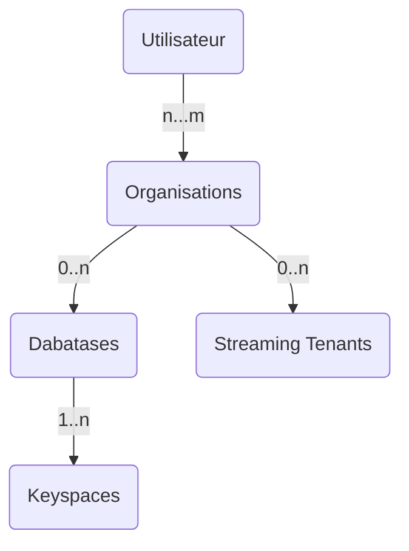
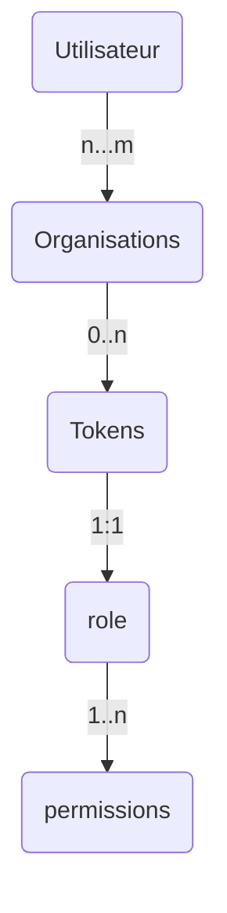

## 🇫🇷 Devoxx France 2022 🇫🇷

[](https://gitpod.io/#https://github.com/datastaxdevs/conference-2022-devoxx)
[](http://www.apache.org/licenses/LICENSE-2.0)
[](https://discord.com/widget?id=685554030159593522&theme=dark)

### Construire des Applications performantes avec Apache Cassandra™


Bienvenue dans ce workshop de découverte d'Apache Cassandra™ adressé aux **développeurs**. L'objectif est de vous rendre _dangeureux_ avec la technologie et savoir la mettre en oeuvre rapidement sur vos dans vos projets.

⏲️ **Durée:** 3 heures

🎓 **Niveau** Débutant à intermédiaire


## 📋 Table des matières.

- [Objectifs](#objectifs)
- [Foire aux questions](#foire-aux-questions)
- [Supports de Formation](#supports-de-formation)
- [#**LAB 1** - Initialisation des Environnements](#lab1---création-de-la-base-de-donnée)
  - 1.1 - Démarrage de `Gitpod`
  - 1.2 - Apache Cassandra™ dans `Docker`
  - 1.3 - Apache Cassandra™ avec `Astra` (dbaas)
- [#**LAB 2** - Les Fondamentaux d'Apache Cassandra™](#lab2---tables-et-types-de-données)
  - 2.1 - Tables et types de données simples
  - 2.2 - Opérations Create, Read, Update, Delete
  - 2.3 - Grammaire des requêtes avec CQL
  - 2.4 - Types de données avancés
  - 2.5 - Lightweight Transactions
  - 2.6 - Batches
  - 2.7 - Indexes secondaires
  - 2.8 - Niveaux de consistance
- [#**LAB 3** - La modélisation de données par l'exemple](#lab3--modèle-de-données-petclinic)
  - 3.1 - Méthodologie
  - 3.2 - Modèle de données timeseries
  - 3.2 - De SQL à NoSQL avec Petclinic
- [#**LAB 4** - Introduction aux drivers](#lab4---introduction-aux-drivers)
  - 4.1 - Connectivité
  - 4.2 - Création des `Statements`
  - 4.3 - Parsing des résultats
  - 4.4 - Pagination
  - 4.5 - Programmation Asynchrone
  - 4.6 - Programmation Réactive
  - 4.7 - Object Mapping
- [#**LAB 5** - Spring Data Cassandra](#lab8---spring-data-cassandra)
  - 5.1 - Configuration
  - 5.2 - Les `Repositories`
  - 5.3 - CassandraOperations
  - 5.4 - Application Spring Boot
- [#**LAB 6** - Cassandra Quarkus extension](#lab9---cassandra-quarkus-extension)
  - 6.1 - Configuration
  - 6.2 - Application Quarkus
- [#**LAB 7** - Micronaut Cassandra](#lab10---micronaut-cassandra)
  - 7.1 - Configuration
  - 7.2 - Application Micronaut
- [#**LAB 8** - Stargate Apis](#lab11---stargate-apis)
  - 8.1 - Introduction à Stargate
  - 8.2 - Rest Apis
  - 8.3 - Document Apis
  - 8.4 - GraphQL Apis
  - 8.5 - Configuration de SDKs
  - 8.6 - Utilisation des SDKs

## Objectifs

- 🎯 Comprendre la nature et l'architecture de la base de donnée NoSQL Apache Cassandra™ pour déterminer les **bons cas d'usage.**
- 🎯 Comprendre les différences fondamentales avec les bases de données relationnelles et la **méthodologie pour construire un modèle de donnée** approprié.
- 🎯 Savoir **utiliser les drivers** pour établir la connexion, construire ses requêtes et implémenter tout type de service.
- 🎯 Disposer d'**exemples fonctionnels** pour bien démarrer avec les principaux frameworks Java: `Spring`, `Quarkus` et `Micronaut`.
- 🎯 Découvrir le composant **Stargate**, comprendre les différentes `Apis`, tester son utilisation avec le `SDK.`

## Foire aux questions

<p/>
<details>
<summary><b> 1️⃣ Quels sont les pré-requis à cette session ? </b></summary>
<hr>
<ul>
<li>Vous devez maîtriser un <b>langage de programmation</b> <i>(Java, Javascript, Python - cette session s'adresse à des développeurs)</i> mais pas nécessairement une grande expérience.
<li>Pour utiliser Gitpod vous aurez besoin d'un <b>compte Github ou Gitlab.</b>
</ul>
</p>
</details>

<p/>
<details>
<summary><b> 2️⃣ Puis-je exécuter les LABS sur ma machine ?</b></summary>
<hr>
<p>Afin de rendre l'expérience la plus agréable possible nous fournissons un environnement dans le cloud avec l'outil Gitpod mais rien de vous empêche d'utiliser votre machine. Durant chaque atelier nous listerons les pré-requis.</p>

<p>Le contenu étant dense, le temps pour l’installation de tous les outils localement est limité. Voici une liste exhaustive:
<ol>
<li><b>Java 8+</b> ainsi que <b>Maven 3.6+</b> pour les LABS avec Java.
<li><b>Python 3+</b> ainsi que <b>pip3</b> pour les LABS avec Python.
<li><b>Node 16+</b> ainsi que <b>NPM 8+</b> pour les LABS avec Javascript.
<li><b>Docker</b> ainsi que <b>Docker-compose</b> pour démarrer les conteneurs.
<li>Une machine disposant d'au moins <b>8Go de mémoire vive.</b>
<li><b>2Go d'espace disque </b>pour télécharger les différents images et outils.
<li>Un atelier de développement logiciel **(IDE)** comme Eclipse, IntelliJ, Netbean...
</ol>
</p>
</details>

<p/>
<details>
<summary><b> 3️⃣ Les outils resteront'ils gratuits après la session ?</b></summary>
<hr>
<b>Absolutement.</b> Toutes les solutions utilisées aujourd'hui sont gratsuites. Pour les démonstrations avec les produits en Saas aucune carte de crédit ne sera demandée ni maintenant ni après.
</details>
<p/>
<details>
<summary><b> 4️⃣ S'agit t'il d'une formation certifiante ?</b></summary>
<hr>


Datastax propose <a href="https://www.datastax.com/dev/certifications">3 certifications </a> autour des technologies Apache Cassandra™. En 3h il nous est impossible de tout couvrir pour prétendre à la certification. Cependant tous les cours nécessaires sont disponibles sur <a href="https://academy.datastax.com">academy.datastax.com"</a> et <a href="https://datastax.com/dev">datastax.com/dev</a>. Participer à cette session (live) vous ouvre le droit à un voucher pour 2 tentatives gratuites aux certifications <i>(au lieu de 145$).</i>.</p>

<p>Vous ne partez pas les mains vides ! Vous repartez avec un tee-shirt ainsi qu'un magnifique BADGE pour se la jouer devant tout le monde sur Twitter et Linkedin. 
</p>
</details>
<p/>

## Supports de Formation

Que vous soyez avec nous pour Devoxx ou que que vous regardiez la session maintenant sur Youtube voici toutes les supports nécessaires:

- [Les slides](slides.pdf)
- [Les différents supports pour LABS](/hands-on)
- [Une invitation sur notre serveur Discord](https://bit.ly/cassandra-workshop) pour poser toutes vos questions.
- [Notre forum, community.datastax.com](https://community.datastax.com/) pour échanger.

## LAB1 - Création de la base de donnée

## 1.1 - Démarrage de `Gitpod`

[Gitpod](https://www.gitpod.io/) est un IDE 100% dans le cloud. Il s'appuie sur [VS Code](https://github.com/gitpod-io/vscode/blob/gp-code/LICENSE.txt?lang=en-US) mais fourni également de nombreux outils pour développer.

#### `✅.001`- _Click-Droit_ sur le bouton pour ouvrir gitpod dans un nouveau TAB.

[](https://gitpod.io/#https://github.com/datastaxdevs/conferennce-2022-devoxx)

## 1.2 - Apache Cassandra™ dans `Docker`

> ℹ️ Lors du premier copier-coller le navigateur vous invite à autoriser les copies depuis le presse-papier, il est nécessaire de le faire.

Lorsque Gitpod est démarré, localiser le terminal `cassandra-docker`. Il devrait contenir uniquement un message en bleu.

```
------------------------------------------------------------
---        Bienvenue à Devoxx France 2022                ---
--           Local Cassandra (Docker)                    ---
------------------------------------------------------------
```

### 1.2.1 - Démarrage du cluster

Dans le répertoire `labs` repérer le fichier `docker-compose.yml`. Nous allons utiliser l'[image officielle Docker Cassandra](https://hub.docker.com/_/cassandra/).

#### `✅.002`- Ouvrir le fichier et visualiser comment le `seed` est un service séparé. La recommentation est de 1 à 2 `seeds` par datacenter (anneau).

```bash
gp open /workspace/conference-2022-devoxx/labs/docker-compose.yml
```

#### `✅.003`- Lancer les 2 premiers noeuds avec `docker-compose`

```bash
cd /workspace/conference-2022-devoxx/labs/
docker-compose up -d
```

> 🖥️ Résultat
>
> ```
> [+] Running 3/3
>  ⠿ Network labs_cassandra           Created      0.0s
>  ⠿ Container labs-dc1_seed-1        Started      0.4s
>  ⠿ Container labs-dc1_noeud-1       Started      1.2s
> ```

#### `✅.004`- Afficher le statut des conteneurs

Les deux services démarrent. Le second attendra le bootstrap du seed (30s). Pour avoir le statut utiliser docker:

```bash
docker ps
```

#### `✅.005`- Afficher le statut des conteneurs avec `docker-compose`

```bash
 docker-compose ps
```

> 🖥️ Résultat
>
> ```bash
>     Name                    Command               State                                        Ports
> --------------------------------------------------------------------------------------------------------------------------------------------
> labs_dc1_noeud_1   docker-entrypoint.sh /bin/ ...   Up      7000/tcp, 7001/tcp, 7199/tcp, 9042/tcp, 9160/tcp
> labs_dc1_seed_1    docker-entrypoint.sh cassa ...   Up      7000/tcp, 7001/tcp, 7199/tcp, 0.0.0.0:9042->9042/tcp,:::9042->9042/tcp, 9160/tcp
> ```

#### `✅.006`- Sauvegarder l'identifiant de conteneur

```bash
export dc1_seed_containerid=`docker ps | grep dc1_seed | cut -b 1-12`
echo "container ID saved: $dc1_seed_containerid"
```

#### `✅.007`- Vérification du démarrage du cluster

```
docker exec -it $dc1_seed_containerid nodetool status
```

> 🖥️ Résultat (après environ 1min)
>
> ```
> Datacenter: dc1
> ===============
> Status=Up/Down
> |/ State=Normal/Leaving/Joining/Moving
> --  Address     Load       Tokens  Owns (effective)  Host > ID                               Rack
> UN  172.28.0.2  69.05 KiB  16      100.0%8707bea1-ac47-4da0-9e96-5541d3e1431d  rack1
> UN  172.28.0.3  69.05 KiB  16      100.0%            25f43936-be10-471d-b8ac-7efe93834712  rack1
> ```

### 1.2.2 - Scale up du cluster

#### `✅.008`- Ajouter le 3e noeud (scaling du noeud non seed).

On notera que la commande n'est pas trop car elle redémarre le `dc1_noeud` existant mais l'ancienne `docker-compose scale` est déprécié. Bon c'est cool cela démontre que Cassandra gère les environnements hostiles.

```bash
docker-compose up --scale dc1_noeud=2 -d
```

#### `✅.009`- Vérifier le statut après environ minute

```bash
docker exec -it $dc1_seed_containerid nodetool status
```

> 🖥️ Résultat (après environ 1min)
>
> ```
> Datacenter: dc1
> ===============
> Status=Up/Down
> |/ State=Normal/Leaving/Joining/Moving
> --  Address     Load       Tokens  Owns (effective)  Host > ID                               Rack
> UN  172.28.0.2  69.05 KiB  16      100.0%8707bea1-ac47-4da0-9e96-5541d3e1431d  rack1
> UN  172.28.0.3  69.05 KiB  16      100.0%            25f43936-be10-471d-b8ac-7efe93834712  rack1
> UN  172.28.0.4  69.06 KiB  16      76.0%             fe43b0d0-952b-48ec-86e1-d73ace617dc8  rack1
> ```

### 1.2.3 - Création d'un `keyspace'

#### `✅.010`- Ouvrez un console CQLSH interactif

```bash
docker exec -it $dc1_seed_containerid cqlsh
```

#### `✅.011`- Vous êtes sur le noeud `dc1_seed`

```sql
select cluster_name,data_center,rack,broadcast_address from system.local;
```

> 🖥️ Résultat (après environ 1min)
>
> ```
>  cluster_name | data_center | rack  | broadcast_address
> --------------+-------------+-------+-------------------
>       handson |         dc1 | rack1 |        172.28.0.2
>
> (1 rows)
> ```

#### `✅.012`- Et vous avez 2 autres noeuds:

```sql
select data_center,rack,peer from system.peers;
```

> 🖥️ Résultat (après environ 1min)
>
> ```
> cqlsh> select data_center,rack,peer from system.peers;
>
> data_center | rack  | peer
> -------------+-------+------------
>         dc1 | rack1 | 172.28.0.4
>         dc1 | rack1 | 172.28.0.3
>
> (2 rows)
> ```

#### `✅.013`- Création du keyspace

```
CREATE KEYSPACE IF NOT EXISTS devoxx
WITH REPLICATION = {'class' : 'NetworkTopologyStrategy', 'dc1' : 3};
```

#### `✅.014`- Vérification

```sql
describe keyspaces;
```

> 🖥️ Résultat (après environ 1min)
>
> ```
> devoxx  system_auth         system_schema  system_views
> system  system_distributed  system_traces  system_virtual_schema
> ```

## 1.3 - Apache Cassandra™ avec `Astra` (dbaas)

Astra est un logiciel de sofware-as-a-service dans le cloud que l'on peut utiliser gratuitement jusqu'à quelques millions de requêtes par mois sans carte de crédit ni limite de temps, parfait pour les environnements de tests et workshop ^\_^.

### 1.3.1 - Configuration Astra

#### `✅.015`- Créer un compte sur Astra

> 📖 Documentation: [Créer son compte Astra 🇬🇧](https://awesome-astra.github.io/docs/pages/astra/create-account/)

[](https://astra.dev/devoxx)

#### `✅.016`- Créer une base de donnée sur Astra

> 📖 Documentation: [Créer une base de donnée sur Astra 🇬🇧](https://awesome-astra.github.io/docs/pages/astra/create-instance/)

Pour la session aujourd'hui utilisons les valeurs suivantes. Vous pouvez les changer bien sûr mais ce sont celles définies par défaut dans les LABS.

| Paramètre     | Valeur                                                                                                                                                                                   |
| ------------- | ---------------------------------------------------------------------------------------------------------------------------------------------------------------------------------------- |
| Database name | `workshops`                                                                                                                                                                              |
| Keyspace name | `devoxx`                                                                                                                                                                                 |
| Region name   | Prenez `Google Cloud` et l'une des 3 régions `North America/us-east-1`, `Europe/europe-west-1` ou `Asia Pacific/Mumbai`. Les autres ne sont pas dans le plan gratuit et repérées par 🔒. |

> 🖥️ **Résultat:**
>
> _Voici une petite animation mais attention à bien utiliser les valeurs dans le tableau ci-dessus._
>
> 

Lorsque vous créez un compte vous créez également une Organization, il s'agit de votre tenant. A l'intérieur vous pouvez définir plusieurs bases de données. Vous pouvez inviter d'autres utilisateurs dans votre organisation.



#### `✅.017`- Créer vos identifiants sur Astra

> 📖 Documentation: [Créer vos identifiants pour Astra 🇬🇧](https://awesome-astra.github.io/docs/pages/astra/create-token/#c-procedure)

Lorsque vous créez un jeton, il faut lui associer un role qui regroupe plusieurs permissions.



Pour la session utilisez le role `Database Administrator` pour avoir accès à tout. N'oubliez pas de télécharger le fichier `CSV`, les informations affichées ne seront plus disponibles pour des raisons de sécurité.

| Parameter | Value                    |
| --------- | ------------------------ |
| Role      | `Database Administrator` |

> 🖥️ **Résultat:**
>
> _Voici une petite animation pour retrouver les étapes_
>
> 

Vos identifiants contiennent 3 champs:

- `ClientId` qui correspond à un identifiant utilisateur
- `ClientSecret` qui correspond à un mot de passe utilisateur
- `Token` qui correspond à une clé pour les Apis mais peut aussi servir de mot de passe avec le compte utilisateur générique `token`.

### 1.3.2 - Configurer `Gitpod`

Retour dans `Gitpod`. Repérer le terminal `cassandra-astra` nous allons configurer `cqlsh` pour utiliser la base de donnée Cassandra dans ASTRA 🚀. Notez que la CQL COnsole est également disponible dans l'interface Astra en tant que TAB.


#### `✅.018`- re-saisisser le nom de la base de données

```bash
export ASTRA_DB_NAME=workshops
```

#### `✅.019`- re-saisisser le nom du `keyspace`

```bash
export ASTRA_DB_KEYSPACE=devoxx
```

#### `✅.020`- Configurer l'environnement avec `astra-setup`

```bash
npm exec -y astra-setup $ASTRA_DB_NAME $ASTRA_DB_KEYSPACE
```

> 🖥️ **Résultat:**
>
> 
>
> _Il est arrivé que le script remonte des erreurs de timeout. Pour le relancer il faut simplement_
>
> ```
> /workspace/conference-2022-devoxx/scripts/astra-cqlsh-install
> ```

#### `✅.021`- Vérifier la configuration des variables

```bash
cat /workspace/conference-2022-devoxx/.env
```

#### `✅.022`- Vérifier que le zip de connexion est téléchargé

```bash
ls -l /home/gitpod/.cassandra/bootstrap.zip
```

#### `✅.023`- Lancement de `CqlSH`

```bash
/workspace/conference-2022-devoxx/scripts/astra-cqlsh
```

> 🖥️ **Résultat:**
>
> 

#### `✅.024`- Vérification

```sql
DESCRIBE KEYSPACES;
```

> 🖥️ **Résultat:**
>
> ```
> token@cqlsh> describe KEYSPACEs;
>
> system_virtual_schema  system_auth         better_reads      todos
> devoxx                 system_views        spring_petclinic  feeds_reader
> undefined              system              native_java
> netflix                datastax_sla        system_traces
> system_schema          data_endpoint_auth  ecommerce
> ```

# LAB2 - Les Fondamentaux d'Apache Cassandra™

Afin d'aborder les différentes notions nous travaillerons dans le shell `CQLSH`. Vous pouvez utilisez celui en local dans docker ou Astra à votre convenance.

## ✅ 2.1 - Tables et types de données simples

#### `✅.025`- Afficher les keyspaces (ne pas oublier le `;`)

```sql
describe KEYSPACES;
```

#### `✅.026`- Sélectionner le keyspace `devoxx`

```sql
use devoxx;
```

#### `✅.027`- Lister les tables (pas trop de suspense...)

```sql
desc tables;
```

#### `✅.028`- Création de votre première table (celle des slides). Notez ici les types simples `text` et la clé primaire en plusieurs parties.

```sql
CREATE TABLE IF NOT EXISTS city_by_country (
	country     text,
	city        text,
	population  int,
	PRIMARY KEY ((country), city)
);
```

#### `✅.029`- Insertion de quelques lignes, la France d'abord puis le reste du monde.

```sql
INSERT INTO city_by_country(country, city, population) VALUES('FR','Paris', 2187526);
INSERT INTO city_by_country(country, city, population) VALUES('FR','Marseille', 863310);
INSERT INTO city_by_country(country, city, population) VALUES('FR','Lyon', 516092);
INSERT INTO city_by_country(country, city, population) VALUES('FR','Toulouse', 479553);
INSERT INTO city_by_country(country, city, population) VALUES('FR','Nice', 340017);
INSERT INTO city_by_country(country, city, population) VALUES('FR','Nantes', 309346);
INSERT INTO city_by_country(country, city, population) VALUES('FR','Montpellier', 285121);
INSERT INTO city_by_country(country, city, population) VALUES('FR','Strasbourg', 280966);
INSERT INTO city_by_country(country, city, population) VALUES('FR','Bordeaux', 254436);
INSERT INTO city_by_country(country, city, population) VALUES('FR','Lille', 232787);
INSERT INTO city_by_country(country, city, population) VALUES('FR','Rennes', 216815);
INSERT INTO city_by_country(country, city, population) VALUES('FR','Reims', 182460);
INSERT INTO city_by_country(country, city, population) VALUES('FR','Saint-Étienne', 172565);
INSERT INTO city_by_country(country, city, population) VALUES('FR','Toulon', 171953);
INSERT INTO city_by_country(country, city, population) VALUES('FR','Le Havre', 170147);
INSERT INTO city_by_country(country, city, population) VALUES('FR','Grenoble', 158454);
INSERT INTO city_by_country(country, city, population) VALUES('FR','Dijon', 156920);
INSERT INTO city_by_country(country, city, population) VALUES('FR','Angers', 150610);
INSERT INTO city_by_country(country, city, population) VALUES('FR','Saint-Denis', 147931);
INSERT INTO city_by_country(country, city, population) VALUES('FR','Villeurbanne', 147712);
INSERT INTO city_by_country(country, city, population) VALUES('FR','Clermont-Ferrand', 143886);
INSERT INTO city_by_country(country, city, population) VALUES('FR','Le Mans', 142946);
INSERT INTO city_by_country(country, city, population) VALUES('FR','Aix-en-Provence', 142482);
INSERT INTO city_by_country(country, city, population) VALUES('FR','Brest',  140064);
INSERT INTO city_by_country(country, city, population) VALUES('FR','Tours', 135787);
INSERT INTO city_by_country(country, city, population) VALUES('FR','Amiens', 134057);
INSERT INTO city_by_country(country, city, population) VALUES('FR','Limoges', 132175);
INSERT INTO city_by_country(country, city, population) VALUES('FR','Annecy', 126924);
INSERT INTO city_by_country(country, city, population) VALUES('FR','Perpignan', 120158);
INSERT INTO city_by_country(country, city, population) VALUES('USA','New York', 8000000);
INSERT INTO city_by_country(country, city, population) VALUES('USA','Los Angeles', 4000000);
INSERT INTO city_by_country(country, city, population) VALUES('DE','Berlin', 3350000);
INSERT INTO city_by_country(country, city, population) VALUES('UK','London', 9200000);
INSERT INTO city_by_country(country, city, population) VALUES('AU','Sydney', 4900000);
INSERT INTO city_by_country(country, city, population) VALUES('DE','Nuremberg', 500000);
INSERT INTO city_by_country(country, city, population) VALUES('CA','Toronto', 6200000);
INSERT INTO city_by_country(country, city, population) VALUES('CA','Montreal', 4200000);
INSERT INTO city_by_country(country, city, population) VALUES('JP','Tokyo', 37430000);
INSERT INTO city_by_country(country, city, population) VALUES('IN','MUMbai', 20200000);
```

#### `✅.030`- Lister toute la table

```sql
select * from city_by_country;
```

## ✅ 2.2 - Opérations Create, Read, Update, Delete

#### `✅.031`- Lister les villes de France

<p/>
<details>
<summary>Cliquer pour afficher la solution</summary>
<pre>select * from city_by_country WHERE country='FR';</pre>
</p>
</details>
<p/>

#### `✅.032`- Rechercher la ville de `Brest`

<p/>
<details>
<summary>Cliquer pour afficher la solution</summary>
<pre>select * from city_by_country WHERE country='FR' AND city='Brest';</pre>
</p>
</details>
<p/>

#### `✅.033`- Mettre à jour la valeur de Brest à `142000`

<p/>
<details>
<summary>Cliquer pour afficher la solution</summary>
<p>Avec Update
<pre>update city_by_country SET population=142000 WHERE country='FR' AND city='Brest';</pre>

ou Avec Insert (tout insert est un upset)

<pre>INSERT INTO city_by_country(country, city, population) VALUES('FR','Brest',  142000);</pre>
</p>
</details>
<p/>

#### `✅.034`- Supprimer Tokyo

<p/>
<details>
<summary>Cliquer pour afficher la solution</summary>
<pre>
DELETE FROM city_by_country WHERE country='JP' and city='Tokyo';
</pre>
Vérification:<pre>select * from city_by_country WHERE country='JP';</pre>
</details>
<p/>

#### `✅.035`- Supprimer le Canada `(CA)`

<p/>
<details>
<summary>Cliquer pour afficher la solution</summary>
<pre>
DELETE FROM city_by_country WHERE country='CA';
</pre>
Vérification:<pre>select * from city_by_country WHERE country='CA';</pre>
</details>
<p/>

#### `✅.036`- Supprimer la population de Sydney `(AU, Sydney)`

<p/>
<details>
<summary>Cliquer pour afficher la solution</summary>
<pre>
DELETE population FROM city_by_country WHERE country='AU' and city='Sydney';
</pre>
Vérification:<pre>select * from city_by_country WHERE country='AU';</pre>
</details>
<p/>

## 2.3 - Grammaire des requêtes avec CQL

Dans cette partie nous présenterons les capacités de requêtage des tables.

```sql
SELECT [DISTINCT] * |
       select_expression [AS column_name][ , ... ]
FROM   [keyspace_name.] table_name
[WHERE partition_key_predicate
  [AND clustering_key_predicate]]
[GROUP BY primary_key_column_name][ , ... ]
[ORDER BY clustering_key_column_name ASC|DESC][ , ... ]
[PER PARTITION LIMIT number]
[LIMIT number]
[ALLOW FILTERING]
```

Dans la clause _`SELECT`_ on trouve :

- les caractères généraux comme `*`
- le nom des colonnes
- des aggrégats comme `COUNT()` et `AVG()`
- des fonctions numériques notamment sur le time-to-live (`TTL`) et le timestamp d'écriture (`WRITETIME`).

Dans la clause _`FROM`_ on trouve :

- le nom du keyspace et de la table
- on peut omettre le nom du keyspace si le shell est déjà positionné sur le keyspace.

Dans la clause _`WHERE`_ on trouve les critères de filtre des enregistrements mais aussi des partitions.

- On doit trouver **au minimum** l'ensemble des colonnes de la clé de partition. (`partition key`)
- On trouve ensuite des filtres sur les clustering colonnes (`clustering key`) dans **l'ordre de définition** de la clé primaire.
- Tous les prédicats sont des égalités (`=` ou `IN()`) sauf celui de la dernières clustering colonne où l'on retrouve une inégalité. (`>`, `<`, `>=`, `<=`).

La clause de `GROUP BY` permet de grouper les enregistrements par clé de partition puis clustering colonnes (`clustering key`) dans **l'ordre de définition** de la clé primaire.

Les clauses `LIMIT` et ` PER PARTITION LIMIT` permettent de limiter le nombre d'enregistrement retournés globalement ou par partition

Enfin la clause `ALLOW FILTERING` permet d'autoriser le full scan cluster et de ne pas seulement rechercher sur la clé primaire. La règle est de **toujours éviter de l'utiliser**. Il existe un cas aux limites lorsque la clé de partition est connue et que la taille de la partition est failble.

#### `✅.037`- Requête sur la clé de partition `=`

```sql
select * from city_by_country WHERE country='FR';
```

#### `✅.038`- Requête sur la clé de partition `IN`

```sql
select * from city_by_country WHERE country IN('CA', 'DE');
```

#### `✅.039`- Requête avec égalité sur la cluster key

```sql
select * from city_by_country WHERE country='FR' AND city='Brest';
```

#### `✅.040`- Requête avec in-égalité sur la cluster key

```sql
select * from city_by_country WHERE country='FR' AND city>'P';
```

#### `✅.041`- Requête avec `GROUP BY` et fonction `AVG`

```sql
SELECT country, AVG(CAST(population AS FLOAT)) AS population_moyenne
FROM city_by_country
GROUP BY country;
```

#### `✅.042`- Requête avec `GROUP BY` et fonction `COUNT`

```sql
SELECT country, count(city) as nb_villes
FROM city_by_country
GROUP BY country;
```

#### `✅.043`- Requêtes avec `ALLOW FILTERING`

```sql
SELECT city,population FROM city_by_country WHERE population > 1000000;
```

```sql
SELECT city,population FROM city_by_country WHERE population > 1000000 ALLOW FILTERING;
```

```sql
SELECT city,population FROM city_by_country WHERE country='FR'
AND population > 1000000
```

```sql
SELECT city,population FROM city_by_country WHERE country='FR'
AND population > 1000000
ALLOW FILTERING;
```

#### `✅.044`- Vider la table

```sql
TRUNCATE city_by_country;
```

## 2.4 - Types de données avancés

Nous avons vu plusieurs types simples comme `int` et `text`. Il en existe une variété assez simples à utiliser: `VARCHAR`, `ASCII`, `TINYINT`, `SMALLINT`, `INT`, `BIGINT`, `VARINT`, `FLOAT`, `DOUBLE`, `DECIMAL`, `TIME`, `TIMESTAMP`, `DATE`, `DURATION`, `BOOLEAN`, `BLOB`, et `INET`. Vous en retrouvez un tableau dans la [documentation Datastax](https://docs.datastax.com/en/cql-oss/3.x/cql/cql_reference/cql_data_types_c.html).

Il existe en revanche des types de données dits avancés sur lesquels il convient de s'attarder:

- Les identifiants uniques ou `UUID` dont les types sont: `UUID` et `TIMEUUID`
- Les collections: `SET`, `LIST` and `MAP`
- Les tuples: `TUPLE`
- Les types personnalisés ou `UDT` (_User-Defined-Types_): `CREATE TYPE`, `ALTER TYPE`, `DROP TYPE` and `DESCRIBE TYPE`
- Les compteurs: `COUNTER`

### 2.4.1 - Les `UUIDS`

Un `UUID` est un nombre sur 128 bits qui peut être généré automatiquement. Ils sont utilisés pour identifier une entité ou une relation dans les bases Cassandra.

Ils fournissent une maniére efficace de créer des idenfiants sans introduire de synchronisation entre les noeuds. Ainsi on s'affranchit d'`UPSERT` involontaire lorsque les identifiants sont déjà utilisés lors des accès concurrents (`MAX()`)

Le CQL, Cassandra Query Language supporte les types suivants:

- `UUID` est un UUID dit de version 4 généré de manière aléatoire. Pour les générer on utilise la fonction `uuid()`.
- `TIMEUUID` est un UUID dit de version 1, il est construit sur la base de l'adresse MAC et d'un timestamp. Pour les générer on utilise la fonction `now()`. On peut extraire le `timestamp` depuis le `TIMEUUID` avec les fonctions `unixTimestampOf()` ou `dateOf()`.

#### `✅.045`- Comprendre les `UUID`

```sql
CREATE TABLE IF NOT EXISTS users (
  id UUID,
  name TEXT,
  age INT,
  PRIMARY KEY ((id))
);
```

#### `✅.046`- Travailler avec les `UUID`

```sql
INSERT INTO users (id, name, age) VALUES (7902a572-e7dc-4428-b056-0571af415df3, 'Joe', 25);
INSERT INTO users (id, name, age) VALUES (uuid(), 'Jen', 27);
SELECT * FROM users;
```

#### `✅.047`- Exercice `UUID`

Créer une tables `movies`, dont la partition est `id` de type `UUID` et insérer les lignes suivantes:

| id                                   | title               | year     | duration |
| ------------------------------------ | ------------------- | -------- | -------- |
| 5069cc15-4300-4595-ae77-381c3af5dc5e | Alice in Wonderland | 2010 108 |
| uuid()                               | Alice in Wonderland | 1951     | 75       |

<p/>
<details>
<summary>Cliquer pour afficher la solution</summary>
<pre>
CREATE TABLE movies (
  id UUID,
  title TEXT,
  year INT,
  duration INT,
  PRIMARY KEY ((id))
);

INSERT INTO movies (id, title, year, duration)
VALUES (5069cc15-4300-4595-ae77-381c3af5dc5e,
'Alice au pays des Merveilles', 2010, 108);

INSERT INTO movies (id, title, year, duration)
VALUES (uuid(), 'Alice', 1951, 75);

</pre>
Vérification:<pre>SELECT * FROM movies;</pre>
</details>
<p/>

### 2.4.2 - Les `SET`

Comme en Java un `SET` est un attribut multi-valué, non ordonné, qui assure l'unicité de chaque enregistrement (dédoublonnage). Il a lui même un `type` qui indique quels sont les objets que l'ont peut y insérer.

#### `✅.048`- Ajouter une colonne dans la table précedent nommée `production`

```sql
ALTER TABLE movies ADD production SET<TEXT>;
```

#### `✅.049`- Mise à jour des enregistrements

Pour mettre à jour la valeur d'un set ou utilise des accolades `{}`.

```sql
UPDATE movies
SET production = { 'Walt Disney Pictures',
                   'Roth Films' }
WHERE id = 5069cc15-4300-4595-ae77-381c3af5dc5e;

UPDATE movies
SET production = production + { 'Team Todd' }
WHERE id = 5069cc15-4300-4595-ae77-381c3af5dc5e;

SELECT title, year, production FROM movies;
```

#### `✅.050`- Exercice `SET`\*\*

Ajouter une colonne `genres` de type `SET<TEXT>` et ajouter les valeurs `Aventure`, `Famille` et `Fantasie`.

<p/>
<details>
<summary>Cliquer pour afficher la solution</summary>
<pre>
ALTER TABLE movies ADD genres SET<TEXT>;

UPDATE movies
SET genres = { 'Adventure', 'Family', 'Fantasy' }
WHERE id = 5069cc15-4300-4595-ae77-381c3af5dc5e;

</pre>
Vérification:<pre>SELECT title, year, genres FROM movies;</pre>
</details>
<p/>

### 2.4.3 - Les `LIST`

Comme en Java une `LIST` est un attribut multi-valué, qui conserve l'ordre d'insertion. Il a lui même un `type` qui indique quels sont les objets que l'ont peut y insérer. Les données sont indexées, on peut donc y accéder en fournissant l'offset.

#### `✅.051`- Ajouter une colonne nommée `searches` de type `LIST<TEXT>` dans la table `users`

```sql
ALTER TABLE users ADD searches LIST<TEXT>;
SELECT id, name, searches FROM users;
```

#### `✅.052`- Insérer des valeurs dans une liste

Pour mettre à jour la valeur d'une `LIST` ou utilise des crochets `[]`.

```sql
UPDATE users
SET searches = [ 'Alice au pays des merveilles' ]
WHERE id = 7902a572-e7dc-4428-b056-0571af415df3;

UPDATE users
SET searches = searches + [ 'Comédies' ]
WHERE id = 7902a572-e7dc-4428-b056-0571af415df3;

UPDATE users
SET searches = searches + [ 'Alice au pays des merveilles' ]
WHERE id = 7902a572-e7dc-4428-b056-0571af415df3;

SELECT id, name, searches FROM users;
```

#### `✅.053`- Ajouter/Supprimer des éléments d'une liste

```sql
DELETE searches[0] FROM users
WHERE id = 7902a572-e7dc-4428-b056-0571af415df3;

UPDATE users
SET searches = searches + [ 'New releases' ]
WHERE id = 7902a572-e7dc-4428-b056-0571af415df3;

SELECT id, name, searches FROM users;
```

#### `✅.054`- Modifier un élément d'une liste

```sql
UPDATE USERS SET searches[2]='cedrick' WHERE id = 7902a572-e7dc-4428-b056-0571af415df3;
```

#### `✅.055`- Exercice LIST

Ajouter une colonne `emails` de type `LIST<TEXT>` à la table `users` et ajouter 2 entrée pour `7902a572-e7dc-4428-b056-0571af415df3`

<p/>
<details>
<summary>Cliquer pour afficher la solution</summary>
<pre>
ALTER TABLE users ADD emails LIST<TEXT>;
UPDATE users SET emails = [ 'cedrick@datastax.com', 'duy@datastax.com' ]
WHERE id = 7902a572-e7dc-4428-b056-0571af415df3;</pre>
Vérification:<pre>SELECT id, name, emails FROM users;</pre>
</details>
<p/>

### 2.4.4 - Les `MAP`

Les maps sont une collection de clé/valeur. Chaque clé est unique. La clé et la valeur sont toute deux typées, on peut écrire une map sous la forme `MAP<TEXT, TEXT>`.

#### `✅.056`- Ajouter une colonne nommée `session` de type `MAP<TIMEUUID, INT>` dans la table `users`

```sql
ALTER TABLE users ADD sessions MAP<TIMEUUID,INT>;
SELECT name, sessions FROM users;
```

#### `✅.057`- Ajouter/Supprimer des éléments d'une `MAP`

Pour mettre à jour la valeur d'une `MAP` ou utilise à nouveau les accolade `{ cle1:valeur1 , cle2:valeur2 }`. Il faut noter qu'il n'y a PAS de guillemets. C'est important afin de ne pas les pas confondre avec les `UDT`.

```sql
UPDATE users
SET sessions = { now(): 32, e22deb70-b65f-11ea-9aac-99396fc4f757: 7 }
WHERE id = 7902a572-e7dc-4428-b056-0571af415df3;

SELECT name, sessions FROM users;
```

#### `✅.058`- Remplacer un élément d'une `MAP`

```sql
UPDATE users
SET sessions[e22deb70-b65f-11ea-9aac-99396fc4f757] = 9
WHERE id = 7902a572-e7dc-4428-b056-0571af415df3;

SELECT name, sessions FROM users;
```

#### `✅.059`- Exercice sur les `MAP`

Ajouter une collone `preferences` sur la table `users` de type `MAP<TEXT,TEXT>`. Insérer les valeurs `color=noir, qualité=auto` dans cette map.

<p/>
<details>
<summary>Cliquer pour afficher la solution</summary>
<pre>
ALTER TABLE users ADD preferences MAP<TEXT,TEXT>;
UPDATE users 
SET preferences['color'] = 'dark'
WHERE id = 7902a572-e7dc-4428-b056-0571af415df3;

UPDATE users
SET preferences['quality'] = 'auto'
WHERE id = 7902a572-e7dc-4428-b056-0571af415df3;</pre>

Vérification:<pre>SELECT id, name, emails FROM users;</pre>

</details>
<p/>

### 2.4.5 - Collections Imbriquées 🪆🪆🪆

Il est possible d'imbriquées les collections les unes dans les autres. On peut ainsi avoir une liste de liste de maps. (`LIST<LIST<MAP<TEXT,TEXT>>>`).

Les collections imbriquées doivent contenir le terme `FROZEN`. Elles sont stockées comme un blob. En d'autres termes si l'un des items est mis à jour c'est toute la liste qui est réécrite.

#### `✅.060`- Ajouter une colonne nommée `crew` de type `MAP<TEXT,<LIST<TEXT>>>` dans la table `movies`

```sql
ALTER TABLE movies
ADD crew MAP<TEXT,FROZEN<LIST<TEXT>>>;
SELECT title, year, crew FROM movies;
```

#### `✅.061`- Ajouter/Supprimer de cette `MAP`

```sql
UPDATE movies
SET crew = {
  'cast': ['Johnny Depp', 'Mia Wasikowska'],
  'directed by': ['Tim Burton']
 }
WHERE id = 5069cc15-4300-4595-ae77-381c3af5dc5e;
SELECT title, year, crew FROM movies;
```

### 2.4.6 - Les `Tuples`

Un tuple est une liste de **taille fixe**. Chaque item de la liste peut avoir son propre type. Un tuple sera donc de la forme `TUPLE<type1, type2, ...typeN>`

#### `✅.062`- Ajouter une colonne nommée `full_name` de type `TUPLE<TEXT,TEXT,TEXT>` dans la table `movies`

```
ALTER TABLE users ADD full_name TUPLE<TEXT,TEXT,TEXT>;

UPDATE users
SET full_name = ('Joe', 'The', 'Great')
WHERE id = 7902a572-e7dc-4428-b056-0571af415df3;

SELECT name, full_name FROM users;
```

A l'inverse des User Defined types (UDT) il est nécessaire de mettre à jour tout le tuple à chaque fois et c'est pour cette raison qu'ils sont peu utilisés.

### 2.4.7 - Les `UDT` ou User Defined Type

Les `UDT` ou `User Defined Type` sont des structures _custom_ que vous pouvez définir commr vous voulez, des sous-types à votre convenance. Il est possible de les imbriquer également avec la contrainte FROZEN présentée en [2.2.5](#).

#### `✅.063`- Création d'un `UDT`

```sql
CREATE TYPE IF NOT EXISTS ADDRESS (
    street  TEXT,
    city    TEXT,
    state   TEXT,
    zipcode INT
);
```

#### `✅.064`- Ajouter/Supprimer une colonne `address` dans la table `users`

```sql
ALTER TABLE users ADD address ADDRESS;
SELECT name, address FROM users;
```

#### `✅.065`- Ajouter une adresse pour l'utilisateur `7902a572-e7dc-4428-b056-0571af415df3`

La mise à jour d'un `UDT` est faite avec des accolades `{ attribut:'valeur'}`. Le nom de l'attribut ne prend pas de guillemets.

```sql
UPDATE users
SET address = { street: '1100 Congress Ave',
                city: 'Austin',
                state: 'Texas',
                postal_code: '78701' }
WHERE id = 7902a572-e7dc-4428-b056-0571af415df3;
SELECT name, address FROM users
WHERE id = 7902a572-e7dc-4428-b056-0571af415df3;
```

#### `✅.066`- Mettre à jour un champ d'UDT

```sql
UPDATE users
SET address.state = 'TX'
WHERE id = 7902a572-e7dc-4428-b056-0571af415df3;
SELECT name,
       address.street      AS street,
       address.city        AS city,
       address.state       AS state,
       address.postal_code AS zip
FROM users
WHERE id = 7902a572-e7dc-4428-b056-0571af415df3;
```

#### `✅.067`- Exercice UDT

Ajouter une colonne `previous_addresses` sur la table `user` comme une liste d'addresses et ajouter 2 valeurs pour un user.

<p/>
<details>
<summary>Cliquer pour afficher la solution</summary>
<pre>
ALTER TABLE users 
ADD previous_addresses LIST<FROZEN<ADDRESS>>;

UPDATE users
SET previous_addresses = [
{ street: '10th and L St',
city: 'Sacramento',
state: 'CA',
postal_code: '95814' } ]
WHERE id = 7902a572-e7dc-4428-b056-0571af415df3;

UPDATE users
SET previous_addresses = previous_addresses + [
{ street: 'State St and Washington Ave',
city: 'Albany',
state: 'NY',
postal_code: '12224' } ]
WHERE id = 7902a572-e7dc-4428-b056-0571af415df3;

Vérification:<pre>SELECT name, address, previous_addresses FROM users
WHERE id = 7902a572-e7dc-4428-b056-0571af415df3;

</pre>

</details>
<p/>

### 2.4.8 - Les `Counter`

Un `counter` est un entier signé de 64 bits. Ce dernier est distribué mais sa mise à jour peut-être réalisée de manière rapide _(pas de lecture avant écriture)_ sans race condition _(accès concurrents)_

Cassandra définit le type `COUNTER` mais induit plsuieurs restrictions:

- La valeur ne peut pas être forcée ou réinitialisée, on ne peut qu'incrémenter ou décrémenter. Si la valeur n'existait pas elle est insérée en considérant que la valeur par défaut était `0`.
- Une table avec un `COUNTER` ne doit avoir que des counters en dehors de sa clé primaire

#### `✅.068`- Création du schéma

```
CREATE TABLE movie_stats (
  id UUID,
  num_ratings COUNTER,
  sum_ratings COUNTER,
  PRIMARY KEY ((id))
);
```

#### `✅.069`- Mises à jour

```sql
UPDATE movie_stats
SET num_ratings = num_ratings + 1,
    sum_ratings = sum_ratings + 7
WHERE id = 5069cc15-4300-4595-ae77-381c3af5dc5e;

UPDATE movie_stats
SET num_ratings = num_ratings + 1,
    sum_ratings = sum_ratings + 9
WHERE id = 5069cc15-4300-4595-ae77-381c3af5dc5e;

SELECT * FROM movie_stats;
```

#### `✅.070`- Exercice

Ajouter un nouveau `counter` avec le nom `num_views` indiquant le nombre de vues pour chaque film et incrémenter le 3 fois.

<p/>
<details>
<summary>Cliquer pour afficher la solution</summary>
<pre>
ALTER TABLE movie_stats ADD num_views COUNTER;

UPDATE movie_stats
SET num_views = num_views + 1
WHERE id = 5069cc15-4300-4595-ae77-381c3af5dc5e;

UPDATE movie_stats
SET num_views = num_views + 1
WHERE id = 5069cc15-4300-4595-ae77-381c3af5dc5e;

UPDATE movie_stats
SET num_views = num_views + 1
WHERE id = 5069cc15-4300-4595-ae77-381c3af5dc5e;</pre>Vérification:<pre>SSELECT \* FROM movie_stats;</pre>

</details>
<p/>

### 2.4.9 - Requêter avec `JSON`

Il est possible de requêter directement en JSON les tables. Cependant les documents JSON devront respecter le schéma des tables.

#### `✅.071`- Créer une table `videos` avec un `UDT`

```sql
CREATE TYPE IF NOT EXISTS video_format (
  width   int,
  height  int
);

CREATE TABLE IF NOT EXISTS videos (
 videoid   uuid,
 title     text,
 upload    timestamp,
 email     text,
 url       text,
 tags      set <text>,
 frames    list<int>,
 formats   map <text,frozen<video_format>>,
 PRIMARY KEY (videoid)
);
```

#### `✅.072`- Insertions en CQL

```sql
INSERT INTO videos(videoid, email, title, upload, url, tags, frames, formats)
VALUES(uuid(), 'clu@sample.com', 'sample video',
     toTimeStamp(now()), 'http://google.fr',
     { 'cassandra','accelerate','2020'},
     [ 1, 2, 3, 4],
     { 'mp4':{width:1,height:1},'ogg':{width:1,height:1}});

INSERT INTO videos(videoid, email, title, upload, url)
VALUES(uuid(), 'clu@sample.com', 'video2', toTimeStamp(now()), 'http://google.fr');

select videoid,email,title from videos;

```

#### `✅.073`- Insertions avec `JSON`

```cql
INSERT INTO videos JSON '{
   "videoid":"e466f561-4ea4-4eb7-8dcc-126e0fbfd573",
     "email":"clunven@sample.com",
     "title":"A video inserted with JSON",
     "upload":"2020-02-26 15:09:22 +00:00",
     "url": "http://google.fr",
     "frames": [1,2,3,4],
     "tags":   [ "cassandra","accelerate", "2020"],
     "formats": {
        "mp4": {"width":1,"height":1},
        "ogg": {"width":1,"height":1}
     }
}';

select videoid,email,title from videos;
```

#### `✅.074`- Requetage enregistrement avec `JSON`

_Traditionnellement:_

```sql
select * from videos
WHERE videoid=e466f561-4ea4-4eb7-8dcc-126e0fbfd573;
```

_Avec l'option JSON:_

```sql
select JSON * from videos
WHERE videoid=e466f561-4ea4-4eb7-8dcc-126e0fbfd573;
```

## 2.5 - Batches

### 2.5.1 - Introduction aux Batches `Atomic`

Avec Cassandra les opérations individuelles d'`insert`, `update`, `delete` sont atomiques (`atomic` = elles sont exécutées ou non, c'est blanc ou noir, pas de statut intermédaire) et isolées (`isolated` = les mises à jour ne sont pas visibles pour les autres). Afin de proposer de l'atomicité pour un groupe d'instructions Cassandra fournit les batches.

On peut en recenser de 2 natures:

- On travaille avec une partition unique (`single-partition`) : Il n'y aura qu'un seul accès à la base et l'on peut garantir le tout-ou-rien. Le cas principal pour son utilisation est la mise à jour de plusieurs enregistrements qui seraient considérés comme corrompus si l'atomicité n'était pas assurée.

- On travaille avec plusieurs partitions (`multi-partition batch`) soit au sein de la même table soit à travers plusieurs tables. Cette fois, il s'agit de mettre à jour la même donnée dans plusieurs tables. Elle aurait été dupliquée pour les besoins de la dénormalisation.

La syntaxe est la suivante:

```sql
BEGIN BATCH
  INSERT ...; | UPDATE ...; | DELETE ...;
  [...]
APPLY BATCH;
```

Remarques importantes:

- Les batches `single-partition` peuvent utiliser les `LWT` mais pas les autres.
- L'ordre des instructions ne compte pas, elles seront toutes exécutées en parallèle.

### 2.5.2 - `EXEMPLE:` - Le Caddie

#### `✅.075`- Créations du schéma

```sql
CREATE TABLE shopping_cart (
  cart_id UUID,
  title TEXT,
  year INT,
  price DECIMAL,
  user TEXT STATIC,
  total DECIMAL STATIC,
  PRIMARY KEY ((cart_id), title, year)
);
```

#### `✅.076`- Insertion Atomique avec Batch

3 enregistrement dans la même partition

```sql
BEGIN BATCH
  INSERT INTO shopping_cart
         (cart_id, title, year, price, user)
  VALUES (b7255608-4a42-4829-9b84-a355e0e5100d,
         'Alice in Wonderland', 2010, 1.99,
         'joe@datastax.com');

  INSERT INTO shopping_cart
         (cart_id, title, year, price, user)
  VALUES (b7255608-4a42-4829-9b84-a355e0e5100d,
         'Alice in Wonderland', 1951, 0.99,
         'joe@datastax.com');

  INSERT INTO shopping_cart (cart_id, total)
  VALUES (b7255608-4a42-4829-9b84-a355e0e5100d, 2.98)
  IF NOT EXISTS;
APPLY BATCH
```

#### `✅.077`- Vérification

```sql
SELECT total, price, title, year
FROM shopping_cart
WHERE cart_id = b7255608-4a42-4829-9b84-a355e0e5100d;
```

#### `✅.078`- Exercice

Mettre á jour le caddie en ajoutant un autre item et en mettant á jour le total.

<p/>
<details>
<summary>Cliquer pour afficher la solution</summary>
<pre>
BEGIN BATCH

INSERT INTO shopping_cart
(cart_id, title, year, price, user)
VALUES (b7255608-4a42-4829-9b84-a355e0e5100d,
'Edward Scissorhands', 1990, 3.99,
'joe@datastax.com');

UPDATE shopping_cart SET total = 6.97
WHERE cart_id = b7255608-4a42-4829-9b84-a355e0e5100d
IF total = 2.98;

APPLY BATCH;

</pre>Vérification:<pre>SELECT total, price, title, year 
FROM shopping_cart
WHERE cart_id = b7255608-4a42-4829-9b84-a355e0e5100d;</pre>
</details>
<p/>

### 2.5.3 - `EXEMPLE:` - Mise à jour de plusieurs tables

#### `✅.079`- Créations du schéma

Pour des raisons de dénormalisation on enregistre la même donnée au sein de 2 tables avec des clés primaires différentes.

```sql
CREATE TABLE ratings_by_user (
  email TEXT,
  title TEXT,
  year INT,
  rating INT,
  PRIMARY KEY ((email), title, year)
);

CREATE TABLE ratings_by_movie (
  title TEXT,
  year INT,
  email TEXT,
  rating INT,
  PRIMARY KEY ((title, year), email)
);
```

#### `✅.080`- Insertion du rating

```sql
BEGIN BATCH
  INSERT INTO ratings_by_user (email, title, year, rating)
  VALUES ('joe@datastax.com', 'Alice in Wonderland', 2010, 9);
  INSERT INTO ratings_by_movie (email, title, year, rating)
  VALUES ('joe@datastax.com', 'Alice in Wonderland', 2010, 9);
APPLY BATCH;
```

#### `✅.081`- Mise à jour du rating

```sql
BEGIN BATCH
  UPDATE ratings_by_user SET rating = 10
  WHERE email = 'joe@datastax.com'
    AND title = 'Alice in Wonderland'
    AND year  = 2010;
  UPDATE ratings_by_movie SET rating = 10
  WHERE email = 'joe@datastax.com'
    AND title = 'Alice in Wonderland'
    AND year  = 2010;
APPLY BATCH;
```

#### `✅.082`- Affichage du rating

```sql
SELECT * FROM ratings_by_user
WHERE email = 'joe@datastax.com'
  AND title = 'Alice in Wonderland'
  AND year  = 2010;
SELECT * FROM ratings_by_movie
WHERE email = 'joe@datastax.com'
  AND title = 'Alice in Wonderland'
  AND year  = 2010;
```

#### `✅.083`- Suppression du rating

```sql
BEGIN BATCH
  DELETE FROM ratings_by_user
  WHERE email = 'joe@datastax.com'
    AND title = 'Alice in Wonderland'
    AND year  = 2010;
  DELETE FROM ratings_by_movie
  WHERE email = 'joe@datastax.com'
    AND title = 'Alice in Wonderland'
    AND year  = 2010;
APPLY BATCH;
```

## 2.6 - Index Secondaires

Lorsqu'il est nécessaire de requêter la même donnée de plusieurs manières le choix par défaut est de créer une nouvelle table avec une autre clé primaire. Maintenant, dans les cas aux limites, **lorsque la cardinalité est faible** (peu de partitions contiennent la valeur, alors on peut utiliser un index secondaire).

#### `✅.084`- Reminder sur `city_by_country`

```sql
describe table city_by_country;
```

Avec une partition key sur les `country` nous pouvons:

```sql
select * from city_by_country where country='FR';
```

En revanche pas possible de rechercher sur les villes (sans ALLOW FILTERING).

```sql
select * from city_by_country where city='Paris';
```

#### `✅.085`- Création d'un index secondaire

On considère qu'il existe peu de villes qui s'appellent `Paris` au travers des différents paays, la cardinalité est donc faible.

```sql
CREATE INDEX country_city_idx
ON devoxx.city_by_country (city);
```

#### `✅.086`- Requêter avec un index

```sql
select * from city_by_country where city='Paris';
```

```sql
describe index country_city_idx;
```

> ℹ️ Sur Astra vous pouvez voir un index `CUSTOM` nommé `StorageAttachedIndex` (ou SAI). Un CEP est actuellement ouvert pour le versé dans `Cassandra 4.1`.
>
> ```
> CREATE CUSTOM INDEX country_city_idx
> ON devoxx.city_by_country (city) USING 'org.apache.cassandra.index.sai.> StorageAttachedIndex';
> ```

> ℹ️ Il existe d'autres type d'index custom comme `Sasi` que nous n'aborderons pas en détail ici (pas dans Astra + pas activé par défaut dans Cassandra). Il possède une configuration plus fine et est adapté à certaines requêtes _full text_ ou range queries. [Plus d'informations ici](https://docs.datastax.com/en/dse/5.1/cql/cql/cql_using/useSASIIndex.html)

## 2.7 - Niveau de consistence

### 2.7.1 - Introduction

Dans un cluster Apache Cassandra™ la donnée est répliquée plusieurs fois dans chaque anneau, c'est le facteur de réplication. `REPLICATION_FACTOR`. Il est spécifié à la création du keyspace.

Lorsque l'on lit ou écrit dans la base on définit combien de replicas doivent valider la réception du message c'est le `CONSISTENCY LEVEL` ou niveau de consistance. Il est spécifié à chaque requête.

Les principaux sont dans le tableau ci-dessous mais vous pouvez la liste exhaustive [ici](https://docs.datastax.com/en/dse/6.8/cql/cql/cql_reference/cqlsh_commands/cqlshConsistency.html).

| Consistency Level | Description                                                                                       |
| ----------------- | ------------------------------------------------------------------------------------------------- |
| ONE,TWO,THREE     | 1,2 ou 3 noeuds doivent répondre respectivement. _(`ONE` est non disponible sur Astra)_.          |
| LOCAL_ONE         | Un seul noeud dans l'anneau local `local datacenter` doit répondre. _(non disponible sur Astra)_. |
| QUORUM            | Une majorité des noeuds (n/2 + 1) doivent répondre.                                               |
| LOCAL_QUORUM      | Une majorité des noeuds dans l'anneau local `local datacenter` (n/2 + 1) doivent répondre.        |
| EACH_QUORUM       | Une majorité des noeuds (n/2 + 1) dans **chaque** anneau doivent répondre.                        |
| ALL               | Tous les noeuds doivent répondre mais alors la disponibilité n'est plus assurée.                  |

### 2.7.2 - Démonstration

Dans la session d'aujourd'hui nous avons un cluster avec un anneau (`dc1` dans docker, `eu-central-1` dans astra) contenant 3 noeuds.


#### `✅.087`- Afficher et Définir le niveau de consistance

```sql
CONSISTENCY;
CONSISTENCY LOCAL_QUORUM;
```

#### `✅.088`- Tracer les acknowlegments

```sql
TRACING ON;
select country,city,population from city_by_country where country='DE';
TRACING OFF;
```

#### `✅.089`- Règle d'or pour la consistance.

La règle d'or afin d'obtenir un système consistant à tout instant ( `immediate consistency`) c'est d'avoir, la somme des niveaux de consistance en lecture et écriture supérieur au facteur de rèplication.

```
CL_READ + CL_WRITE > RF
```

Avec une écriture en quorum, j'ai la confirmation de 2 noeuds sur les 3.


Avec une lecture en quorum, au même moment je peux obtenir des confirmations avec des valeurs différentes. La dernière écriture gagne.


Ici `ECRITURE QUORUM (2) + LECTURE QUORUM(2) > RF(3)`

Il y a plusieurs de combinaisons possibles:

- `CL_READ=*QUORUM avec CL_WRITE=*QUORUM`
- `CL_READ=ONE avec CL_WRITE=ALL`
- `CL_READ=ALL avec CL_WRITE=ONE`
- ...

## 2.8 - Lightweight Transactions

### 2.8.1 - Linearizable Consistency

L'_`eventual consistency`_ avec son niveau de consistance configurable est suffisante pour bien des cas de la vie quotidienne mais pas tous.

Certaines fois il faut se prémunir de _race condition_, c'est-à-dire la mise à jour de la même valeur par deux acteurs différents. C'est ce que l'on appelle la `Linearizable Consistency`.

### 2.8.2 - Introduction aux LWT

Avec Cassandra, pour assurer la `Linearizable Consistency` on utilise les _lightweight transactions_ (LWT).

```sql
INSERT INTO ... VALUES ...
IF NOT EXISTS;

UPDATE ... SET ... WHERE ...
IF EXISTS | IF predicate [ AND ... ];

DELETE ... FROM ... WHERE ...
IF EXISTS | IF predicate [ AND ... ];
```

Avec Cassandra, afin de rendre les requêtes les plus rapides possibles on veut éviter de faire des _lectures_ avant des _écritures_.

Ici on ne peut s'y soustraire, la condition `IF` précède l'écriture. Cette transaction s'appuie sur Paxos et nécessite la synchronization des noeuds. En conséquence il faut s'attendre à un temps de réponse environ 4 fois supérieur.

#### `✅.090`- Création d'une table et dataset

```sql
CREATE TABLE sample_lwt (
  username TEXT,
  email TEXT,
  name TEXT,
  password TEXT,
  reset_token UUID,
  PRIMARY KEY ((username))
);
```

#### `✅.091`- Insertion sous conditions

```sql
INSERT INTO sample_lwt (username, email, name)
VALUES ('dragonslayer', 'joe@datastax.com', 'Joe')
IF NOT EXISTS;

INSERT INTO sample_lwt (username, email, name)
VALUES ('dragonslayer', 'jen@datastax.com', 'Jen')
IF NOT EXISTS;

SELECT * FROM sample_lwt
WHERE username = 'dragonslayer';
```

### 2.8.3 - `EXEMPLE:` - Reset de mots de passe

Un utilisateur veut mettre à jour son password. À la première demande un jeton qui expire au bout d'une heure est généré. Si une nouvelle demande est formulée durant l'heure, le jeton ne doit pas être mis a jour.

#### `✅.092`- Première demande

```sql
UPDATE sample_lwt USING TTL 3600
SET reset_token = 6ef95fd0-9ae0-11ea-a9d2-d777ab7dec9e
WHERE username = 'devoxx_developer';

SELECT * FROM sample_lwt
WHERE username = 'devoxx_developer';
```

#### `✅.093`- Mise à jour du mot de passe

```sql
UPDATE sample_lwt
SET reset_token = null, password = 'encrypted password'
WHERE username = 'devoxx_developer'
IF reset_token = 6ef95fd0-9ae0-11ea-a9d2-d777ab7dec9e;

UPDATE sample_lwt
SET reset_token = null, password = 'malicious password'
WHERE username = 'devoxx_developer'
IF reset_token = 6ef95fd0-9ae0-11ea-a9d2-d777ab7dec9e;
```

#### `✅.0094`- Affiche des informations de l'utilisateur

```sql
SELECT * FROM sample_lwt
WHERE username = 'devoxx_developer';
```

### 2.8.4 - `EXEMPLE:` - Annulation d'une commande

Dans cet exemple nous voulons changer le statut d'une commande. L'idée est de bloquer l'annulation de la commande lorsque l'envoi est déjà effectué. Il peut donc passer à `cancelled` seulement si le précédent est `awaiting shipment` ou `awaiting payment`. Il peut également passer de `awaiting shipment` à `shipped`.

#### `✅.095`- Création du dataset

```sql
CREATE TABLE orders_by_user (
  username TEXT,
  order_id UUID,
  status TEXT,
  PRIMARY KEY ((username), order_id)
);

INSERT INTO orders_by_user (username, order_id, status)
VALUES ('devoxx_developer', f1fa2590-2d78-4b77-9710-95bdb45b7fa1, 'awaiting payment');
INSERT INTO orders_by_user (username, order_id, status)
VALUES ('devoxx_developer', c420d3a3-cecc-4c25-a7f8-ef28eb532969, 'awaiting shipment');
SELECT * FROM orders_by_user WHERE username = 'devoxx_developer';
```

#### `✅.096`- Déclencher les envois

```sql
UPDATE orders_by_user SET status = 'shipped'
WHERE username = 'devoxx_developer'
  AND order_id = f1fa2590-2d78-4b77-9710-95bdb45b7fa1
IF status = 'awaiting shipment';

UPDATE orders_by_user SET status = 'shipped'
WHERE username = 'devoxx_developer'
  AND order_id = c420d3a3-cecc-4c25-a7f8-ef28eb532969
IF status = 'awaiting shipment';

SELECT * FROM orders_by_user WHERE username = 'devoxx_developer';
```

#### `✅.097`- Tenter d'annuler les commandes

```sql
UPDATE orders_by_user
SET status = 'cancelled'
WHERE username = 'devoxx_developer'
  AND order_id = f1fa2590-2d78-4b77-9710-95bdb45b7fa1
IF status IN ('awaiting payment','awaiting shipment');

UPDATE orders_by_user
SET status = 'cancelled'
WHERE username = 'devoxx_developer'
  AND order_id = c420d3a3-cecc-4c25-a7f8-ef28eb532969
IF status IN ('awaiting payment','awaiting shipment');

SELECT * FROM orders_by_user WHERE username = 'devoxx_developer';
```

### 2.8.5 - `EXEMPLE:` - Système d'enchèrews

`Kirsten` et `Ryan`, 2 développeurs javascript, enchérissent sur le framework `JS` du moment qui sera probablement obsolète la semaine prochaine.

#### `✅.098`- Création du schéma

```sql
CREATE TABLE auction_items (
  item_id TEXT,
  starting_bid DECIMAL,
  highest_bid DECIMAL,
  highest_bidder TEXT,
  PRIMARY KEY ((item_id))
);

INSERT INTO auction_items (item_id, starting_bid, highest_bid)
VALUES ('Angular_528', 10.00, 0.00);
SELECT * FROM auction_items WHERE item_id = 'Angular_528';
```

#### `✅.099`- Kirsten place une enchère

```sql
UPDATE auction_items
SET highest_bid = 10.00, highest_bidder = 'Kirsten'
WHERE item_id = 'Angular_528'
IF starting_bid <= 10.00 AND highest_bid < 10.00;

SELECT * FROM auction_items WHERE item_id = 'Angular_528';
```

#### `✅.100`- Ryan place la même enchère, un peu plus tard

```sql
UPDATE auction_items
SET highest_bid = 10.00, highest_bidder = 'Ryan'
WHERE item_id = 'Angular_528'
IF starting_bid <= 10.00 AND highest_bid < 10.00;
SELECT * FROM auction_items WHERE item_id = 'Angular_528';
```

#### `✅.101`- Ryan surenchérit à `10.99`

```
UPDATE auction_items
SET highest_bid = 10.99, highest_bidder = 'Ryan'
WHERE item_id = 'Angular_528'
IF starting_bid <= 10.99 AND highest_bid < 10.99;
SELECT * FROM auction_items WHERE item_id = 'Angular_528';
```

### 2.8.6 - `EXEMPLE:` - Historique des enchères

#### `✅.102`- Création du schéma

```sql
CREATE TABLE bids_by_item (
  item_id TEXT,
  bid_id TIMEUUID,
  bid DECIMAL,
  bidder TEXT,
  starting_bid DECIMAL STATIC,
  highest_bid DECIMAL STATIC,
  highest_bidder TEXT STATIC,
  PRIMARY KEY ((item_id), bid_id)
) WITH CLUSTERING ORDER BY (bid_id DESC);

INSERT INTO bids_by_item (item_id, bid_id, starting_bid, highest_bid)
VALUES ('ABC123', NOW(), 10.00, 0.00);
SELECT * FROM bids_by_item WHERE item_id = 'ABC123';
```

#### `✅.103`- Première enchère

```sql
INSERT INTO bids_by_item (item_id, bid_id, bid, bidder)
VALUES ('ABC123', NOW(), 10.00, 'dragonslayer');

UPDATE bids_by_item
SET highest_bid = 10.00, highest_bidder = 'dragonslayer'
WHERE item_id = 'ABC123'
IF starting_bid <= 10.00 AND highest_bid < 10.00;

SELECT * FROM bids_by_item WHERE item_id = 'ABC123';
```

#### `✅.104`- Deuxième enchère

```sql
INSERT INTO bids_by_item (item_id, bid_id, bid, bidder)
VALUES ('ABC123', NOW(), 10.00, 'delossailor');

UPDATE bids_by_item
SET highest_bid = 10.00, highest_bidder = 'delossailor'
WHERE item_id = 'ABC123'
IF starting_bid <= 10.00 AND highest_bid < 10.00;
SELECT * FROM bids_by_item WHERE item_id = 'ABC123';
```

#### `✅.105`- Troisième enchère

```sql
INSERT INTO bids_by_item (item_id, bid_id, bid, bidder)
VALUES ('ABC123', NOW(), 10.99, 'delossailor');

UPDATE bids_by_item
SET highest_bid = 10.99, highest_bidder = 'delossailor'
WHERE item_id = 'ABC123'
IF starting_bid <= 10.99 AND highest_bid < 10.99;
SELECT * FROM bids_by_item WHERE item_id = 'ABC123';
```

---

---

# LAB5 - Introduction aux drivers

## LAB6 - Mapping Objet avec les drivers

## LAB7 - Programmation reactive

## LAB8 - Spring Data Cassandra

## LAB9 - Cassandra Quarkus extension

## LAB10 - Micronaut Cassandra

## LAB11 - Stargate Apis

## LAB12 - Stargate SDK

## 10. Native Drivers

- _Show MetaData_ :

```bash
cd 1-cassandra-drivers
mvn exec:java -Dexec.mainClass=com.datastax.samples.E01_ClusterShowMetaData
```

- _Create the Keyspace_ :

```bash
mvn exec:java -Dexec.mainClass=com.datastax.samples.E02_CreateKeyspace
```

- _You have now a new keyspace 'javazone'_

```sql
describe keyspaces;
```

or

```bash
docker exec -it `docker ps | grep cassandra:4.0.1 | cut -b 1-12` cqlsh -e "describe keyspaces"
```

- _Create the Schema_ :

```bash
mvn exec:java -Dexec.mainClass=com.datastax.samples.E03_CreateSchema
```

- _You have now 4 tables_

```sql
use javazone;
describe tables;
```

- _Connect with configuration File_

```bash
mvn exec:java -Dexec.mainClass=com.datastax.samples.E04_ConfigurationFile
```

- _Connect with Explicit Configuration_

```bash
mvn exec:java -Dexec.mainClass=com.datastax.samples.E05_ProgrammaticConfiguration
```

- _Drop Schema_

```bash
mvn exec:java -Dexec.mainClass=com.datastax.samples.E06_DropSchema
```

- _Drop Keyspace_

```bash
mvn exec:java -Dexec.mainClass=com.datastax.samples.E07_DropKeyspace
```

#### ✅ 10d. Connect to Astra

- _Download the secure-connect-bundle.zip_


- _Edit `E08_ConnectToAstraProgrammatic` to override the settings_

```java
final String ASTRA_ZIP_FILE     = "/tmp/secure-connect-javazone.zip";
final String ASTRA_KEYSPACE     = "javazone";
final String ASTRA_CLIENTID     = "<change_me>";
final String ASTRA_CLIENTSECRET = "<change_me>";
```

- _Execute `E08_ConnectToAstraProgrammatic` to override the settings_

```bash
mvn exec:java -Dexec.mainClass=com.datastax.samples.E08_ConnectToAstraProgrammatic
```

- _Report same edits in the Configuration file `custom_astra.conf`_

```TypeScript
datastax-java-driver {

  basic {
    session-keyspace = javazone
    request {
       timeout     = 8 seconds
       consistency = LOCAL_QUORUM
       page-size = 5000
    }
    cloud {
      secure-connect-bundle = /tmp/secure-connect-javazone.zip
    }
  }

  advanced {
    connection {
      init-query-timeout = 10 seconds
      set-keyspace-timeout = 10 seconds
    }
    control-connection.timeout = 10 seconds
    auth-provider {
      class = PlainTextAuthProvider
      username = "<change_me>"
      password = "<change_me>"
    }
  }
}
```

- _Execute `E09_ConnectToAstraConfFile` to validate your settings_

```bash
mvn exec:java -Dexec.mainClass=com.datastax.samples.E09_ConnectToAstraConfFile
```

#### ✅ 10e. Use all Drivers Features

For the following samples the connection remains the same using your configuration file.

- _Execute `E10_GettingStarted` to work with table USERS_

```bash
mvn exec:java -Dexec.mainClass=com.datastax.samples.E10_GettingStarted
```

- _In Astra CQL Console you can now_

```sql
select * from javazone.users;
```

- _Execute `E11_SimpleCrud` to work with table USERS_

```bash
mvn exec:java -Dexec.mainClass=com.datastax.samples.E11_SimpleCrud
```

- _Execute `E12_Paging` to work with table USERS_

```bash
mvn exec:java -Dexec.mainClass=com.datastax.samples.E12_Paging
```

- _Execute `E13_Batches` to work with table USERS_

```bash
mvn exec:java -Dexec.mainClass=com.datastax.samples.E13_Batches
```

- _Execute `E14_ListSetMapAndUdt` to work with nested Structures_

```bash
mvn exec:java -Dexec.mainClass=com.datastax.samples.E14_ListSetMapAndUdt
```

- _Execute `E15_Json` to work with nested Structures_

```bash
mvn exec:java -Dexec.mainClass=com.datastax.samples.E15_Json
```

- _Execute `E16_Async`_

```bash
mvn exec:java -Dexec.mainClass=com.datastax.samples.E16_Async
```

- _Execute `E17_Reactive`_

```bash
mvn exec:java -Dexec.mainClass=com.datastax.samples.E17_Reactive
```

- _Execute `E18_Counters`_

```bash
mvn exec:java -Dexec.mainClass=com.datastax.samples.E18_Counters
```

- _Execute `E19_LightweightTransactions`_

```bash
mvn exec:java -Dexec.mainClass=com.datastax.samples.E19_LightweightTransactions
```

- _Execute `E20_BlobAndCodec`_

```bash
mvn exec:java -Dexec.mainClass=com.datastax.samples.E20_BlobAndCodec
```

## 11. Drivers Object Mapping

### ✅ 11a. Browse Code

The mapping from Object to Tables is avaible in the native drivers Ad Hoc, no need for an external framework. Get more information in the [reference documentation](https://docs.datastax.com/en/developer/java-driver/4.13/manual/mapper/)

- _We imported the following library_

```xml
<dependency>
  <groupId>com.datastax.oss</groupId>
  <artifactId>java-driver-mapper-runtime</artifactId>
  <version>${cassandra.driver.oss.version}</version>
</dependency>
```

- _And enable the annotation processor_. Sometimes you need to explicitely invoke a `mvn package` to generate the expected classes.

```xml
<plugins>
 <plugin>
  <groupId>org.apache.maven.plugins</groupId>
  <artifactId>maven-compiler-plugin</artifactId>
  <configuration>
   <release>11</release>
   <source>11</source>
   <target>11</target>
   <annotationProcessorPaths>
    <path>
     <groupId>com.datastax.oss</groupId>
     <artifactId>java-driver-mapper-processor</artifactId>
    </path>
   </annotationProcessorPaths>
  </configuration>
 </plugin>
</plugins>
```

- _Create a Bean mapped from the table_

```java
@Entity
@CqlName("myTable")
public class CommentByUser {
    @PartitionKey
    UUID userid;

    @ClusteringColumn
    UUID commentid;

    UUID videoid;

    String comment;
}
```

- _Look at the DAO_

```java
@Dao
public interface CommentDao extends CassandraSchemaConstants {

    @Query("SELECT * FROM ${keyspaceId}.${tableId} "
         + "WHERE " + COMMENT_BY_USER_USERID + " = :userid ")
    PagingIterable<CommentByUser> retrieveUserComments(UUID userid);
```

- _Look at the Mapper_

```java
@Mapper
public interface CommentDaoMapper {
 @DaoFactory
 CommentDao commentDao();

 static MapperBuilder<CommentDaoMapper> builder(CqlSession session) {
   return new CommentDaoMapperBuilder(session);
 }
}
```

### ✅ 11b. Run the Setp

```bash
mvn exec:java -Dexec.mainClass=com.datastax.samples.E21_ObjectMapping
```

[🏠 Back to Table of Contents](#-table-of-content)

## 12. Spring Data Cassandra

To isolate the `Spring Data` work from what we did previous let's create a new keypace.

### ✅ 12a. Create a keyspace

- _Locate the `new keyspace` button on the DB home page_


- \*Create the `spring_data` keyspace the DB will shoft in maintenance for a few seconds.


### ✅ 12b. Setup the application

- Import the project `2-spring-data` in your IDE.

- Locate the configuration file `application.properties` in the folder `src/main/resources`.

- Edit the Spring configuration file updating `username`, `password` and `secure-connect-bundle` properties as shown below

```ini
spring.data.cassandra.schema-action=CREATE_IF_NOT_EXISTS
spring.data.cassandra.request.timeout=10s
spring.data.cassandra.connection.connect-timeout=10s
spring.data.cassandra.connection.init-query-timeout=10s

# -- Keys to be filled
spring.data.cassandra.keyspace-name=spring_data
spring.data.cassandra.username=<client_id>
spring.data.cassandra.password=<client_secret>

datastax.astra.secure-connect-bundle=/tmp/secure-connect-javazone.zip
```

### ✅ 12c. Validate configuration and create schema

- _Check Connectivity_

```bash
cd ../2-spring-data
mvn test -Dtest=com.datastax.workshop.E22_SpringDataAstraConnectivity
```

- _Create Schema if needed_

```bash
mvn test -Dtest=com.datastax.workshop.E23_CreateSchemaInAstraTest
```

### ✅ 12d. Browse the code

- _Project configuration, notice we are using a dedicated Spring Boot Starter_

```xml
<dependency>
  <groupId>org.springframework.boot</groupId>
  <artifactId>spring-boot-starter-data-cassandra</artifactId>
</dependency>
```

- _Create a Projo_

```java
@Table(value = TodoEntity.TABLENAME)
public class TodoEntity {

 public static final String TABLENAME        = "todos";
 public static final String COLUMN_UID       = "uid";
 public static final String COLUMN_TITLE     = "title";
 public static final String COLUMN_COMPLETED = "completed";
 public static final String COLUMN_ORDER     = "offset";

 @PrimaryKey
 @Column(COLUMN_UID)
 @CassandraType(type = Name.UUID)
 private UUID uid;

 @Column(COLUMN_TITLE)
 @CassandraType(type = Name.TEXT)
 private String title;

 @Column(COLUMN_COMPLETED)
 @CassandraType(type = Name.BOOLEAN)
 private boolean completed = false;

 @Column(COLUMN_ORDER)
 @CassandraType(type = Name.INT)
 private int order = 0;

 public TodoEntity(String title, int offset) {
   this(UUID.randomUUID(), title, false, offset);
 }
}
```

- _Create the Repository (An interface !) extending `CassandraRepository`_

```java
@Repository
public interface TodoRepositoryCassandra extends CassandraRepository<TodoEntity, UUID> {
}
```

- _Create a Better Repository now extending `SimpleCassandraRepository` to have access to CqlSession._

```java
@Repository
public class TodoRepositorySimpleCassandra extends SimpleCassandraRepository<TodoEntity, UUID> {

 protected final CqlSession cqlSession;

 protected final CassandraOperations cassandraTemplate;

 @SuppressWarnings("unchecked")
 public TodoRepositorySimpleCassandra(CqlSession cqlSession, CassandraOperations ops) {
   super(new MappingCassandraEntityInformation<TodoEntity, UUID>(
     (CassandraPersistentEntity<TodoEntity>) ops.getConverter().getMappingContext()
     .getRequiredPersistentEntity(TodoEntity.class), ops.getConverter()), ops);
   this.cqlSession = cqlSession;
   this.cassandraTemplate = ops;
 }

}
```

### ✅ 12e. Start the application

Start

```
mvn spring-boot:run
```

You can access Hello world

```
http://localhost:8080/
```

You can interact with the API

```

```

You can work with an external user interface

```

```

[🏠 Back to Table of Contents](#-table-of-content)

## 13. Cassandra Quarkus extension

To isolate the `Quarkus` work from what we did previous let's create a new keypace.

### ✅ 13a. Create a keyspace

- _Locate the `new keyspace` button on the DB home page_


- \*Create the `spring_data` keyspace the DB will shoft in maintenance for a few seconds.


### ✅ 13b. Setup the application

- Import the project `3-quarkus` in your IDE.

- Locate the configuration file `application.properties` in the folder `src/main/resources` (sounds familiar ?)

- Edit the Quarkusconfiguration file updating `username`, `password` and `secure-connect-bundle` properties as shown below

```ini
quarkus.cassandra.keyspace=quarkus
quarkus.cassandra.cloud.secure-connect-bundle=/tmp/secure-connect-javazone.zip
quarkus.cassandra.auth.username=<client_id>
quarkus.cassandra.auth.password=<client_secret>
```

### ✅ 13c. Validate configuration

- _Check Connectivity_

```bash
cd ../3-quarkus
mvn test -Dtest=com.datastaxdev.E24_QuarkusAstraConnectivity
```

### ✅ 13d. Browse the code

- _Project configuration, notice we are not using the same set of drivers_

```xml
<dependency>
  <groupId>com.datastax.oss.quarkus</groupId>
  <artifactId>cassandra-quarkus-client</artifactId>
  <version>1.1.1</version>
</dependency>
```

- _Define a Pojo_

```java
@RegisterForReflection
public class Todo {
   private String id;
   private String title;
   private boolean completed;
   // Getter and setters
}
```

### ✅ 13e. Start the Application

- _Start the application_

```
mvn quarkus:dev -DskipTests
```

The application starts

```
2021-12-02 17:53:52,114 WARN  [com.dat.oss.qua.dep.int.CassandraClientProcessor] (build-16) Micrometer metrics were enabled by configuration, but MicrometerMetricsFactory was not found.
2021-12-02 17:53:52,116 WARN  [com.dat.oss.qua.dep.int.CassandraClientProcessor] (build-16) Make sure to include a dependency to the java-driver-metrics-micrometer module.
__  ____  __  _____   ___  __ ____  ______
 --/ __ \/ / / / _ | / _ \/ //_/ / / / __/
 -/ /_/ / /_/ / __ |/ , _/ ,< / /_/ /\ \
--\___\_\____/_/ |_/_/|_/_/|_|\____/___/
2021-12-02 17:53:52,758 INFO  [com.dat.oss.dri.int.cor.DefaultMavenCoordinates] (Quarkus Main Thread) DataStax Java driver for Apache Cassandra(R) (com.datastax.oss:java-driver-core) version 4.13.0
2021-12-02 17:53:53,067 INFO  [com.dat.oss.qua.run.int.qua.CassandraClientStarter] (Quarkus Main Thread) Eagerly initializing Quarkus Cassandra client.
2021-12-02 17:53:53,919 INFO  [com.dat.oss.dri.int.cor.tim.Clock] (vert.x-eventloop-thread-0) Using native clock for microsecond precision
2021-12-02 17:53:55,381 INFO  [com.dat.oss.dri.int.cor.ses.DefaultSession] (vert.x-eventloop-thread-8) [s0] Negotiated protocol version V4 for the initial contact point, but cluster seems to support V5, keeping the negotiated version
**** Table created true****
2021-12-02 17:53:56,344 INFO  [io.quarkus] (Quarkus Main Thread) javazone-3-quarkus 0.0.1-SNAPSHOT on JVM (powered by Quarkus 2.3.1.Final) started in 5.326s. Listening on: http://localhost:8080
2021-12-02 17:53:56,346 INFO  [io.quarkus] (Quarkus Main Thread) Profile dev activated. Live Coding activated.
2021-12-02 17:53:56,346 INFO  [io.quarkus] (Quarkus Main Thread) Installed features: [cassandra-client, cdi, kubernetes, micrometer, resteasy-reactive, resteasy-reactive-jackson, smallrye-context-propagation, smallrye-health, smallrye-openapi, swagger-ui, vertx]

Tests paused
Press [r] to resume testing, [o] Toggle test output, [h] for more options
```

- \*Press `h` to show more options

```bash
== Continuous Testing

[r] - Resume testing
[o] - Toggle test output (disabled)

== HTTP

[w] - Open the application in a browser
[d] - Open the Dev UI in a browser

== System

[s] - Force restart
[i] - Toggle instrumentation based reload (disabled)
[l] - Toggle live reload (enabled)
[j] - Toggle log levels (INFO)
[h] - Shows this help
[q] - Quits the application
```

- \*Press `w` to see the [web UI](http://localhost:8080/)


[🏠 Back to Table of Contents](#-table-of-content)

## 14. Overview of Stargate APis

lmn

[🏠 Back to Table of Contents](#-table-of-content)

## 15. Astra and Stargate SDK

pqr

[🏠 Back to Table of Contents](#-table-of-content)
